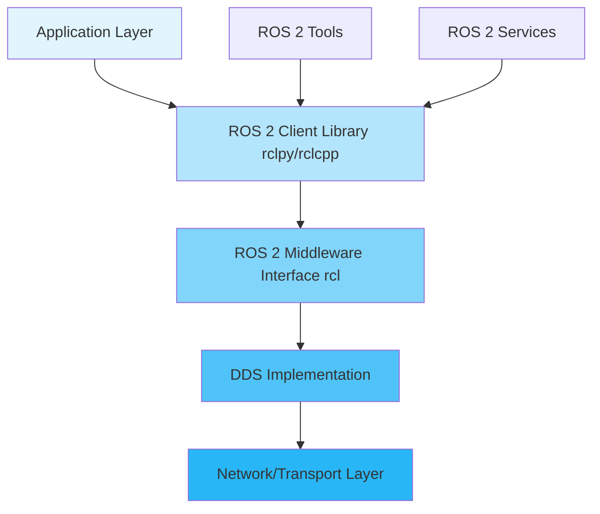

# Chapter 1: Introduction to ROS 2

## What is ROS 2?

ROS 2 (Robot Operating System 2) is the next-generation framework for building robotic applications. Unlike its predecessor ROS 1, ROS 2 was designed from the ground up to address modern robotics challenges including real-time performance, security, multi-robot systems, and cross-platform compatibility.

### Evolution from ROS 1

ROS 1, released in 2010, revolutionized robotics development but had several limitations:

- **Single master node**: Created a single point of failure
- **Limited real-time support**: Not suitable for safety-critical applications
- **No built-in security**: Vulnerable to network attacks
- **Platform limitations**: Primarily Linux-focused

ROS 2 addresses these issues by:

- **Distributed architecture**: No single master, uses DDS (Data Distribution Service)
- **Real-time capable**: Supports deterministic execution
- **Built-in security**: DDS Security extensions
- **Cross-platform**: Works on Linux, Windows, macOS, and embedded systems

### Key Improvements

1. **DDS Middleware**: Replaces custom TCPROS/UDPROS with industry-standard DDS
2. **Quality of Service (QoS)**: Fine-grained control over communication reliability
3. **Lifecycle Nodes**: Structured node state management
4. **Composition**: Runtime node composition for better performance
5. **Type System**: Improved type safety and introspection

## ROS 2 Architecture

ROS 2 follows a layered architecture that separates concerns and enables flexibility:



### Architecture Components

1. **Application Layer**: Your robot code (nodes, publishers, subscribers)
2. **ROS 2 Client Libraries**: Language-specific APIs (rclpy for Python, rclcpp for C++)
3. **ROS 2 Middleware Interface (rcl)**: Abstraction layer over DDS
4. **DDS Implementation**: Communication middleware (FastDDS, CycloneDDS, RTI Connext)
5. **Transport Layer**: TCP/UDP, shared memory, or other transports

### DDS (Data Distribution Service)

DDS is an Object Management Group (OMG) standard for data-centric publish-subscribe communication. ROS 2 uses DDS to provide:

- **Discovery**: Automatic node and topic discovery
- **Quality of Service**: Configurable reliability, durability, and deadline policies
- **Security**: Built-in authentication and encryption
- **Performance**: Low latency, high throughput

## Installation Guide for Ubuntu 22.04

### Prerequisites

```bash
# Update system
sudo apt update && sudo apt upgrade -y

# Install locale
sudo apt install locales
sudo locale-gen en_US en_US.UTF-8
sudo update-locale LC_ALL=en_US.UTF-8 LANG=en_US.UTF-8
export LANG=en_US.UTF-8
```

### Install ROS 2 Humble

```bash
# Add ROS 2 apt repository
sudo apt install software-properties-common
sudo add-apt-repository universe
sudo apt update && sudo apt install curl -y

# Add ROS 2 GPG key
sudo curl -sSL https://raw.githubusercontent.com/ros/rosdistro/master/ros.asc | sudo apt-key add -

# Add ROS 2 repository
sudo sh -c 'echo "deb [arch=$(dpkg --print-architecture)] http://packages.ros.org/ros2/ubuntu $(lsb_release -cs) main" > /etc/apt/sources.list.d/ros2-latest.list'

# Install ROS 2
sudo apt update
sudo apt install ros-humble-desktop -y

# Install development tools
sudo apt install python3-colcon-common-extensions python3-argcomplete -y
```

### Environment Setup

Add to your `~/.bashrc`:

```bash
# Source ROS 2
source /opt/ros/humble/setup.bash

# Optional: Source workspace
# source ~/ros2_ws/install/setup.bash
```

Verify installation:

```bash
# Check ROS 2 version
ros2 --version

# List available packages
ros2 pkg list

# Test installation
ros2 run demo_nodes_cpp talker
# In another terminal:
ros2 run demo_nodes_cpp listener
```

### Common Installation Issues

**Issue 1: Locale errors**
```bash
# Solution:
export LC_ALL=C
sudo locale-gen en_US.UTF-8
```

**Issue 2: Package not found**
```bash
# Solution: Update package lists
sudo apt update
sudo apt install --fix-missing
```

**Issue 3: Permission denied**
```bash
# Solution: Check file permissions
sudo chown -R $USER:$USER ~/ros2_ws
```

## Your First "Hello World" Node

Let's create a simple ROS 2 node that publishes a "Hello World" message.

### Step 1: Create Workspace

```bash
mkdir -p ~/ros2_ws/src
cd ~/ros2_ws/src
```

### Step 2: Create Package

```bash
ros2 pkg create --build-type ament_python my_first_package --dependencies rclpy
```

### Step 3: Create Node

Create `my_first_package/my_first_package/hello_world.py`:

```python
#!/usr/bin/env python3
"""
Hello World ROS 2 Node

This node demonstrates the basic structure of a ROS 2 node.
It publishes a simple message to demonstrate communication.
"""

import rclpy
from rclpy.node import Node
from std_msgs.msg import String


class HelloWorldNode(Node):
    """
    A simple ROS 2 node that publishes "Hello World" messages.
    
    This class demonstrates:
    - Node initialization
    - Creating a publisher
    - Publishing messages
    - Using timers
    """
    
    def __init__(self):
        """
        Initialize the HelloWorldNode.
        
        Creates a publisher for String messages on the 'hello_world' topic.
        Sets up a timer to publish messages every second.
        """
        # Initialize the parent Node class with the node name
        super().__init__('hello_world_node')
        
        # Create a publisher
        # Topic name: 'hello_world'
        # Message type: String
        # Queue size: 10 (number of messages to queue if subscribers are slow)
        self.publisher_ = self.create_publisher(
            String,
            'hello_world',
            10
        )
        
        # Create a timer that calls timer_callback every 1.0 seconds
        timer_period = 1.0  # seconds
        self.timer = self.create_timer(timer_period, self.timer_callback)
        
        # Counter to track message number
        self.i = 0
        
        # Log that the node has started
        self.get_logger().info('Hello World node has been started!')
    
    def timer_callback(self):
        """
        Callback function called by the timer.
        
        Creates a String message, fills it with data, and publishes it.
        """
        # Create a new String message
        msg = String()
        
        # Set the message data
        msg.data = f'Hello World: {self.i}'
        
        # Publish the message
        self.publisher_.publish(msg)
        
        # Log the published message
        self.get_logger().info(f'Publishing: "{msg.data}"')
        
        # Increment counter
        self.i += 1


def main(args=None):
    """
    Main function to run the node.
    
    This function:
    1. Initializes ROS 2
    2. Creates and runs the node
    3. Spins the node (keeps it alive)
    4. Shuts down ROS 2 when done
    """
    # Initialize ROS 2
    rclpy.init(args=args)
    
    # Create the node
    hello_world_node = HelloWorldNode()
    
    try:
        # Spin the node (keeps it running and processes callbacks)
        rclpy.spin(hello_world_node)
    except KeyboardInterrupt:
        # Handle Ctrl+C gracefully
        hello_world_node.get_logger().info('Node interrupted by user')
    finally:
        # Destroy the node explicitly
        hello_world_node.destroy_node()
        
        # Shutdown ROS 2
        rclpy.shutdown()


if __name__ == '__main__':
    main()
```

### Step 4: Make Executable

```bash
chmod +x my_first_package/my_first_package/hello_world.py
```

### Step 5: Update setup.py

Edit `my_first_package/setup.py`:

```python
from setuptools import setup

package_name = 'my_first_package'

setup(
    name=package_name,
    version='0.0.1',
    packages=[package_name],
    data_files=[
        ('share/ament_index/resource_index/packages',
            ['resource/' + package_name]),
        ('share/' + package_name, ['package.xml']),
    ],
    install_requires=['setuptools'],
    zip_safe=True,
    maintainer='Your Name',
    maintainer_email='your.email@example.com',
    description='My first ROS 2 package',
    license='Apache-2.0',
    tests_require=['pytest'],
    entry_points={
        'console_scripts': [
            'hello_world = my_first_package.hello_world:main',
        ],
    },
)
```

### Step 6: Build and Run

```bash
cd ~/ros2_ws
colcon build --packages-select my_first_package
source install/setup.bash

# Run the node
ros2 run my_first_package hello_world
```

### Step 7: Test the Node

In another terminal:

```bash
# Listen to the topic
ros2 topic echo /hello_world

# Check node info
ros2 node info /hello_world_node

# List all topics
ros2 topic list
```

## Code Explanation

Let's break down the key components:

### 1. Import Statements

```python
import rclpy
from rclpy.node import Node
from std_msgs.msg import String
```

- `rclpy`: Python client library for ROS 2
- `Node`: Base class for all ROS 2 nodes
- `String`: Standard string message type

### 2. Node Class

```python
class HelloWorldNode(Node):
    def __init__(self):
        super().__init__('hello_world_node')
```

- Inherits from `Node` base class
- `super().__init__()` initializes the node with a name
- Node name must be unique in the system

### 3. Publisher

```python
self.publisher_ = self.create_publisher(
    String,        # Message type
    'hello_world', # Topic name
    10             # Queue size
)
```

- Creates a publisher for String messages
- Topic name: where messages are published
- Queue size: buffers messages if subscribers are slow

### 4. Timer

```python
self.timer = self.create_timer(
    1.0,              # Period in seconds
    self.timer_callback  # Callback function
)
```

- Executes callback function periodically
- Non-blocking (doesn't stop other operations)
- Can be cancelled with `timer.cancel()`

### 5. Main Function

```python
rclpy.init(args=args)      # Initialize ROS 2
rclpy.spin(node)           # Keep node alive
rclpy.shutdown()           # Clean shutdown
```

- `rclpy.init()`: Must be called before creating nodes
- `rclpy.spin()`: Blocks and processes callbacks
- `rclpy.shutdown()`: Cleans up resources

## Key Concepts Summary

### Nodes

Nodes are executable processes that perform computation. Each node:
- Has a unique name
- Can publish/subscribe to topics
- Can provide/use services
- Can have parameters
- Runs independently

### Topics

Topics are named buses for exchanging messages:
- **Publisher**: Sends messages to a topic
- **Subscriber**: Receives messages from a topic
- **Message Type**: Defines the data structure
- **Asynchronous**: Publishers and subscribers are decoupled

### Messages

Messages are data structures that define what information is exchanged:
- Typed: Each message has a specific type
- Structured: Can contain multiple fields
- Versioned: Can evolve over time

## Common Errors and Solutions

### Error 1: "Node name already exists"

```python
# Problem: Two nodes with same name
# Solution: Use unique names or namespaces
super().__init__('unique_node_name')
# Or use namespace:
super().__init__('my_namespace/hello_world_node')
```

### Error 2: "rclpy.init() not called"

```python
# Problem: Creating node before initialization
# Solution: Always call rclpy.init() first
rclpy.init(args=args)  # Must be first!
node = HelloWorldNode()
```

### Error 3: "Topic not found"

```bash
# Problem: Topic name mismatch
# Solution: Check topic names
ros2 topic list
ros2 topic echo /correct_topic_name
```

### Error 4: "Import error"

```python
# Problem: Missing dependencies
# Solution: Add to package.xml and setup.py
# In package.xml:
<depend>rclpy</depend>
<depend>std_msgs</depend>
```

## Exercises

### Exercise 1: Modify Hello World

Modify the hello_world node to:
1. Publish messages every 0.5 seconds instead of 1.0
2. Include a timestamp in the message
3. Add a counter that resets every 10 messages

**Solution:**

```python
import time
from std_msgs.msg import String

def timer_callback(self):
    msg = String()
    msg.data = f'Hello World: {self.i} at {time.time()}'
    self.publisher_.publish(msg)
    self.i = (self.i + 1) % 10  # Reset every 10
```

### Exercise 2: Create a Subscriber

Create a new node that subscribes to `/hello_world` and prints received messages.

**Solution:**

```python
class HelloWorldSubscriber(Node):
    def __init__(self):
        super().__init__('hello_world_subscriber')
        self.subscription = self.create_subscription(
            String,
            'hello_world',
            self.listener_callback,
            10
        )
    
    def listener_callback(self, msg):
        self.get_logger().info(f'I heard: "{msg.data}"')
```

### Exercise 3: Custom Message

Create a custom message with multiple fields and use it in your node.

## Next Steps

Now that you understand the basics, let's dive deeper into:
- **Nodes and Topics**: Understanding the publish-subscribe pattern in detail
- **Services and Actions**: Request-response and long-running operations
- **Parameters**: Runtime configuration
- **Launch Files**: Orchestrating multiple nodes

Continue to [Chapter 2: Nodes and Topics](./02-nodes-topics.md) to learn about the communication patterns that make ROS 2 powerful.

