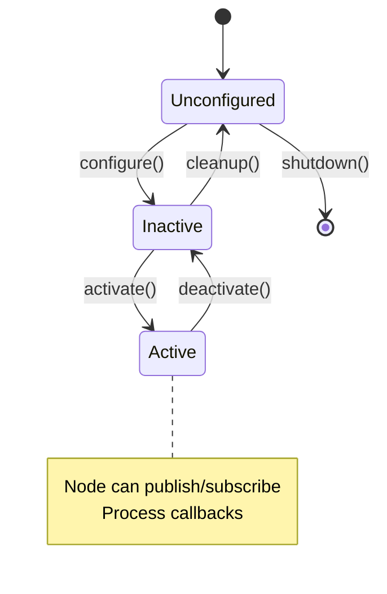
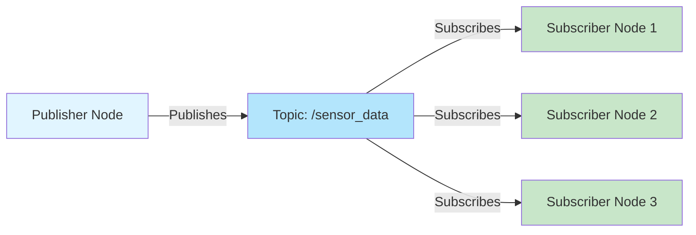

# Chapter 2: Nodes and Topics

## Deep Dive into Nodes

Nodes are the fundamental building blocks of ROS 2 applications. Understanding nodes is crucial for building robust robotic systems.

### What is a Node?

A **node** is an executable process that performs a specific task in a robot system. Each node:
- Operates independently
- Communicates with other nodes via topics, services, or actions
- Has a unique name in the ROS 2 graph
- Can be written in Python, C++, or other supported languages

### Node Lifecycle



### Creating a Node

```python
import rclpy
from rclpy.node import Node

class MyNode(Node):
    def __init__(self):
        super().__init__('my_node_name')
        # Node initialization code here
```

### Node Namespaces

Organize nodes using namespaces:

```python
# Global namespace
super().__init__('my_node')

# Namespaced
super().__init__('robot1/my_node')
super().__init__('robot1/sensors/camera_node')
```

### Node Logging

ROS 2 provides logging levels:

```python
self.get_logger().debug('Debug message')
self.get_logger().info('Info message')
self.get_logger().warn('Warning message')
self.get_logger().error('Error message')
self.get_logger().fatal('Fatal message')
```

## Publisher-Subscriber Pattern

The publish-subscribe (pub-sub) pattern is the most common communication method in ROS 2. It provides:

- **Decoupling**: Publishers and subscribers don't need to know about each other
- **Scalability**: Multiple subscribers can receive the same message
- **Flexibility**: Easy to add/remove nodes

### Architecture Diagram



## Complete Code Example 1: Simple Publisher

Let's create a temperature sensor publisher:

```python
#!/usr/bin/env python3
"""
Temperature Sensor Publisher

Publishes simulated temperature readings.
"""

import rclpy
from rclpy.node import Node
from std_msgs.msg import Float32
import random
import math


class TemperaturePublisher(Node):
    """Publishes temperature sensor data."""
    
    def __init__(self):
        super().__init__('temperature_publisher')
        
        # Create publisher
        self.publisher_ = self.create_publisher(
            Float32,
            'temperature',
            10
        )
        
        # Timer: publish every 0.5 seconds
        timer_period = 0.5
        self.timer = self.create_timer(timer_period, self.timer_callback)
        
        # Simulate temperature (20-25°C with noise)
        self.base_temp = 22.5
        self.time = 0.0
        
        self.get_logger().info('Temperature publisher started')
    
    def timer_callback(self):
        """Publish temperature reading."""
        msg = Float32()
        
        # Simulate temperature with sine wave + noise
        self.time += 0.5
        temperature = self.base_temp + \
                      2.0 * math.sin(self.time * 0.1) + \
                      random.gauss(0, 0.5)
        
        msg.data = temperature
        
        self.publisher_.publish(msg)
        self.get_logger().info(f'Published temperature: {temperature:.2f}°C')


def main(args=None):
    rclpy.init(args=args)
    node = TemperaturePublisher()
    
    try:
        rclpy.spin(node)
    except KeyboardInterrupt:
        node.get_logger().info('Shutting down...')
    finally:
        node.destroy_node()
        rclpy.shutdown()


if __name__ == '__main__':
    main()
```

## Complete Code Example 2: Simple Subscriber

Now let's create a subscriber that processes temperature data:

```python
#!/usr/bin/env python3
"""
Temperature Monitor Subscriber

Subscribes to temperature data and monitors for high temperatures.
"""

import rclpy
from rclpy.node import Node
from std_msgs.msg import Float32


class TemperatureMonitor(Node):
    """Monitors temperature and alerts if too high."""
    
    def __init__(self):
        super().__init__('temperature_monitor')
        
        # Create subscriber
        self.subscription = self.create_subscription(
            Float32,
            'temperature',
            self.temperature_callback,
            10  # Queue size
        )
        
        # Prevent unused variable warning
        self.subscription
        
        # Thresholds
        self.warning_threshold = 24.0
        self.critical_threshold = 26.0
        
        # Statistics
        self.max_temp = float('-inf')
        self.min_temp = float('inf')
        self.reading_count = 0
        
        self.get_logger().info('Temperature monitor started')
    
    def temperature_callback(self, msg):
        """Process incoming temperature message."""
        temp = msg.data
        
        # Update statistics
        self.max_temp = max(self.max_temp, temp)
        self.min_temp = min(self.min_temp, temp)
        self.reading_count += 1
        
        # Log based on temperature
        if temp >= self.critical_threshold:
            self.get_logger().error(
                f'CRITICAL: Temperature {temp:.2f}°C exceeds threshold!'
            )
        elif temp >= self.warning_threshold:
            self.get_logger().warn(
                f'WARNING: Temperature {temp:.2f}°C is high'
            )
        else:
            self.get_logger().info(
                f'Temperature: {temp:.2f}°C (Normal)'
            )
        
        # Periodic statistics report
        if self.reading_count % 10 == 0:
            self.get_logger().info(
                f'Stats: Min={self.min_temp:.2f}°C, '
                f'Max={self.max_temp:.2f}°C, '
                f'Readings={self.reading_count}'
            )


def main(args=None):
    rclpy.init(args=args)
    node = TemperatureMonitor()
    
    try:
        rclpy.spin(node)
    except KeyboardInterrupt:
        node.get_logger().info('Shutting down...')
    finally:
        node.destroy_node()
        rclpy.shutdown()


if __name__ == '__main__':
    main()
```

## Complete Code Example 3: Bidirectional Communication

A node that both publishes and subscribes:

```python
#!/usr/bin/env python3
"""
Temperature Controller

Subscribes to temperature, publishes control commands.
Implements a simple PID controller.
"""

import rclpy
from rclpy.node import Node
from std_msgs.msg import Float32


class TemperatureController(Node):
    """Controls temperature using PID algorithm."""
    
    def __init__(self):
        super().__init__('temperature_controller')
        
        # Subscriber: receive temperature readings
        self.temp_subscription = self.create_subscription(
            Float32,
            'temperature',
            self.temperature_callback,
            10
        )
        self.temp_subscription
        
        # Publisher: publish control commands
        self.control_publisher = self.create_publisher(
            Float32,
            'control_signal',
            10
        )
        
        # PID parameters
        self.setpoint = 23.0  # Target temperature
        self.kp = 2.0  # Proportional gain
        self.ki = 0.1  # Integral gain
        self.kd = 0.5  # Derivative gain
        
        # PID state
        self.last_error = 0.0
        self.integral = 0.0
        self.last_time = None
        
        self.get_logger().info(
            f'Temperature controller started (setpoint: {self.setpoint}°C)'
        )
    
    def temperature_callback(self, msg):
        """Calculate and publish control signal."""
        current_temp = msg.data
        current_time = self.get_clock().now()
        
        # Calculate error
        error = self.setpoint - current_temp
        
        # Calculate time delta
        if self.last_time is None:
            dt = 0.1  # Default
        else:
            dt = (current_time - self.last_time).nanoseconds / 1e9
        
        # PID calculation
        # Proportional term
        p_term = self.kp * error
        
        # Integral term
        self.integral += error * dt
        i_term = self.ki * self.integral
        
        # Derivative term
        if dt > 0:
            derivative = (error - self.last_error) / dt
        else:
            derivative = 0.0
        d_term = self.kd * derivative
        
        # Total control signal
        control_signal = p_term + i_term + d_term
        
        # Clamp control signal
        control_signal = max(-100.0, min(100.0, control_signal))
        
        # Publish control signal
        control_msg = Float32()
        control_msg.data = control_signal
        self.control_publisher.publish(control_msg)
        
        # Update state
        self.last_error = error
        self.last_time = current_time
        
        # Log
        self.get_logger().info(
            f'Temp: {current_temp:.2f}°C, '
            f'Error: {error:.2f}°C, '
            f'Control: {control_signal:.2f}'
        )


def main(args=None):
    rclpy.init(args=args)
    node = TemperatureController()
    
    try:
        rclpy.spin(node)
    except KeyboardInterrupt:
        node.get_logger().info('Shutting down...')
    finally:
        node.destroy_node()
        rclpy.shutdown()


if __name__ == '__main__':
    main()
```

## Topic Inspection Commands

ROS 2 provides powerful command-line tools for inspecting topics:

### List All Topics

```bash
ros2 topic list
# Output:
# /control_signal
# /temperature
# /rosout
```

### Get Topic Information

```bash
ros2 topic info /temperature
# Output:
# Type: std_msgs/msg/Float32
# Publisher count: 1
# Subscription count: 1
```

### View Topic Data

```bash
# Echo topic messages
ros2 topic echo /temperature

# Echo with specific message field
ros2 topic echo /temperature --field data

# Echo with rate limit
ros2 topic echo /temperature --once
```

### Publish to Topic

```bash
# Publish once
ros2 topic pub /temperature std_msgs/msg/Float32 "{data: 25.0}"

# Publish repeatedly
ros2 topic pub --rate 1 /temperature std_msgs/msg/Float32 "{data: 25.0}"

# Publish with timestamp
ros2 topic pub /temperature std_msgs/msg/Float32 "{data: 25.0}" --once
```

### Get Topic Type

```bash
ros2 topic type /temperature
# Output: std_msgs/msg/Float32
```

### Monitor Topic Rate

```bash
ros2 topic hz /temperature
# Output:
# average rate: 2.000
#   min: 0.500s max: 0.500s std dev: 0.00000s window: 10
```

### View Topic Bandwidth

```bash
ros2 topic bw /temperature
# Output:
# average: 0.00 B/s
#   mean: 0.00 B/s min: 0.00 B/s max: 0.00 B/s window: 10
```

## Quality of Service (QoS) Profiles

QoS profiles control how messages are delivered. This is crucial for reliable communication.

### QoS Settings

```python
from rclpy.qos import QoSProfile, ReliabilityPolicy, DurabilityPolicy, HistoryPolicy

# Create custom QoS profile
qos_profile = QoSProfile(
    reliability=ReliabilityPolicy.RELIABLE,  # or BEST_EFFORT
    durability=DurabilityPolicy.VOLATILE,    # or TRANSIENT_LOCAL
    history=HistoryPolicy.KEEP_LAST,         # or KEEP_ALL
    depth=10                                  # Queue depth
)

# Use in publisher
self.publisher_ = self.create_publisher(
    Float32,
    'temperature',
    qos_profile  # Use custom QoS
)
```

### Common QoS Profiles

```python
from rclpy.qos import qos_profile_sensor_data, qos_profile_default

# Sensor data (best effort, small queue)
self.publisher_ = self.create_publisher(
    Float32,
    'sensor_data',
    qos_profile_sensor_data
)

# Default profile (reliable, volatile)
self.publisher_ = self.create_publisher(
    Float32,
    'commands',
    qos_profile_default
)
```

### QoS Compatibility

Publishers and subscribers must have compatible QoS:

| Publisher | Subscriber | Result |
|-----------|------------|--------|
| RELIABLE | RELIABLE | ✅ Works |
| RELIABLE | BEST_EFFORT | ✅ Works |
| BEST_EFFORT | RELIABLE | ❌ Fails |
| BEST_EFFORT | BEST_EFFORT | ✅ Works |

### Example: QoS Configuration

```python
from rclpy.qos import (
    QoSProfile,
    ReliabilityPolicy,
    DurabilityPolicy,
    HistoryPolicy
)

# Reliable communication for critical data
critical_qos = QoSProfile(
    reliability=ReliabilityPolicy.RELIABLE,
    durability=DurabilityPolicy.TRANSIENT_LOCAL,
    history=HistoryPolicy.KEEP_LAST,
    depth=10
)

# Best effort for high-frequency sensor data
sensor_qos = QoSProfile(
    reliability=ReliabilityPolicy.BEST_EFFORT,
    durability=DurabilityPolicy.VOLATILE,
    history=HistoryPolicy.KEEP_LAST,
    depth=5
)
```

## Advanced Topics

### Remapping Topics

Change topic names at runtime:

```bash
ros2 run my_package my_node --ros-args \
  -r temperature:=/robot1/temperature
```

### Namespaces

Organize topics with namespaces:

```python
# Global topic
self.publisher_ = self.create_publisher(Float32, 'temperature', 10)

# Namespaced topic
self.publisher_ = self.create_publisher(
    Float32,
    'robot1/sensors/temperature',
    10
)
```

### Message Filtering

Filter messages based on conditions:

```python
def temperature_callback(self, msg):
    # Only process if temperature is significant
    if abs(msg.data - self.last_temp) > 0.5:
        self.process_temperature(msg.data)
        self.last_temp = msg.data
```

## Common Errors and Solutions

### Error 1: "No subscribers connected"

**Problem**: Publisher sends messages but no one receives them.

**Solution**: 
```python
# Check if subscribers exist
if self.publisher_.get_subscription_count() > 0:
    self.publisher_.publish(msg)
else:
    self.get_logger().warn('No subscribers connected')
```

### Error 2: "QoS incompatibility"

**Problem**: Publisher and subscriber have incompatible QoS.

**Solution**: Match QoS profiles or use compatible settings.

### Error 3: "Message queue full"

**Problem**: Subscriber can't process messages fast enough.

**Solution**: Increase queue size or process messages faster.

```python
# Increase queue size
self.subscription = self.create_subscription(
    Float32,
    'temperature',
    self.callback,
    100  # Larger queue
)
```

### Error 4: "Topic name typo"

**Problem**: Publisher and subscriber use different topic names.

**Solution**: Use constants or check topic names.

```python
# Define topic name as constant
TEMPERATURE_TOPIC = 'temperature'

self.publisher_ = self.create_publisher(Float32, TEMPERATURE_TOPIC, 10)
```

## Student Exercises

### Exercise 1: Multi-Sensor Publisher

Create a node that publishes data from multiple sensors (temperature, humidity, pressure) on separate topics.

**Requirements:**
- Three publishers
- Different publish rates for each sensor
- Simulated sensor data

**Solution Template:**

```python
class MultiSensorPublisher(Node):
    def __init__(self):
        super().__init__('multi_sensor_publisher')
        
        # Create three publishers
        self.temp_pub = self.create_publisher(Float32, 'temperature', 10)
        self.humidity_pub = self.create_publisher(Float32, 'humidity', 10)
        self.pressure_pub = self.create_publisher(Float32, 'pressure', 10)
        
        # Different timers for different rates
        self.create_timer(0.5, self.temp_callback)    # 2 Hz
        self.create_timer(1.0, self.humidity_callback) # 1 Hz
        self.create_timer(2.0, self.pressure_callback)  # 0.5 Hz
```

### Exercise 2: Data Logger

Create a subscriber that logs all received messages to a file with timestamps.

**Requirements:**
- Subscribe to any topic
- Log to CSV file
- Include timestamp and data

### Exercise 3: Topic Relay

Create a node that subscribes to one topic and republishes on another topic (useful for topic remapping).

**Requirements:**
- Subscribe to `/input_topic`
- Publish to `/output_topic`
- Maintain message type

### Exercise 4: Message Statistics

Create a subscriber that calculates statistics (mean, std dev, min, max) for received messages.

**Requirements:**
- Calculate running statistics
- Report every N messages
- Handle numeric message types

### Exercise 5: QoS Experiment

Create two nodes with incompatible QoS and observe the behavior. Then fix the compatibility.

**Requirements:**
- Publisher with RELIABLE QoS
- Subscriber with BEST_EFFORT QoS
- Document the behavior
- Fix to make compatible

## Best Practices

1. **Use descriptive topic names**: `temperature_sensor` not `temp`
2. **Choose appropriate message types**: Use standard types when possible
3. **Set reasonable queue sizes**: Too small = dropped messages, too large = memory issues
4. **Match QoS profiles**: Ensure compatibility
5. **Handle errors gracefully**: Check for None, validate data
6. **Use namespaces**: Organize topics logically
7. **Document topics**: Use comments and README files

## Next Steps

Now that you understand nodes and topics, continue to:
- [Chapter 3: Services and Actions](./03-services-actions.md) - Learn about request-response patterns
- [Chapter 4: Python rclpy Deep Dive](./04-python-rclpy.md) - Master the Python API

