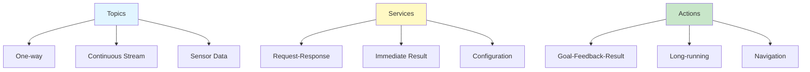
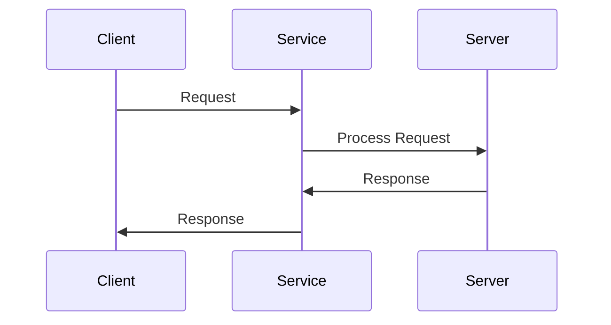
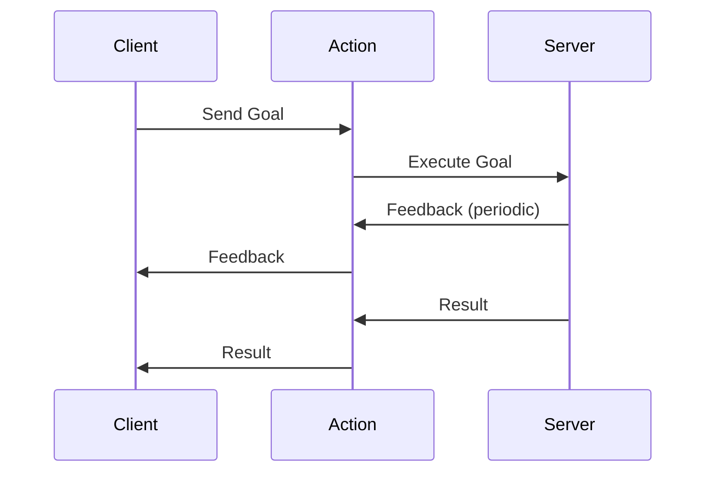
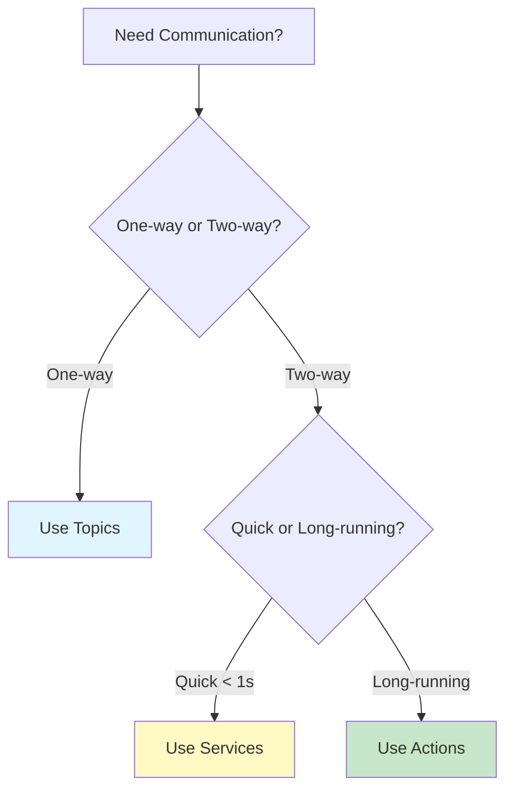

# Chapter 3: Services and Actions

## Introduction

While topics provide one-way communication (publisher → subscriber), ROS 2 also provides **services** and **actions** for two-way, request-response patterns. Understanding when to use each communication mechanism is crucial for building effective robotic systems.

### Communication Patterns Comparison



## Services: Request-Response Communication

**Services** provide synchronous request-response communication. They are ideal for:

- **One-time requests**: Operations that happen once and return a result
- **Immediate results**: Tasks that complete quickly (< 1 second)
- **Configuration changes**: Setting parameters or modes
- **Querying state**: Getting current robot status
- **Simple computations**: Calculations that need a result

### Service Architecture



### Creating a Service Definition

First, create a service definition file. Create `srv/AddTwoInts.srv`:

```
int64 a
int64 b
---
int64 sum
```

The `---` separates the request (above) from the response (below).

### Service Server Example

```python
#!/usr/bin/env python3
"""
Service Server Example

Creates a service that adds two integers.
"""

import rclpy
from rclpy.node import Node
from example_interfaces.srv import AddTwoInts

class AddTwoIntsServer(Node):
    def __init__(self):
        super().__init__('add_two_ints_server')
        
        # Create service
        self.srv = self.create_service(
            AddTwoInts,
            'add_two_ints',
            self.add_two_ints_callback
        )
        
        self.get_logger().info('AddTwoInts service ready')
    
    def add_two_ints_callback(self, request, response):
        """Service callback function."""
        response.sum = request.a + request.b
        self.get_logger().info(
            f'Incoming request: a={request.a}, b={request.b}'
        )
        self.get_logger().info(f'Sending response: sum={response.sum}')
        return response

def main(args=None):
    rclpy.init(args=args)
    
    node = AddTwoIntsServer()
    
    try:
        rclpy.spin(node)
    except KeyboardInterrupt:
        node.get_logger().info('Shutting down service server...')
    finally:
        node.destroy_node()
        rclpy.shutdown()

if __name__ == '__main__':
    main()
```

### Service Client Example

```python
#!/usr/bin/env python3
"""
Service Client Example

Calls the AddTwoInts service.
"""

import rclpy
from rclpy.node import Node
from example_interfaces.srv import AddTwoInts

class AddTwoIntsClient(Node):
    def __init__(self):
        super().__init__('add_two_ints_client')
        
        # Create client
        self.cli = self.create_client(AddTwoInts, 'add_two_ints')
        
        # Wait for service to be available
        while not self.cli.wait_for_service(timeout_sec=1.0):
            self.get_logger().info('Service not available, waiting again...')
    
    def send_request(self, a, b):
        """Send request to service."""
        request = AddTwoInts.Request()
        request.a = a
        request.b = b
        
        self.get_logger().info(f'Requesting: {a} + {b}')
        
        # Call service asynchronously
        self.future = self.cli.call_async(request)
        return self.future
    
    def get_result(self):
        """Get result from service call."""
        rclpy.spin_until_future_complete(self, self.future)
        return self.future.result()

def main(args=None):
    rclpy.init(args=args)
    
    client = AddTwoIntsClient()
    
    # Send request
    future = client.send_request(5, 3)
    
    # Wait for result
    rclpy.spin_until_future_complete(client, future)
    
    if future.done():
        try:
            response = future.result()
            client.get_logger().info(f'Result: {response.sum}')
        except Exception as e:
            client.get_logger().error(f'Service call failed: {e}')
    
    client.destroy_node()
    rclpy.shutdown()

if __name__ == '__main__':
    main()
```

### Using Services from Command Line

```bash
# List available services
ros2 service list

# Get service type
ros2 service type /add_two_ints

# Call service
ros2 service call /add_two_ints example_interfaces/srv/AddTwoInts "{a: 5, b: 3}"
```

### Practical Service Example: Robot LED Control

```python
#!/usr/bin/env python3
"""
Robot LED Control Service

Service to control robot LEDs.
"""

import rclpy
from rclpy.node import Node
from std_srvs.srv import SetBool

class LEDControlService(Node):
    def __init__(self):
        super().__init__('led_control_service')
        
        # Create service
        self.srv = self.create_service(
            SetBool,
            'set_led',
            self.set_led_callback
        )
        
        # LED state
        self.led_state = False
        
        self.get_logger().info('LED control service ready')
    
    def set_led_callback(self, request, response):
        """Control LED on/off."""
        self.led_state = request.data
        
        if self.led_state:
            self.get_logger().info('LED turned ON')
            # Here you would control actual hardware
        else:
            self.get_logger().info('LED turned OFF')
        
        response.success = True
        response.message = f'LED set to {self.led_state}'
        return response

def main(args=None):
    rclpy.init(args=args)
    node = LEDControlService()
    
    try:
        rclpy.spin(node)
    except KeyboardInterrupt:
        node.get_logger().info('Shutting down...')
    finally:
        node.destroy_node()
        rclpy.shutdown()

if __name__ == '__main__':
    main()
```

## Actions: Long-Running Tasks with Feedback

**Actions** are designed for long-running tasks that provide periodic feedback. They consist of:

- **Goal**: What you want to achieve
- **Feedback**: Periodic updates on progress
- **Result**: Final outcome when complete

### When to Use Actions

Actions are ideal for:
- **Navigation**: Moving to a goal position
- **Manipulation**: Picking up objects
- **Long computations**: Processing that takes time
- **Tasks with progress**: Operations where you need status updates

### Action Architecture



### Creating an Action Definition

Create `action/Fibonacci.action`:

```
int32 order
---
int32[] sequence
---
int32[] partial_sequence
```

The `---` separates goal (first), result (second), and feedback (third).

### Action Server Example

```python
#!/usr/bin/env python3
"""
Action Server Example

Implements Fibonacci action server.
"""

import rclpy
from rclpy.node import Node
from rclpy.action import ActionServer
from example_interfaces.action import Fibonacci

class FibonacciActionServer(Node):
    def __init__(self):
        super().__init__('fibonacci_action_server')
        
        # Create action server
        self._action_server = ActionServer(
            self,
            Fibonacci,
            'fibonacci',
            self.execute_callback
        )
        
        self.get_logger().info('Fibonacci action server ready')
    
    def execute_callback(self, goal_handle):
        """Execute action goal."""
        self.get_logger().info(f'Executing goal: order={goal_handle.request.order}')
        
        # Initialize feedback
        feedback_msg = Fibonacci.Feedback()
        feedback_msg.partial_sequence = [0, 1]
        
        # Generate Fibonacci sequence
        for i in range(1, goal_handle.request.order):
            if goal_handle.is_cancel_requested:
                goal_handle.canceled()
                self.get_logger().info('Goal canceled')
                return Fibonacci.Result()
            
            # Update sequence
            feedback_msg.partial_sequence.append(
                feedback_msg.partial_sequence[i] + 
                feedback_msg.partial_sequence[i-1]
            )
            
            # Publish feedback
            self.get_logger().info(f'Feedback: {feedback_msg.partial_sequence}')
            goal_handle.publish_feedback(feedback_msg)
            
            # Simulate work
            self.get_clock().sleep_for(rclpy.duration.Duration(seconds=1))
        
        # Goal completed
        goal_handle.succeed()
        
        # Create result
        result = Fibonacci.Result()
        result.sequence = feedback_msg.partial_sequence
        
        self.get_logger().info(f'Result: {result.sequence}')
        return result

def main(args=None):
    rclpy.init(args=args)
    node = FibonacciActionServer()
    
    try:
        rclpy.spin(node)
    except KeyboardInterrupt:
        node.get_logger().info('Shutting down...')
    finally:
        node.destroy_node()
        rclpy.shutdown()

if __name__ == '__main__':
    main()
```

### Action Client Example

```python
#!/usr/bin/env python3
"""
Action Client Example

Sends goals to Fibonacci action server.
"""

import rclpy
from rclpy.node import Node
from rclpy.action import ActionClient
from example_interfaces.action import Fibonacci

class FibonacciActionClient(Node):
    def __init__(self):
        super().__init__('fibonacci_action_client')
        
        # Create action client
        self._action_client = ActionClient(self, Fibonacci, 'fibonacci')
    
    def send_goal(self, order):
        """Send goal to action server."""
        self.get_logger().info(f'Waiting for action server...')
        self._action_client.wait_for_server()
        
        # Create goal
        goal_msg = Fibonacci.Goal()
        goal_msg.order = order
        
        self.get_logger().info(f'Sending goal: order={order}')
        
        # Send goal
        self._send_goal_future = self._action_client.send_goal_async(
            goal_msg,
            feedback_callback=self.feedback_callback
        )
        
        self._send_goal_future.add_done_callback(self.goal_response_callback)
    
    def goal_response_callback(self, future):
        """Handle goal response."""
        goal_handle = future.result()
        
        if not goal_handle.accepted:
            self.get_logger().info('Goal rejected')
            return
        
        self.get_logger().info('Goal accepted')
        
        # Get result
        self._get_result_future = goal_handle.get_result_async()
        self._get_result_future.add_done_callback(self.get_result_callback)
    
    def feedback_callback(self, feedback_msg):
        """Handle feedback."""
        feedback = feedback_msg.feedback
        self.get_logger().info(f'Feedback: {feedback.partial_sequence}')
    
    def get_result_callback(self, future):
        """Handle result."""
        result = future.result().result
        self.get_logger().info(f'Result: {result.sequence}')
        rclpy.shutdown()

def main(args=None):
    rclpy.init(args=args)
    node = FibonacciActionClient()
    
    # Send goal
    node.send_goal(10)
    
    try:
        rclpy.spin(node)
    except KeyboardInterrupt:
        node.get_logger().info('Shutting down...')
    finally:
        node.destroy_node()
        rclpy.shutdown()

if __name__ == '__main__':
    main()
```

### Practical Action Example: Navigation Goal

```python
#!/usr/bin/env python3
"""
Navigation Action Example

Action server for robot navigation.
"""

import rclpy
from rclpy.node import Node
from rclpy.action import ActionServer
from geometry_msgs.msg import PoseStamped
from nav2_msgs.action import NavigateToPose

class NavigationActionServer(Node):
    def __init__(self):
        super().__init__('navigation_action_server')
        
        # Create action server
        self._action_server = ActionServer(
            self,
            NavigateToPose,
            'navigate_to_pose',
            self.execute_callback
        )
        
        self.get_logger().info('Navigation action server ready')
    
    def execute_callback(self, goal_handle):
        """Execute navigation goal."""
        goal = goal_handle.request.pose
        
        self.get_logger().info(
            f'Navigating to: x={goal.pose.position.x}, '
            f'y={goal.pose.position.y}'
        )
        
        # Simulate navigation with feedback
        # In real implementation, this would control the robot
        distance_remaining = 10.0  # meters
        
        while distance_remaining > 0.1:
            if goal_handle.is_cancel_requested:
                goal_handle.canceled()
                return NavigateToPose.Result()
            
            # Update progress
            distance_remaining -= 0.5
            
            # Publish feedback
            feedback = NavigateToPose.Feedback()
            feedback.distance_remaining = distance_remaining
            goal_handle.publish_feedback(feedback)
            
            self.get_logger().info(f'Distance remaining: {distance_remaining}m')
            self.get_clock().sleep_for(rclpy.duration.Duration(seconds=1))
        
        # Goal completed
        goal_handle.succeed()
        result = NavigateToPose.Result()
        return result

def main(args=None):
    rclpy.init(args=args)
    node = NavigationActionServer()
    
    try:
        rclpy.spin(node)
    except KeyboardInterrupt:
        node.get_logger().info('Shutting down...')
    finally:
        node.destroy_node()
        rclpy.shutdown()

if __name__ == '__main__':
    main()
```

## When to Use What?

### Decision Tree



### Comparison Table

| Feature | Topics | Services | Actions |
|---------|--------|----------|---------|
| **Direction** | One-way | Two-way | Two-way |
| **Timing** | Asynchronous | Synchronous | Asynchronous |
| **Feedback** | No | No | Yes |
| **Use Case** | Sensor data | Queries | Long tasks |
| **Example** | Camera images | Get battery level | Navigate to goal |

### Real-World Examples

**Topics**:
- Camera images (`/camera/image_raw`)
- LIDAR scans (`/scan`)
- Robot velocity commands (`/cmd_vel`)

**Services**:
- Set robot mode (`/set_mode`)
- Get robot status (`/get_status`)
- Calibrate sensor (`/calibrate`)

**Actions**:
- Navigate to position (`/navigate_to_pose`)
- Pick up object (`/pick_object`)
- Follow path (`/follow_path`)

## Best Practices

### Services

1. **Keep it fast**: Services should complete quickly
2. **Idempotent**: Multiple calls should have same effect
3. **Error handling**: Return meaningful error messages
4. **Timeout**: Set reasonable timeouts for clients

### Actions

1. **Provide feedback**: Update progress regularly
2. **Handle cancellation**: Allow goals to be canceled
3. **Check preemption**: Handle new goals while executing
4. **Clear status**: Use appropriate status codes

## Common Errors and Solutions

### Error 1: Service Not Available

```python
# Problem: Service client fails immediately
# Solution: Wait for service
while not self.cli.wait_for_service(timeout_sec=1.0):
    self.get_logger().info('Service not available, waiting...')
```

### Error 2: Action Goal Rejected

```python
# Problem: Action server rejects goal
# Solution: Check goal validity before accepting
def execute_callback(self, goal_handle):
    if goal_handle.request.order < 0:
        goal_handle.abort()
        return
    # Process valid goal
```

### Error 3: Service Timeout

```python
# Problem: Service call times out
# Solution: Set appropriate timeout
future = self.cli.call_async(request)
rclpy.spin_until_future_complete(self, future, timeout_sec=5.0)
```

## Exercises

1. **Service Exercise**: Create a service to get robot battery level
2. **Action Exercise**: Implement an action to move robot in a square pattern
3. **Integration**: Combine service and action in a single node
4. **Error Handling**: Add proper error handling to service and action examples

## Next Steps

Continue learning:
- [Chapter 4: Python rclpy](04-python-rclpy.md) - Deep dive into ROS 2 Python library
- [Chapter 5: URDF Basics](05-urdf-basics.md) - Robot modeling

