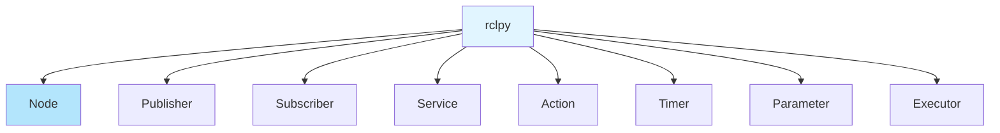
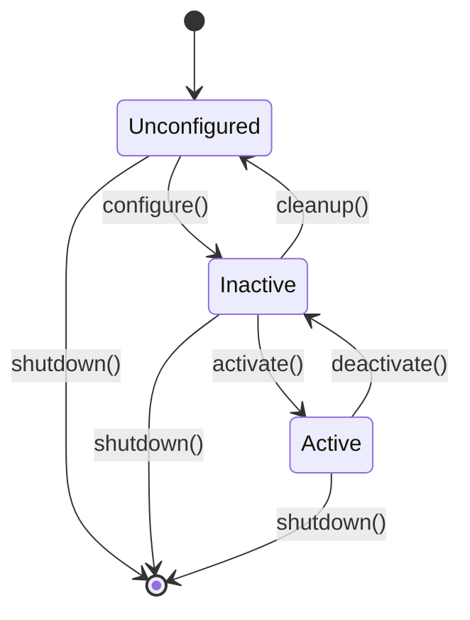

# Chapter 4: Python rclpy Deep Dive

## Introduction

The `rclpy` library is the Python client library for ROS 2. This chapter provides a comprehensive guide to mastering rclpy, covering node lifecycle, timers, callbacks, parameters, and advanced features.

## rclpy Library Overview

### Core Components



### Import Structure

```python
import rclpy
from rclpy.node import Node
from rclpy.qos import QoSProfile
from rclpy.parameter import Parameter
from rclpy.executors import SingleThreadedExecutor
```

## Node Lifecycle

Understanding the node lifecycle is crucial for proper resource management.

### Lifecycle States



### Basic Node Lifecycle

```python
import rclpy
from rclpy.node import Node

class LifecycleNode(Node):
    def __init__(self):
        super().__init__('lifecycle_node')
        self.get_logger().info('Node created (Unconfigured)')
    
    def configure(self):
        """Called when node is configured."""
        self.get_logger().info('Node configured (Inactive)')
        return True
    
    def activate(self):
        """Called when node is activated."""
        self.get_logger().info('Node activated (Active)')
        return True
    
    def deactivate(self):
        """Called when node is deactivated."""
        self.get_logger().info('Node deactivated (Inactive)')
        return True
    
    def cleanup(self):
        """Called when node is cleaned up."""
        self.get_logger().info('Node cleaned up (Unconfigured)')
        return True
    
    def shutdown(self):
        """Called when node is shut down."""
        self.get_logger().info('Node shut down')
        return True
```

### Standard Node Lifecycle

For standard nodes (non-lifecycle), the lifecycle is simpler:

```python
def main(args=None):
    # 1. Initialize ROS 2
    rclpy.init(args=args)
    
    # 2. Create node
    node = MyNode()
    
    try:
        # 3. Spin (keep node alive)
        rclpy.spin(node)
    except KeyboardInterrupt:
        # 4. Handle interruption
        node.get_logger().info('Interrupted')
    finally:
        # 5. Cleanup
        node.destroy_node()
        rclpy.shutdown()
```

## Timers and Callbacks

Timers are essential for periodic operations in ROS 2 nodes.

### Creating Timers

```python
class TimerNode(Node):
    def __init__(self):
        super().__init__('timer_node')
        
        # Create timer with period and callback
        self.timer = self.create_timer(
            1.0,  # Period in seconds
            self.timer_callback
        )
    
    def timer_callback(self):
        """Called periodically by timer."""
        self.get_logger().info('Timer callback executed')
```

### Timer Types

```python
# Wall timer (real-time)
self.wall_timer = self.create_timer(1.0, self.wall_callback)

# Rate-based timer
import time
last_time = time.time()
rate = 10.0  # Hz

def rate_callback(self):
    current_time = time.time()
    if current_time - last_time >= 1.0 / rate:
        # Execute callback
        self.do_work()
        last_time = current_time
```

### Multiple Timers

```python
class MultiTimerNode(Node):
    def __init__(self):
        super().__init__('multi_timer_node')
        
        # Fast timer (10 Hz)
        self.fast_timer = self.create_timer(0.1, self.fast_callback)
        
        # Slow timer (1 Hz)
        self.slow_timer = self.create_timer(1.0, self.slow_callback)
    
    def fast_callback(self):
        """Called 10 times per second."""
        self.get_logger().debug('Fast callback')
    
    def slow_callback(self):
        """Called once per second."""
        self.get_logger().info('Slow callback')
```

### Timer Management

```python
class ManagedTimerNode(Node):
    def __init__(self):
        super().__init__('managed_timer_node')
        
        self.timer = self.create_timer(1.0, self.timer_callback)
        self.timer_running = True
    
    def timer_callback(self):
        if not self.timer_running:
            return
        
        self.get_logger().info('Timer running')
    
    def stop_timer(self):
        """Stop the timer."""
        self.timer_running = False
        self.timer.cancel()
    
    def restart_timer(self):
        """Restart the timer."""
        self.timer_running = True
        self.timer = self.create_timer(1.0, self.timer_callback)
```

## Callback Functions

Callbacks are functions called in response to events. Understanding callback behavior is crucial.

### Callback Execution

```python
class CallbackNode(Node):
    def __init__(self):
        super().__init__('callback_node')
        
        # Subscription callback
        self.subscription = self.create_subscription(
            String,
            'topic',
            self.subscription_callback,
            10
        )
        
        # Service callback
        self.service = self.create_service(
            MyService,
            'service',
            self.service_callback
        )
        
        # Timer callback
        self.timer = self.create_timer(1.0, self.timer_callback)
    
    def subscription_callback(self, msg):
        """Called when message received."""
        self.get_logger().info(f'Received: {msg.data}')
    
    def service_callback(self, request, response):
        """Called when service requested."""
        response.result = request.input * 2
        return response
    
    def timer_callback(self):
        """Called periodically."""
        self.get_logger().info('Timer tick')
```

### Callback Best Practices

1. **Keep callbacks fast**: Don't block in callbacks
2. **Avoid heavy computation**: Use threads or async for heavy work
3. **Handle errors**: Wrap callbacks in try-except
4. **Don't modify node state carelessly**: Be thread-safe

```python
def safe_callback(self, msg):
    """Safe callback with error handling."""
    try:
        # Process message
        result = self.process_message(msg)
        self.get_logger().info(f'Processed: {result}')
    except Exception as e:
        self.get_logger().error(f'Callback error: {e}')
```

### Callback Threading

```python
import threading

class ThreadedCallbackNode(Node):
    def __init__(self):
        super().__init__('threaded_callback_node')
        
        self.subscription = self.create_subscription(
            String,
            'topic',
            self.subscription_callback,
            10
        )
        
        self.work_queue = queue.Queue()
        self.worker_thread = threading.Thread(target=self.worker)
        self.worker_thread.start()
    
    def subscription_callback(self, msg):
        """Fast callback - just queue work."""
        self.work_queue.put(msg)
    
    def worker(self):
        """Worker thread for heavy processing."""
        while True:
            try:
                msg = self.work_queue.get(timeout=1.0)
                # Heavy processing here
                self.process_heavy_work(msg)
            except queue.Empty:
                continue
```

## Parameters

Parameters allow runtime configuration of nodes without code changes.

### Declaring Parameters

```python
class ParameterNode(Node):
    def __init__(self):
        super().__init__('parameter_node')
        
        # Declare parameters with default values
        self.declare_parameter('my_string', 'default_value')
        self.declare_parameter('my_int', 42)
        self.declare_parameter('my_double', 3.14)
        self.declare_parameter('my_bool', True)
        
        # Get parameter values
        my_string = self.get_parameter('my_string').get_parameter_value().string_value
        my_int = self.get_parameter('my_int').get_parameter_value().integer_value
        
        self.get_logger().info(f'String: {my_string}, Int: {my_int}')
```

### Parameter Descriptors

```python
from rclpy.parameter import ParameterDescriptor
from rcl_interfaces.msg import ParameterType

class DescribedParameterNode(Node):
    def __init__(self):
        super().__init__('described_parameter_node')
        
        # Parameter with description
        descriptor = ParameterDescriptor(
            description='A string parameter for configuration',
            type=ParameterType.PARAMETER_STRING,
            read_only=False
        )
        
        self.declare_parameter('config_string', 'default', descriptor)
```

### Parameter Constraints

```python
from rcl_interfaces.msg import IntegerRange, FloatingPointRange

class ConstrainedParameterNode(Node):
    def __init__(self):
        super().__init__('constrained_parameter_node')
        
        # Integer with range
        int_descriptor = ParameterDescriptor(
            description='Integer between 0 and 100',
            integer_range=[IntegerRange(from_value=0, to_value=100, step=1)]
        )
        self.declare_parameter('my_int', 50, int_descriptor)
        
        # Double with range
        double_descriptor = ParameterDescriptor(
            description='Double between 0.0 and 1.0',
            floating_point_range=[FloatingPointRange(from_value=0.0, to_value=1.0, step=0.1)]
        )
        self.declare_parameter('my_double', 0.5, double_descriptor)
```

### Setting Parameters at Runtime

```python
class DynamicParameterNode(Node):
    def __init__(self):
        super().__init__('dynamic_parameter_node')
        
        self.declare_parameter('threshold', 10.0)
        
        # Service to update parameter
        self.service = self.create_service(
            SetParameters,
            'set_parameters',
            self.set_parameters_callback
        )
    
    def set_parameters_callback(self, request, response):
        """Update parameters via service."""
        for param in request.parameters:
            if param.name == 'threshold':
                self.set_parameters([param])
                response.results.append(
                    SetParametersResult(successful=True)
                )
        return response
```

## Executors

Executors control how callbacks are executed. Understanding executors is key to performance.

### Single-Threaded Executor

```python
from rclpy.executors import SingleThreadedExecutor

def main(args=None):
    rclpy.init(args=args)
    
    node1 = Node1()
    node2 = Node2()
    
    executor = SingleThreadedExecutor()
    executor.add_node(node1)
    executor.add_node(node2)
    
    try:
        executor.spin()
    except KeyboardInterrupt:
        pass
    finally:
        executor.shutdown()
        rclpy.shutdown()
```

### Multi-Threaded Executor

```python
from rclpy.executors import MultiThreadedExecutor
import threading

def main(args=None):
    rclpy.init(args=args)
    
    node1 = Node1()
    node2 = Node2()
    
    executor = MultiThreadedExecutor(num_threads=4)
    executor.add_node(node1)
    executor.add_node(node2)
    
    try:
        executor.spin()
    except KeyboardInterrupt:
        pass
    finally:
        executor.shutdown()
        rclpy.shutdown()
```

### Custom Executor

```python
from rclpy.executors import Executor

class CustomExecutor(Executor):
    def __init__(self):
        super().__init__()
        self.priority_queue = []
    
    def spin_once(self, timeout_sec=None):
        """Custom spin logic with priorities."""
        # Implement custom callback scheduling
        pass
```

## Complete Working Examples

### Example 1: Sensor Fusion Node

```python
#!/usr/bin/env python3
"""
Sensor Fusion Node

Combines data from multiple sensors with timers and callbacks.
"""

import rclpy
from rclpy.node import Node
from std_msgs.msg import Float32
from sensor_msgs.msg import Imu
import numpy as np


class SensorFusionNode(Node):
    """Fuses data from multiple sensors."""
    
    def __init__(self):
        super().__init__('sensor_fusion_node')
        
        # Declare parameters
        self.declare_parameter('fusion_rate', 10.0)
        self.declare_parameter('alpha', 0.8)  # Filter coefficient
        
        # Get parameters
        fusion_rate = self.get_parameter('fusion_rate').value
        self.alpha = self.get_parameter('alpha').value
        
        # Subscribers
        self.temp_sub = self.create_subscription(
            Float32,
            'temperature',
            self.temp_callback,
            10
        )
        
        self.imu_sub = self.create_subscription(
            Imu,
            'imu',
            self.imu_callback,
            10
        )
        
        # Publisher
        self.fused_pub = self.create_publisher(
            Float32,
            'fused_data',
            10
        )
        
        # State
        self.temperature = 0.0
        self.acceleration = 0.0
        self.fused_value = 0.0
        
        # Timer for fusion
        timer_period = 1.0 / fusion_rate
        self.timer = self.create_timer(timer_period, self.fusion_callback)
        
        self.get_logger().info('Sensor fusion node started')
    
    def temp_callback(self, msg):
        """Handle temperature data."""
        self.temperature = msg.data
    
    def imu_callback(self, msg):
        """Handle IMU data."""
        # Extract acceleration magnitude
        accel = msg.linear_acceleration
        self.acceleration = np.sqrt(
            accel.x**2 + accel.y**2 + accel.z**2
        )
    
    def fusion_callback(self):
        """Fuse sensor data."""
        # Simple weighted fusion
        self.fused_value = (
            self.alpha * self.fused_value +
            (1 - self.alpha) * (self.temperature + self.acceleration)
        )
        
        # Publish fused data
        msg = Float32()
        msg.data = self.fused_value
        self.fused_pub.publish(msg)
        
        self.get_logger().info(
            f'Fused: {self.fused_value:.2f} '
            f'(T: {self.temperature:.2f}, A: {self.acceleration:.2f})'
        )


def main(args=None):
    rclpy.init(args=args)
    node = SensorFusionNode()
    
    try:
        rclpy.spin(node)
    except KeyboardInterrupt:
        node.get_logger().info('Shutting down...')
    finally:
        node.destroy_node()
        rclpy.shutdown()


if __name__ == '__main__':
    main()
```

### Example 2: State Machine Node

```python
#!/usr/bin/env python3
"""
State Machine Node

Demonstrates state management with timers and callbacks.
"""

import rclpy
from rclpy.node import Node
from std_msgs.msg import String
from enum import Enum


class RobotState(Enum):
    IDLE = 'idle'
    MOVING = 'moving'
    STOPPED = 'stopped'
    ERROR = 'error'


class StateMachineNode(Node):
    """Node with state machine logic."""
    
    def __init__(self):
        super().__init__('state_machine_node')
        
        # State
        self.state = RobotState.IDLE
        
        # Publisher
        self.state_pub = self.create_publisher(
            String,
            'robot_state',
            10
        )
        
        # Timer for state updates
        self.timer = self.create_timer(0.5, self.state_callback)
        
        # Subscriber for commands
        self.cmd_sub = self.create_subscription(
            String,
            'command',
            self.command_callback,
            10
        )
        
        self.get_logger().info('State machine node started')
    
    def command_callback(self, msg):
        """Handle commands."""
        cmd = msg.data.lower()
        
        if cmd == 'start' and self.state == RobotState.IDLE:
            self.state = RobotState.MOVING
            self.get_logger().info('State: IDLE -> MOVING')
        elif cmd == 'stop' and self.state == RobotState.MOVING:
            self.state = RobotState.STOPPED
            self.get_logger().info('State: MOVING -> STOPPED')
        elif cmd == 'reset' and self.state == RobotState.STOPPED:
            self.state = RobotState.IDLE
            self.get_logger().info('State: STOPPED -> IDLE')
        else:
            self.get_logger().warn(f'Invalid command: {cmd} in state: {self.state}')
    
    def state_callback(self):
        """Publish current state."""
        msg = String()
        msg.data = self.state.value
        self.state_pub.publish(msg)


def main(args=None):
    rclpy.init(args=args)
    node = StateMachineNode()
    
    try:
        rclpy.spin(node)
    except KeyboardInterrupt:
        node.get_logger().info('Shutting down...')
    finally:
        node.destroy_node()
        rclpy.shutdown()


if __name__ == '__main__':
    main()
```

## Advanced Features

### Logging Configuration

```python
# Set log level
self.get_logger().set_level(rclpy.logging.LoggingSeverity.DEBUG)

# Log with different levels
self.get_logger().debug('Debug message')
self.get_logger().info('Info message')
self.get_logger().warn('Warning message')
self.get_logger().error('Error message')
```

### Clock and Time

```python
# Get current time
now = self.get_clock().now()
self.get_logger().info(f'Current time: {now}')

# Create duration
from rclpy.duration import Duration
duration = Duration(seconds=5, nanoseconds=0)

# Sleep
import time
time.sleep(1.0)
```

### Node Namespaces

```python
# Create node in namespace
node = Node('my_node', namespace='robot1')

# Topics will be: /robot1/my_topic
```

## Best Practices

1. **Always initialize rclpy**: Call `rclpy.init()` before creating nodes
2. **Clean shutdown**: Always call `rclpy.shutdown()` in finally block
3. **Handle exceptions**: Wrap callbacks in try-except
4. **Use parameters**: Don't hardcode values
5. **Manage timers**: Cancel timers when not needed
6. **Thread safety**: Be careful with shared state in callbacks

## Common Errors and Solutions

### Error 1: "rclpy.init() not called"

```python
# Problem
node = MyNode()  # Error!

# Solution
rclpy.init(args=args)
node = MyNode()
```

### Error 2: "Timer callback blocking"

```python
# Problem: Heavy work in callback
def timer_callback(self):
    heavy_computation()  # Blocks other callbacks

# Solution: Use threads or async
def timer_callback(self):
    threading.Thread(target=heavy_computation).start()
```

### Error 3: "Parameter not declared"

```python
# Problem
value = self.get_parameter('my_param').value  # Error!

# Solution
self.declare_parameter('my_param', default_value)
value = self.get_parameter('my_param').value
```

## Exercises

### Exercise 1: Parameter-Driven Node

Create a node with multiple parameters that control its behavior (publish rate, message content, etc.).

### Exercise 2: Multi-Timer Coordination

Create a node with multiple timers that coordinate (e.g., one timer collects data, another processes it).

### Exercise 3: Callback Queue Management

Implement a node that manages callback execution with priorities.

## Next Steps

Continue learning:
- [Chapter 5: URDF Basics](./05-urdf-basics.md) - Create robot models
- [Chapter 6: Launch Files](./06-launch-files.md) - Orchestrate multiple nodes

