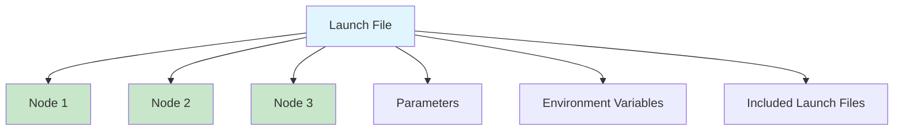

# Chapter 6: Launch Files

## Launch System Overview

Launch files in ROS 2 allow you to start multiple nodes, set parameters, and configure your entire robot system with a single command. This chapter covers creating Python launch files, managing multi-node systems, and advanced launch configurations.

### Why Launch Files?

Launch files provide:
- **Orchestration**: Start multiple nodes simultaneously
- **Configuration**: Set parameters consistently
- **Reproducibility**: Same setup every time
- **Documentation**: Clear system configuration
- **Flexibility**: Conditional launching, arguments, includes

### Launch File Architecture



## Python Launch Files

ROS 2 uses Python for launch files (unlike ROS 1's XML). This provides more flexibility and programmability.

### Basic Launch File Structure

```python
from launch import LaunchDescription
from launch_ros.actions import Node

def generate_launch_description():
    return LaunchDescription([
        # Launch actions here
    ])
```

### Simple Launch File Example

```python
#!/usr/bin/env python3
"""
Simple Launch File

Launches a single node.
"""

from launch import LaunchDescription
from launch_ros.actions import Node

def generate_launch_description():
    return LaunchDescription([
        Node(
            package='my_package',
            executable='my_node',
            name='my_node',
            output='screen'
        )
    ])
```

### Running Launch Files

```bash
# Basic launch
ros2 launch my_package my_launch.py

# With arguments
ros2 launch my_package my_launch.py arg1:=value1 arg2:=value2
```

## Multi-Node Systems

### Launching Multiple Nodes

```python
from launch import LaunchDescription
from launch_ros.actions import Node

def generate_launch_description():
    return LaunchDescription([
        # Sensor node
        Node(
            package='sensor_package',
            executable='sensor_node',
            name='sensor_node',
            output='screen'
        ),
        
        # Processing node
        Node(
            package='processing_package',
            executable='processor_node',
            name='processor_node',
            output='screen'
        ),
        
        # Control node
        Node(
            package='control_package',
            executable='controller_node',
            name='controller_node',
            output='screen'
        ),
    ])
```

### Robot System Example

```python
from launch import LaunchDescription
from launch_ros.actions import Node

def generate_launch_description():
    return LaunchDescription([
        # Robot State Publisher
        Node(
            package='robot_state_publisher',
            executable='robot_state_publisher',
            name='robot_state_publisher',
            parameters=[{'robot_description': robot_description}]
        ),
        
        # Joint State Publisher (for simulation)
        Node(
            package='joint_state_publisher',
            executable='joint_state_publisher',
            name='joint_state_publisher'
        ),
        
        # Sensor nodes
        Node(
            package='camera_package',
            executable='camera_node',
            name='camera_node'
        ),
        
        Node(
            package='lidar_package',
            executable='lidar_node',
            name='lidar_node'
        ),
        
        # Navigation stack
        Node(
            package='nav2_bringup',
            executable='nav2_bringup',
            name='nav2_bringup'
        ),
    ])
```

## Parameters in Launch Files

### Setting Parameters

```python
Node(
    package='my_package',
    executable='my_node',
    parameters=[{
        'param1': 'value1',
        'param2': 42,
        'param3': 3.14,
        'param4': True
    }]
)
```

### Loading Parameter Files

```python
import os
from ament_index_python.packages import get_package_share_directory

def generate_launch_description():
    # Get path to parameter file
    config_file = os.path.join(
        get_package_share_directory('my_package'),
        'config',
        'params.yaml'
    )
    
    return LaunchDescription([
        Node(
            package='my_package',
            executable='my_node',
            parameters=[config_file]  # Load from YAML
        )
    ])
```

### Parameter File Example (params.yaml)

```yaml
my_node:
  ros__parameters:
    sensor_rate: 10.0
    max_velocity: 1.0
    threshold: 0.5
    enable_logging: true
    robot_name: "robot1"
```

### Multiple Parameter Sources

```python
Node(
    package='my_package',
    executable='my_node',
    parameters=[
        config_file,  # From YAML
        {
            'override_param': 'new_value'  # Override specific param
        }
    ]
)
```

## Launch Arguments

Arguments make launch files flexible and reusable.

### Declaring Arguments

```python
from launch import LaunchDescription
from launch.actions import DeclareLaunchArgument
from launch.substitutions import LaunchConfiguration

def generate_launch_description():
    return LaunchDescription([
        # Declare arguments
        DeclareLaunchArgument(
            'robot_name',
            default_value='robot1',
            description='Name of the robot'
        ),
        
        DeclareLaunchArgument(
            'use_sim_time',
            default_value='false',
            description='Use simulation time'
        ),
        
        # Use arguments in nodes
        Node(
            package='my_package',
            executable='my_node',
            parameters=[{
                'robot_name': LaunchConfiguration('robot_name'),
                'use_sim_time': LaunchConfiguration('use_sim_time')
            }]
        )
    ])
```

### Using Arguments

```bash
# Use default values
ros2 launch my_package my_launch.py

# Override arguments
ros2 launch my_package my_launch.py \
    robot_name:=robot2 \
    use_sim_time:=true
```

### Conditional Launching

```python
from launch.conditions import IfCondition, UnlessCondition
from launch.substitutions import LaunchConfiguration

def generate_launch_description():
    use_sim = LaunchConfiguration('use_sim')
    
    return LaunchDescription([
        DeclareLaunchArgument(
            'use_sim',
            default_value='false'
        ),
        
        # Launch simulation node if use_sim is true
        Node(
            package='gazebo_ros',
            executable='gazebo',
            condition=IfCondition(use_sim)
        ),
        
        # Launch hardware node if use_sim is false
        Node(
            package='hardware_package',
            executable='hardware_node',
            condition=UnlessCondition(use_sim)
        )
    ])
```

## Including Other Launch Files

### Including Launch Files

```python
from launch.actions import IncludeLaunchDescription
from launch.launch_description_sources import PythonLaunchDescriptionSource
import os
from ament_index_python.packages import get_package_share_directory

def generate_launch_description():
    # Path to included launch file
    included_launch = os.path.join(
        get_package_share_directory('other_package'),
        'launch',
        'other.launch.py'
    )
    
    return LaunchDescription([
        # Include another launch file
        IncludeLaunchDescription(
            PythonLaunchDescriptionSource(included_launch)
        ),
        
        # Your own nodes
        Node(
            package='my_package',
            executable='my_node'
        )
    ])
```

### Passing Arguments to Included Files

```python
IncludeLaunchDescription(
    PythonLaunchDescriptionSource(included_launch),
    launch_arguments={
        'arg1': 'value1',
        'arg2': LaunchConfiguration('my_arg')
    }.items()
)
```

## Environment Variables

### Setting Environment Variables

```python
from launch.actions import SetEnvironmentVariable

def generate_launch_description():
    return LaunchDescription([
        SetEnvironmentVariable('ROS_DOMAIN_ID', '42'),
        SetEnvironmentVariable('GAZEBO_MODEL_PATH', '/path/to/models'),
        
        Node(
            package='my_package',
            executable='my_node'
        )
    ])
```

## Complete Example: Robot Launch System

Here's a complete launch file for a robot system:

```python
#!/usr/bin/env python3
"""
Complete Robot Launch File

Launches a complete robot system with sensors, processing, and control.
"""

from launch import LaunchDescription
from launch.actions import DeclareLaunchArgument, IncludeLaunchDescription
from launch.conditions import IfCondition
from launch.launch_description_sources import PythonLaunchDescriptionSource
from launch.substitutions import LaunchConfiguration
from launch_ros.actions import Node
import os
from ament_index_python.packages import get_package_share_directory


def generate_launch_description():
    # Get package directories
    robot_pkg = get_package_share_directory('my_robot_package')
    nav2_pkg = get_package_share_directory('nav2_bringup')
    
    # Declare launch arguments
    use_sim_time = LaunchConfiguration('use_sim_time')
    robot_name = LaunchConfiguration('robot_name')
    
    # URDF file path
    urdf_file = os.path.join(robot_pkg, 'urdf', 'robot.urdf')
    with open(urdf_file, 'r') as f:
        robot_description = f.read()
    
    # Parameter files
    nav2_params = os.path.join(robot_pkg, 'config', 'nav2_params.yaml')
    sensor_params = os.path.join(robot_pkg, 'config', 'sensor_params.yaml')
    
    return LaunchDescription([
        # Launch arguments
        DeclareLaunchArgument(
            'use_sim_time',
            default_value='false',
            description='Use simulation time'
        ),
        
        DeclareLaunchArgument(
            'robot_name',
            default_value='robot1',
            description='Robot name'
        ),
        
        # Robot State Publisher
        Node(
            package='robot_state_publisher',
            executable='robot_state_publisher',
            name='robot_state_publisher',
            parameters=[{
                'robot_description': robot_description,
                'use_sim_time': use_sim_time
            }],
            output='screen'
        ),
        
        # Joint State Publisher (for simulation)
        Node(
            package='joint_state_publisher',
            executable='joint_state_publisher',
            name='joint_state_publisher',
            condition=IfCondition(use_sim_time),
            output='screen'
        ),
        
        # Camera Node
        Node(
            package='camera_package',
            executable='camera_node',
            name='camera_node',
            parameters=[sensor_params],
            output='screen'
        ),
        
        # LiDAR Node
        Node(
            package='lidar_package',
            executable='lidar_node',
            name='lidar_node',
            parameters=[sensor_params],
            output='screen'
        ),
        
        # Processing Node
        Node(
            package='processing_package',
            executable='processor_node',
            name='processor_node',
            parameters=[{
                'robot_name': robot_name
            }],
            output='screen'
        ),
        
        # Navigation Stack
        IncludeLaunchDescription(
            PythonLaunchDescriptionSource(
                os.path.join(nav2_pkg, 'launch', 'navigation2.launch.py')
            ),
            launch_arguments={
                'params_file': nav2_params,
                'use_sim_time': use_sim_time
            }.items()
        ),
        
        # Control Node
        Node(
            package='control_package',
            executable='controller_node',
            name='controller_node',
            parameters=[{
                'robot_name': robot_name,
                'use_sim_time': use_sim_time
            }],
            output='screen'
        )
    ])
```

## Advanced Launch Features

### Group Actions

```python
from launch.actions import GroupAction
from launch_ros.actions import PushRosNamespace

def generate_launch_description():
    return LaunchDescription([
        GroupAction([
            PushRosNamespace('robot1'),
            Node(
                package='my_package',
                executable='my_node',
                name='node1'
            ),
            Node(
                package='my_package',
                executable='my_node',
                name='node2'
            )
        ])
    ])
```

### Timer Actions

```python
from launch.actions import TimerAction

def generate_launch_description():
    return LaunchDescription([
        # Start immediately
        Node(
            package='package1',
            executable='node1'
        ),
        
        # Start after 5 seconds
        TimerAction(
            period=5.0,
            actions=[
                Node(
                    package='package2',
                    executable='node2'
                )
            ]
        )
    ])
```

### Logging Configuration

```python
from launch.actions import LogInfo

def generate_launch_description():
    return LaunchDescription([
        LogInfo(msg='Starting robot system...'),
        
        Node(
            package='my_package',
            executable='my_node'
        ),
        
        LogInfo(msg='Robot system started')
    ])
```

## Best Practices

1. **Organize launch files**: Create separate launch files for different scenarios
2. **Use arguments**: Make launch files flexible with arguments
3. **Document parameters**: Include descriptions for all arguments
4. **Test incrementally**: Test each node before combining
5. **Use includes**: Reuse common launch configurations
6. **Set output**: Use `output='screen'` for debugging
7. **Handle errors**: Check file paths and package existence

## Common Errors and Solutions

### Error 1: "Package not found"

**Problem**: Package doesn't exist or not in workspace.

**Solution**: 
```bash
# Build package first
colcon build --packages-select my_package
source install/setup.bash
```

### Error 2: "Executable not found"

**Problem**: Executable name doesn't match setup.py entry point.

**Solution**: Check `setup.py`:
```python
entry_points={
    'console_scripts': [
        'executable_name = package.module:main',
    ],
},
```

### Error 3: "Parameter file not found"

**Problem**: Parameter file path is incorrect.

**Solution**: Use `get_package_share_directory()`:
```python
config_file = os.path.join(
    get_package_share_directory('my_package'),
    'config',
    'params.yaml'
)
```

## Exercises

### Exercise 1: Multi-Robot Launch

Create a launch file that starts multiple robots with different namespaces.

### Exercise 2: Conditional System

Create a launch file that can launch either simulation or hardware based on an argument.

### Exercise 3: Modular Launch

Break down a complex system into multiple launch files and include them.

## Module 1 Summary

Congratulations! You've completed Module 1: ROS 2 Fundamentals. You now understand:

- ✅ ROS 2 architecture and installation
- ✅ Nodes and topics (publish-subscribe)
- ✅ Services and actions (request-response, long-running tasks)
- ✅ Python rclpy library (timers, callbacks, parameters)
- ✅ URDF robot descriptions
- ✅ Launch files (orchestrating systems)

## Next Steps

Continue your learning journey:
- **Module 2: Simulation & Gazebo** - Create and simulate robots
- **Module 3: AI-Powered Perception** - Computer vision and SLAM
- **Module 4: Vision-Language-Action** - Natural language control

Ready to build amazing robots! 🤖

