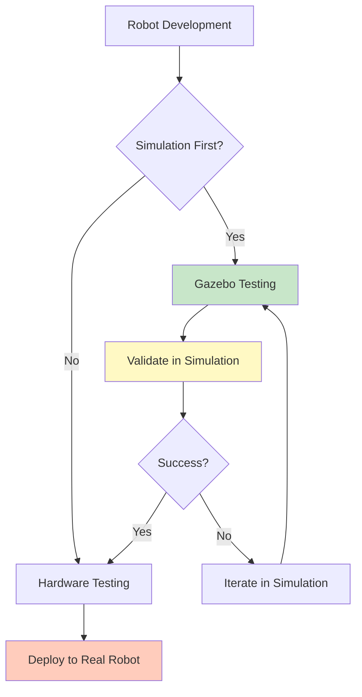
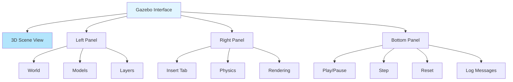

# Chapter 1: Gazebo Introduction

## What is Gazebo and Why Simulation?

Gazebo is a powerful 3D physics simulator that enables you to test robots in realistic virtual environments before deploying to real hardware. It's one of the most widely used simulation tools in robotics, providing a safe, cost-effective way to develop, test, and validate robotic systems.

### Why Use Simulation?

Simulation offers numerous advantages over working directly with hardware:

1. **Cost-Effective**: No need for expensive robots during development
2. **Safe Testing**: Test dangerous scenarios without risk
3. **Rapid Iteration**: Faster development cycles
4. **Reproducible**: Same conditions every time
5. **Scalable**: Test with multiple robots simultaneously
6. **Debugging**: Easier to inspect and debug systems
7. **Training**: Generate synthetic data for machine learning

### Gazebo's Role in Robotics



### Key Features of Gazebo

- **Physics Simulation**: Realistic dynamics using ODE, Bullet, or Simbody
- **Sensor Simulation**: Cameras, LiDAR, IMU, force/torque sensors
- **3D Rendering**: High-quality visualization with OGRE
- **Plugin System**: Extensible architecture
- **ROS Integration**: Seamless connection with ROS 2
- **Model Library**: Extensive collection of pre-built models

## Installation on Ubuntu 22.04

### Prerequisites

```bash
# Update system
sudo apt update && sudo apt upgrade -y

# Install basic dependencies
sudo apt install -y \
    lsb-release \
    wget \
    gnupg \
    software-properties-common
```

### Install ROS 2 Humble (if not already installed)

Gazebo works best with ROS 2. If you haven't installed ROS 2 Humble:

```bash
# Add ROS 2 repository
sudo apt install software-properties-common
sudo add-apt-repository universe
sudo apt update && sudo apt install curl -y

# Add ROS 2 GPG key
sudo curl -sSL https://raw.githubusercontent.com/ros/rosdistro/master/ros.asc | sudo apt-key add -

# Add ROS 2 repository
sudo sh -c 'echo "deb [arch=$(dpkg --print-architecture)] http://packages.ros.org/ros2/ubuntu $(lsb_release -cs) main" > /etc/apt/sources.list.d/ros2-latest.list'

# Install ROS 2
sudo apt update
sudo apt install ros-humble-desktop -y
```

### Install Gazebo

Gazebo comes in different versions. For ROS 2 Humble, we'll use Gazebo Classic (Gazebo 11):

```bash
# Install Gazebo Classic
sudo apt install -y \
    gazebo11 \
    libgazebo11-dev \
    gazebo11-plugin-base \
    libgazebo11-plugin-base

# Install ROS 2 Gazebo packages
sudo apt install -y \
    ros-humble-gazebo-ros-pkgs \
    ros-humble-gazebo-plugins \
    ros-humble-gazebo-ros
```

### Install Additional Tools

```bash
# Install Gazebo models (optional but recommended)
cd ~
git clone https://github.com/osrf/gazebo_models.git
mkdir -p ~/.gazebo/models
cp -r gazebo_models/* ~/.gazebo/models/

# Install development tools
sudo apt install -y \
    python3-pip \
    python3-colcon-common-extensions
```

### Verify Installation

```bash
# Test Gazebo
gazebo --version
# Should output: gazebo11

# Test ROS 2 integration
source /opt/ros/humble/setup.bash
ros2 run gazebo_ros gazebo
```

### Common Installation Issues

**Issue 1: Gazebo won't start (display errors)**

```bash
# Solution: Set display (for headless systems)
export DISPLAY=:0
# Or install virtual display
sudo apt install xvfb
```

**Issue 2: Missing models**

```bash
# Solution: Set model path
export GAZEBO_MODEL_PATH=$HOME/.gazebo/models:$GAZEBO_MODEL_PATH
```

**Issue 3: Permission errors**

```bash
# Solution: Fix permissions
sudo chown -R $USER:$USER ~/.gazebo
```

## Interface Tour

When you launch Gazebo, you'll see a comprehensive interface with multiple panels and tools.

### Main Window Components



### 3D Scene View

The main 3D viewport where you see your simulation:
- **Navigation**: 
  - Left-click + drag: Rotate view
  - Middle-click + drag: Pan view
  - Scroll: Zoom in/out
  - Right-click: Context menu
- **Selection**: Click objects to select them
- **Grid**: Ground plane for reference

### Left Panel: World/Models

- **World Tab**: Shows world hierarchy
  - Models in the scene
  - Links and joints
  - Properties
- **Models Tab**: Available models to insert
  - Search functionality
  - Categories (robots, objects, etc.)

### Right Panel: Tools

- **Insert Tab**: Drag models into scene
- **Physics Tab**: Physics engine settings
- **Rendering Tab**: Graphics settings
- **Scene Tab**: Scene properties

### Bottom Panel: Controls

- **Play/Pause**: Start/stop simulation
- **Step**: Advance one simulation step
- **Reset**: Reset simulation to initial state
- **Real-time Factor**: Shows simulation speed
- **Log Messages**: Error and info messages

### Keyboard Shortcuts

- `Space`: Play/Pause
- `Ctrl+R`: Reset simulation
- `Ctrl+Q`: Quit Gazebo
- `Ctrl+N`: New world
- `Ctrl+O`: Open world
- `Ctrl+S`: Save world

## First Simulation Example

Let's create your first simulation with a simple robot.

### Step 1: Launch Gazebo

```bash
# Launch empty world
gazebo

# Or with ROS 2
ros2 launch gazebo_ros gazebo.launch.py
```

### Step 2: Insert a Model

1. Click the **Insert** tab in the right panel
2. Find **Ground Plane** in the list
3. Drag it into the scene (or click to place at origin)

### Step 3: Add a Simple Robot

1. In the **Insert** tab, search for "box"
2. Drag a **Box** into the scene
3. Position it above the ground plane

### Step 4: Create a Simple URDF

Create a file `simple_robot.urdf`:

```xml
<?xml version="1.0"?>
<robot name="simple_robot">
  <link name="base_link">
    <visual>
      <geometry>
        <box size="0.5 0.5 0.5"/>
      </geometry>
      <material name="blue">
        <color rgba="0 0 1 1"/>
      </material>
    </visual>
    <collision>
      <geometry>
        <box size="0.5 0.5 0.5"/>
      </geometry>
    </collision>
    <inertial>
      <mass value="1.0"/>
      <inertia ixx="0.1" ixy="0" ixz="0"
               iyy="0.1" iyz="0" izz="0.1"/>
    </inertial>
  </link>
</robot>
```

### Step 5: Spawn Robot in Gazebo

```bash
# In a new terminal
source /opt/ros/humble/setup.bash

# Spawn robot
ros2 run gazebo_ros spawn_entity.py \
    -entity simple_robot \
    -file $(pwd)/simple_robot.urdf \
    -x 0 -y 0 -z 1.0
```

### Step 6: Add Physics

The robot should fall due to gravity. You'll see it drop and settle on the ground plane.

### Step 7: Control the Robot

Create a simple controller node `robot_controller.py`:

```python
#!/usr/bin/env python3
"""
Simple Robot Controller

Applies force to move the robot.
"""

import rclpy
from rclpy.node import Node
from geometry_msgs.msg import Wrench
from gazebo_msgs.srv import ApplyBodyWrench

class SimpleController(Node):
    def __init__(self):
        super().__init__('simple_controller')
        
        # Create service client
        self.client = self.create_client(
            ApplyBodyWrench,
            '/apply_body_wrench'
        )
        
        # Wait for service
        while not self.client.wait_for_service(timeout_sec=1.0):
            self.get_logger().info('Waiting for service...')
        
        # Timer to apply force
        self.timer = self.create_timer(0.1, self.apply_force)
    
    def apply_force(self):
        request = ApplyBodyWrench.Request()
        request.body_name = 'simple_robot::base_link'
        request.reference_frame = 'world'
        request.wrench.force.x = 1.0  # Push forward
        request.duration.sec = 0.1
        
        future = self.client.call_async(request)
        rclpy.spin_until_future_complete(self, future)

def main(args=None):
    rclpy.init(args=args)
    controller = SimpleController()
    rclpy.spin(controller)
    controller.destroy_node()
    rclpy.shutdown()

if __name__ == '__main__':
    main()
```

## World Files and Models

### Understanding World Files

World files (`.world`) define the simulation environment:

```xml
<?xml version="1.0"?>
<sdf version="1.6">
  <world name="my_world">
    <!-- Physics settings -->
    <physics type="ode">
      <max_step_size>0.001</max_step_size>
      <real_time_factor>1.0</real_time_factor>
    </physics>
    
    <!-- Scene settings -->
    <scene>
      <ambient>0.4 0.4 0.4 1</ambient>
      <background>0.7 0.7 0.7 1</background>
    </scene>
    
    <!-- Include models -->
    <include>
      <uri>model://ground_plane</uri>
    </include>
    
    <include>
      <uri>model://sun</uri>
    </include>
    
    <!-- Custom models -->
    <model name="my_robot">
      <!-- Model definition -->
    </model>
  </world>
</sdf>
```

### Creating a Custom World

Create `my_world.world`:

```xml
<?xml version="1.0"?>
<sdf version="1.6">
  <world name="test_world">
    <physics type="ode">
      <max_step_size>0.001</max_step_size>
      <real_time_factor>1.0</real_time_factor>
      <real_time_update_rate>1000</real_time_update_rate>
    </physics>
    
    <scene>
      <ambient>0.4 0.4 0.4 1</ambient>
      <background>0.7 0.7 0.7 1</background>
      <shadows>true</shadows>
    </scene>
    
    <!-- Ground plane -->
    <include>
      <uri>model://ground_plane</uri>
    </include>
    
    <!-- Lighting -->
    <include>
      <uri>model://sun</uri>
    </include>
    
    <!-- Obstacles -->
    <model name="box1">
      <pose>2 0 0.5 0 0 0</pose>
      <link name="link">
        <collision name="collision">
          <geometry>
            <box>
              <size>1 1 1</size>
            </box>
          </geometry>
        </collision>
        <visual name="visual">
          <geometry>
            <box>
              <size>1 1 1</size>
            </box>
          </geometry>
        </visual>
      </link>
    </model>
  </world>
</sdf>
```

### Launching Custom World

```bash
# Launch world file
gazebo my_world.world

# Or with ROS 2
ros2 launch gazebo_ros gazebo.launch.py world:=my_world.world
```

### Model Structure

Gazebo models are organized in directories:

```
~/.gazebo/models/
  my_model/
    model.config      # Model metadata
    model.sdf         # Model definition
    meshes/           # 3D meshes (optional)
      model.dae
    materials/        # Textures (optional)
```

### Creating a Simple Model

Create directory structure:

```bash
mkdir -p ~/.gazebo/models/my_box
cd ~/.gazebo/models/my_box
```

Create `model.config`:

```xml
<?xml version="1.0"?>
<model>
  <name>My Box</name>
  <version>1.0</version>
  <sdf version="1.6">model.sdf</sdf>
  <author>
    <name>Your Name</name>
    <email>your.email@example.com</email>
  </author>
  <description>
    A simple box model for testing
  </description>
</model>
```

Create `model.sdf`:

```xml
<?xml version="1.0"?>
<sdf version="1.6">
  <model name="my_box">
    <pose>0 0 0.5 0 0 0</pose>
    <static>false</static>
    <link name="link">
      <collision name="collision">
        <geometry>
          <box>
            <size>1 1 1</size>
          </box>
        </geometry>
      </collision>
      <visual name="visual">
        <geometry>
          <box>
            <size>1 1 1</size>
          </box>
        </geometry>
        <material>
          <script>
            <name>Gazebo/Red</name>
            <uri>file://media/materials/scripts/gazebo.material</uri>
          </script>
        </material>
      </visual>
      <inertial>
        <mass>1.0</mass>
        <inertia>
          <ixx>0.1</ixx>
          <iyy>0.1</iyy>
          <izz>0.1</izz>
        </inertia>
      </inertial>
    </link>
  </model>
</sdf>
```

Now your model appears in the Insert tab!

## Common Pitfalls

### Pitfall 1: Missing Inertial Properties

**Problem**: Model doesn't respond to physics.

**Solution**: Always include inertial properties:

```xml
<inertial>
  <mass value="1.0"/>
  <inertia ixx="0.1" ixy="0" ixz="0"
           iyy="0.1" iyz="0" izz="0.1"/>
</inertial>
```

### Pitfall 2: Complex Collision Geometry

**Problem**: Simulation runs slowly.

**Solution**: Use simple collision shapes:

```xml
<!-- Good: Simple box -->
<collision>
  <geometry>
    <box size="1 1 1"/>
  </geometry>
</collision>

<!-- Bad: Complex mesh -->
<collision>
  <geometry>
    <mesh filename="complex_model.dae"/>
  </geometry>
</collision>
```

### Pitfall 3: Wrong Coordinate Frames

**Problem**: Robot spawns in wrong position.

**Solution**: Check pose and origin tags:

```xml
<pose>x y z roll pitch yaw</pose>
<origin xyz="x y z" rpy="roll pitch yaw"/>
```

## Next Steps

Now that you understand Gazebo basics, continue to:
- [Chapter 2: URDF vs SDF](02-urdf-sdf.md) - Learn about robot description formats
- [Chapter 3: Physics Simulation](03-physics-simulation.md) - Master physics engines

