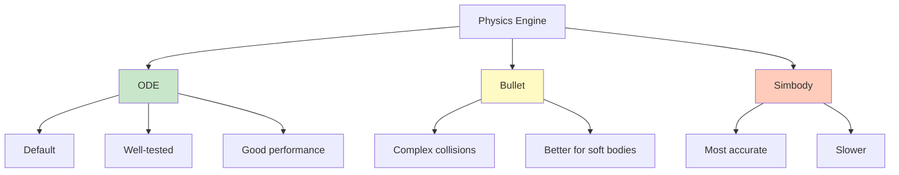

# Chapter 3: Physics Simulation

## Physics Engines Comparison

Gazebo supports multiple physics engines, each with different characteristics. Understanding which engine to use for your simulation is crucial for accuracy and performance.

### Available Physics Engines



### ODE (Open Dynamics Engine)

**Default engine in Gazebo**

- **Pros**:
  - Well-tested and stable
  - Good performance
  - Extensive documentation
  - Default choice for most simulations
- **Cons**:
  - Can have issues with complex contacts
  - Less accurate for some scenarios
- **Best For**: General-purpose robotics simulation

### Bullet Physics

**Alternative engine with better collision handling**

- **Pros**:
  - Better handling of complex collisions
  - Good for soft bodies
  - More stable contact resolution
- **Cons**:
  - Slightly slower than ODE
  - Less commonly used
- **Best For**: Complex contact scenarios, soft robotics

### Simbody

**Most accurate but slower**

- **Pros**:
  - Most physically accurate
  - Better for biomechanics
  - Precise constraint solving
- **Cons**:
  - Slowest performance
  - More complex configuration
- **Best For**: High-accuracy requirements, research

### Choosing the Right Engine

```python
# In world file or launch file
<physics type="ode">  # or "bullet" or "simbody"
  <max_step_size>0.001</max_step_size>
  <real_time_factor>1.0</real_time_factor>
</physics>
```

**Recommendation**: Start with ODE, switch to Bullet if you have contact issues, use Simbody only if you need maximum accuracy.

## Gravity Configuration

Gravity is a fundamental force in physics simulation. Configuring it correctly is essential for realistic behavior.

### Setting Gravity

```xml
<!-- In world file -->
<world name="my_world">
  <physics type="ode">
    <gravity>0 0 -9.81</gravity>  <!-- Earth gravity -->
    <!-- or -->
    <gravity>0 0 -1.62</gravity>  <!-- Moon gravity -->
    <!-- or -->
    <gravity>0 0 0</gravity>      <!-- No gravity -->
  </physics>
</world>
```

### Gravity in Different Environments

```python
# Earth: 9.81 m/s²
gravity_earth = [0, 0, -9.81]

# Moon: 1.62 m/s²
gravity_moon = [0, 0, -1.62]

# Mars: 3.71 m/s²
gravity_mars = [0, 0, -3.71]

# Space: 0 m/s²
gravity_space = [0, 0, 0]
```

### Per-Link Gravity Control

```xml
<!-- Disable gravity for specific link -->
<gazebo reference="floating_link">
  <turnGravityOff>true</turnGravityOff>
</gazebo>
```

## Friction and Contact

Friction determines how objects interact when in contact. Proper friction modeling is crucial for realistic robot behavior.

### Friction Configuration

```xml
<!-- In link definition -->
<link name="wheel">
  <collision name="collision">
    <surface>
      <friction>
        <ode>
          <mu>0.8</mu>        <!-- Static friction coefficient -->
          <mu2>0.6</mu2>       <!-- Dynamic friction coefficient -->
          <fdir1>0 0 0</fdir1> <!-- Friction direction -->
          <slip1>0.0</slip1>   <!-- Slip in direction 1 -->
          <slip2>0.0</slip2>   <!-- Slip in direction 2 -->
        </ode>
      </friction>
    </surface>
  </collision>
</link>
```

### Common Friction Coefficients

| Material | Static (μ) | Dynamic (μ₂) |
|----------|------------|---------------|
| Rubber on concrete | 0.9 | 0.7 |
| Metal on metal | 0.5 | 0.3 |
| Wood on wood | 0.4 | 0.2 |
| Ice on ice | 0.1 | 0.05 |
| Teflon on Teflon | 0.04 | 0.04 |

### Friction Example

```xml
<!-- High-friction wheel -->
<link name="high_friction_wheel">
  <collision name="collision">
    <surface>
      <friction>
        <ode>
          <mu>1.0</mu>
          <mu2>0.8</mu2>
        </ode>
      </friction>
    </surface>
  </collision>
</link>

<!-- Low-friction slider -->
<link name="low_friction_slider">
  <collision name="collision">
    <surface>
      <friction>
        <ode>
          <mu>0.1</mu>
          <mu2>0.05</mu2>
        </ode>
      </friction>
    </surface>
  </collision>
</link>
```

## Mass and Inertia

Mass and inertia properties determine how objects respond to forces. Accurate values are essential for realistic simulation.

### Mass Definition

```xml
<inertial>
  <mass value="10.0"/>  <!-- Kilograms -->
  <inertia ixx="0.4" ixy="0" ixz="0"
           iyy="0.4" iyz="0" izz="0.4"/>
</inertial>
```

### Inertia Matrix

The inertia matrix describes how mass is distributed:

```
I = [Ixx  Ixy  Ixz]
    [Ixy  Iyy  Iyz]
    [Ixz  Iyz  Izz]
```

- **Diagonal elements** (Ixx, Iyy, Izz): Moments of inertia
- **Off-diagonal elements** (Ixy, Ixz, Iyz): Products of inertia (usually 0 for symmetric objects)

### Calculating Inertia

For simple shapes:

**Box**:
```
Ixx = (1/12) * m * (h² + d²)
Iyy = (1/12) * m * (w² + d²)
Izz = (1/12) * m * (w² + h²)
```

**Cylinder** (axis along z):
```
Ixx = Iyy = (1/12) * m * (3*r² + h²)
Izz = (1/2) * m * r²
```

**Sphere**:
```
Ixx = Iyy = Izz = (2/5) * m * r²
```

### Inertia Example

```xml
<!-- Box: 1m x 0.5m x 0.3m, mass 10kg -->
<inertial>
  <mass value="10.0"/>
  <inertia ixx="0.283" ixy="0" ixz="0"
           iyy="0.458" iyz="0"
           izz="0.542"/>
</inertial>

<!-- Cylinder: radius 0.1m, height 0.5m, mass 5kg -->
<inertial>
  <mass value="5.0"/>
  <inertia ixx="0.021" ixy="0" ixz="0"
           iyy="0.021" iyz="0"
           izz="0.025"/>
</inertial>
```

### Center of Mass

```xml
<inertial>
  <origin xyz="0 0 0.1" rpy="0 0 0"/>  <!-- COM offset -->
  <mass value="10.0"/>
  <inertia ixx="0.4" ixy="0" ixz="0"
           iyy="0.4" iyz="0" izz="0.4"/>
</inertial>
```

## Physics Parameters

### Step Size

Controls simulation accuracy vs performance:

```xml
<physics type="ode">
  <max_step_size>0.001</max_step_size>  <!-- Smaller = more accurate but slower -->
</physics>
```

**Guidelines**:
- **0.0001**: Very high accuracy (slow)
- **0.001**: Good balance (default)
- **0.01**: Lower accuracy (fast)

### Real-Time Factor

Controls simulation speed relative to real time:

```xml
<real_time_factor>1.0</real_time_factor>  <!-- Real-time -->
```

- **1.0**: Real-time (1 second simulation = 1 second real time)
- **Greater than 1.0**: Faster than real-time
- **Less than 1.0**: Slower than real-time

### Solver Parameters (ODE)

```xml
<physics type="ode">
  <solver>
    <type>quick</type>        <!-- or "world" -->
    <iters>50</iters>         <!-- Solver iterations -->
    <sor>1.3</sor>            <!-- Successive Over-Relaxation -->
    <use_dynamic_moi_rescaling>1</use_dynamic_moi_rescaling>
  </solver>
  <constraints>
    <cfm>0.00001</cfm>        <!-- Constraint Force Mixing -->
    <erp>0.2</erp>            <!-- Error Reduction Parameter -->
    <contact_max_correcting_vel>100</contact_max_correcting_vel>
    <contact_surface_layer>0.001</contact_surface_layer>
  </constraints>
</physics>
```

## Debugging Physics

### Common Physics Issues

#### Issue 1: Objects Penetrating

**Symptoms**: Objects pass through each other

**Solutions**:
- Increase solver iterations
- Decrease step size
- Check collision geometries
- Increase contact surface layer

```xml
<constraints>
  <contact_surface_layer>0.01</contact_surface_layer>  <!-- Increase -->
</constraints>
```

#### Issue 2: Jittery Motion

**Symptoms**: Objects shake or vibrate

**Solutions**:
- Increase CFM (Constraint Force Mixing)
- Decrease ERP (Error Reduction Parameter)
- Check mass/inertia values
- Use proper damping

```xml
<constraints>
  <cfm>0.0001</cfm>  <!-- Increase for stability -->
  <erp>0.1</erp>     <!-- Decrease for stability -->
</constraints>
```

#### Issue 3: Objects Flying Away

**Symptoms**: Objects accelerate unexpectedly

**Solutions**:
- Check mass values (too small?)
- Verify inertia calculations
- Check for conflicting forces
- Review joint limits

#### Issue 4: Slow Simulation

**Symptoms**: Simulation runs slower than real-time

**Solutions**:
- Increase step size (carefully)
- Reduce solver iterations
- Simplify collision geometries
- Use simpler physics engine

### Physics Debug Visualization

Enable debug visualization to see forces and contacts:

```python
# In Python/Gazebo API
import gazebo_msgs.srv import GetPhysicsProperties

# Or in world file
<scene>
  <ambient>0.4 0.4 0.4 1</ambient>
  <shadows>true</shadows>
  <grid>true</grid>
</scene>
```

### Monitoring Physics

```bash
# Check real-time factor
gz stats

# Monitor physics performance
gz topic -e /gazebo/default/physics/contacts
```

## Performance Tips

### 1. Optimize Collision Geometries

```xml
<!-- Good: Simple box -->
<collision>
  <geometry>
    <box size="1 1 1"/>
  </geometry>
</collision>

<!-- Bad: Complex mesh -->
<collision>
  <geometry>
    <mesh filename="complex_model.dae"/>
  </geometry>
</collision>
```

### 2. Use Appropriate Step Size

```xml
<!-- Balance accuracy and performance -->
<max_step_size>0.001</max_step_size>  <!-- Good default -->
```

### 3. Limit Solver Iterations

```xml
<solver>
  <iters>50</iters>  <!-- Increase for accuracy, decrease for speed -->
</solver>
```

### 4. Simplify Models

- Use fewer links when possible
- Combine simple shapes
- Remove unnecessary details

### 5. Use Static Objects

```xml
<model name="static_wall">
  <static>true</static>  <!-- No physics computation -->
  <!-- ... -->
</model>
```

### 6. Optimize Contact Detection

```xml
<collision name="collision">
  <geometry>...</geometry>
  <max_contacts>10</max_contacts>  <!-- Limit contacts -->
</collision>
```

## Complete Physics Configuration Example

```xml
<?xml version="1.0"?>
<sdf version="1.6">
  <world name="optimized_world">
    <physics type="ode" name="default_physics" default="0" type="ode">
      <max_step_size>0.001</max_step_size>
      <real_time_factor>1.0</real_time_factor>
      <real_time_update_rate>1000</real_time_update_rate>
      
      <gravity>0 0 -9.81</gravity>
      
      <solver>
        <type>quick</type>
        <iters>50</iters>
        <sor>1.3</sor>
        <use_dynamic_moi_rescaling>1</use_dynamic_moi_rescaling>
      </solver>
      
      <constraints>
        <cfm>0.00001</cfm>
        <erp>0.2</erp>
        <contact_max_correcting_vel>100</contact_max_correcting_vel>
        <contact_surface_layer>0.001</contact_surface_layer>
      </constraints>
    </physics>
    
    <!-- Models with proper physics -->
    <model name="robot">
      <link name="base">
        <collision name="collision">
          <geometry>
            <box>
              <size>0.4 0.3 0.2</size>
            </box>
          </geometry>
          <surface>
            <friction>
              <ode>
                <mu>0.8</mu>
                <mu2>0.6</mu2>
              </ode>
            </friction>
          </surface>
        </collision>
        <inertial>
          <mass>5.0</mass>
          <inertia>
            <ixx>0.1</ixx>
            <iyy>0.1</iyy>
            <izz>0.1</izz>
          </inertia>
        </inertial>
      </link>
    </model>
  </world>
</sdf>
```

## Common Pitfalls

### Pitfall 1: Unrealistic Mass Values

**Problem**: Robot too light or too heavy

**Solution**: Research actual component weights and scale appropriately

### Pitfall 2: Incorrect Inertia

**Problem**: Robot rotates unrealistically

**Solution**: Calculate inertia properly or use CAD software

### Pitfall 3: Too Small Step Size

**Problem**: Simulation too slow

**Solution**: Balance accuracy and performance (0.001 is usually good)

### Pitfall 4: Missing Friction

**Problem**: Robot slides unrealistically

**Solution**: Set appropriate friction coefficients

## Next Steps

Continue learning:
- [Chapter 4: Sensor Simulation](04-sensor-simulation.md) - Add sensors to your robot
- [Chapter 5: Unity Integration](05-unity-integration.md) - High-fidelity rendering

