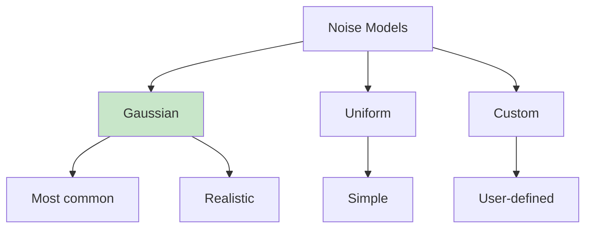

# Chapter 4: Sensor Simulation

## Introduction

Sensors are the eyes and ears of robots. Simulating sensors accurately in Gazebo is crucial for developing perception algorithms and testing robot behavior before deployment. This chapter covers camera, LiDAR, IMU sensors, noise models, ROS 2 integration, and visualization.

## Camera Sensors

Cameras are one of the most common sensors in robotics, providing visual information for navigation, object detection, and manipulation.

### Basic Camera Configuration

```xml
<gazebo reference="camera_link">
  <sensor type="camera" name="camera1">
    <update_rate>30</update_rate>
    <camera name="head">
      <horizontal_fov>1.047</horizontal_fov>  <!-- 60 degrees -->
      <image>
        <width>640</width>
        <height>480</height>
        <format>R8G8B8</format>
      </image>
      <clip>
        <near>0.02</near>
        <far>300</far>
      </clip>
    </camera>
    <plugin name="camera_controller" filename="libgazebo_ros_camera.so">
      <ros>
        <namespace>/camera</namespace>
      </ros>
      <camera_name>camera</camera_name>
      <frame_name>camera_link</frame_name>
      <hack_baseline>0.07</hack_baseline>
    </plugin>
  </sensor>
</gazebo>
```

### Camera Parameters Explained

- **update_rate**: Frames per second (Hz)
- **horizontal_fov**: Horizontal field of view in radians
- **width/height**: Image resolution in pixels
- **format**: Color format (R8G8B8, L8, etc.)
- **near/far**: Clipping planes (objects closer/farther are not rendered)

### Stereo Camera Setup

```xml
<!-- Left Camera -->
<gazebo reference="left_camera_link">
  <sensor type="camera" name="left_camera">
    <update_rate>30</update_rate>
    <camera name="left">
      <horizontal_fov>1.047</horizontal_fov>
      <image>
        <width>640</width>
        <height>480</height>
        <format>R8G8B8</format>
      </image>
    </camera>
    <plugin name="left_camera_controller" filename="libgazebo_ros_camera.so">
      <ros>
        <namespace>/left_camera</namespace>
      </ros>
      <camera_name>left</camera_name>
      <frame_name>left_camera_link</frame_name>
    </plugin>
  </sensor>
</gazebo>

<!-- Right Camera -->
<gazebo reference="right_camera_link">
  <sensor type="camera" name="right_camera">
    <update_rate>30</update_rate>
    <camera name="right">
      <horizontal_fov>1.047</horizontal_fov>
      <image>
        <width>640</width>
        <height>480</height>
        <format>R8G8B8</format>
      </image>
    </camera>
    <plugin name="right_camera_controller" filename="libgazebo_ros_camera.so">
      <ros>
        <namespace>/right_camera</namespace>
      </ros>
      <camera_name>right</camera_name>
      <frame_name>right_camera_link</frame_name>
      <hack_baseline>0.12</hack_baseline>  <!-- Stereo baseline -->
    </plugin>
  </sensor>
</gazebo>
```

### Depth Camera (RGB-D)

```xml
<gazebo reference="depth_camera_link">
  <sensor type="depth" name="depth_camera">
    <update_rate>30</update_rate>
    <camera name="depth">
      <horizontal_fov>1.047</horizontal_fov>
      <image>
        <width>640</width>
        <height>480</height>
        <format>R8G8B8</format>
      </image>
      <clip>
        <near>0.05</near>
        <far>10.0</far>
      </clip>
    </camera>
    <plugin name="depth_camera_controller" filename="libgazebo_ros_openni_kinect.so">
      <baseline>0.2</baseline>
      <alwaysOn>true</alwaysOn>
      <updateRate>1.0</updateRate>
      <cameraName>depth_camera</cameraName>
      <imageTopicName>rgb/image_raw</imageTopicName>
      <cameraInfoTopicName>rgb/camera_info</cameraInfoTopicName>
      <depthImageTopicName>depth/image_raw</depthImageTopicName>
      <depthImageCameraInfoTopicName>depth/camera_info</depthImageCameraInfoTopicName>
      <pointCloudTopicName>points</pointCloudTopicName>
      <frameName>depth_camera_link</frameName>
      <pointCloudCutoff>0.5</pointCloudCutoff>
      <pointCloudCutoffMax>3.0</pointCloudCutoffMax>
      <distortionK1>0</distortionK1>
      <distortionK2>0</distortionK2>
      <distortionK3>0</distortionK3>
      <distortionT1>0</distortionT1>
      <distortionT2>0</distortionT2>
      <CxPrime>0</CxPrime>
      <Cx>0</Cx>
      <Cy>0</Cy>
      <focalLength>0</focalLength>
      <hackBaseline>0</hackBaseline>
    </plugin>
  </sensor>
</gazebo>
```

## LiDAR Sensors

LiDAR (Light Detection and Ranging) sensors provide 3D point clouds by measuring distances using laser light.

### 2D LiDAR (Laser Scanner)

```xml
<gazebo reference="lidar_link">
  <sensor type="ray" name="head_lidar">
    <pose>0 0 0 0 0 0</pose>
    <visualize>false</visualize>
    <update_rate>40</update_rate>
    <ray>
      <scan>
        <horizontal>
          <samples>720</samples>        <!-- Number of rays -->
          <resolution>1</resolution>
          <min_angle>-3.14159</min_angle>  <!-- -180 degrees -->
          <max_angle>3.14159</max_angle>    <!-- +180 degrees -->
        </horizontal>
      </scan>
      <range>
        <min>0.10</min>    <!-- Minimum range (m) -->
        <max>30.0</max>    <!-- Maximum range (m) -->
        <resolution>0.01</resolution>
      </range>
    </ray>
    <plugin name="gazebo_ros_lidar_controller" filename="libgazebo_ros_ray_sensor.so">
      <ros>
        <namespace>/lidar</namespace>
      </ros>
      <output_type>sensor_msgs/LaserScan</output_type>
      <frame_name>lidar_link</frame_name>
    </plugin>
  </sensor>
</gazebo>
```

### 3D LiDAR (Velodyne-style)

```xml
<gazebo reference="velodyne_link">
  <sensor type="ray" name="velodyne">
    <pose>0 0 0 0 0 0</pose>
    <visualize>false</visualize>
    <update_rate>10</update_rate>
    <ray>
      <scan>
        <horizontal>
          <samples>2200</samples>
          <resolution>1</resolution>
          <min_angle>-3.14159</min_angle>
          <max_angle>3.14159</max_angle>
        </horizontal>
        <vertical>
          <samples>16</samples>
          <resolution>1</resolution>
          <min_angle>-0.261799</min_angle>  <!-- -15 degrees -->
          <max_angle>0.261799</max_angle>    <!-- +15 degrees -->
        </vertical>
      </scan>
      <range>
        <min>0.2</min>
        <max>100.0</max>
        <resolution>0.01</resolution>
      </range>
    </ray>
    <plugin name="velodyne_controller" filename="libgazebo_ros_ray_sensor.so">
      <ros>
        <namespace>/velodyne</namespace>
      </ros>
      <output_type>sensor_msgs/PointCloud2</output_type>
      <frame_name>velodyne_link</frame_name>
    </plugin>
  </sensor>
</gazebo>
```

### LiDAR Parameters

- **samples**: Number of laser rays
- **min_angle/max_angle**: Angular range
- **min/max range**: Distance limits
- **update_rate**: Scan frequency

## IMU Sensors

IMU (Inertial Measurement Unit) sensors measure acceleration and angular velocity.

### IMU Configuration

```xml
<gazebo reference="imu_link">
  <sensor name="imu_sensor" type="imu">
    <plugin filename="libgazebo_ros_imu_sensor.so" name="imu_plugin">
      <ros>
        <namespace>/imu</namespace>
      </ros>
      <initial_orientation_as_reference>false</initial_orientation_as_reference>
    </plugin>
    <always_on>true</always_on>
    <update_rate>100</update_rate>
    <visualize>true</visualize>
    <imu>
      <angular_velocity>
        <x>
          <noise type="gaussian">
            <mean>0.0</mean>
            <stddev>2e-4</stddev>
            <bias_mean>0.0000075</bias_mean>
            <bias_stddev>0.0000008</bias_stddev>
          </noise>
        </x>
        <y>
          <noise type="gaussian">
            <mean>0.0</mean>
            <stddev>2e-4</stddev>
            <bias_mean>0.0000075</bias_mean>
            <bias_stddev>0.0000008</bias_stddev>
          </noise>
        </y>
        <z>
          <noise type="gaussian">
            <mean>0.0</mean>
            <stddev>2e-4</stddev>
            <bias_mean>0.0000075</bias_mean>
            <bias_stddev>0.0000008</bias_stddev>
          </noise>
        </z>
      </angular_velocity>
      <linear_acceleration>
        <x>
          <noise type="gaussian">
            <mean>0.0</mean>
            <stddev>1.7e-2</stddev>
            <bias_mean>0.1</bias_mean>
            <bias_stddev>0.001</bias_stddev>
          </noise>
        </x>
        <y>
          <noise type="gaussian">
            <mean>0.0</mean>
            <stddev>1.7e-2</stddev>
            <bias_mean>0.1</bias_mean>
            <bias_stddev>0.001</bias_stddev>
          </noise>
        </y>
        <z>
          <noise type="gaussian">
            <mean>0.0</mean>
            <stddev>1.7e-2</stddev>
            <bias_mean>0.1</bias_mean>
            <bias_stddev>0.001</bias_stddev>
          </noise>
        </z>
      </linear_acceleration>
    </imu>
  </sensor>
</gazebo>
```

## Noise Models

Real sensors have noise. Adding realistic noise to simulated sensors makes algorithms more robust.

### Noise Types



### Gaussian Noise

Most common noise model, based on normal distribution:

```xml
<noise type="gaussian">
  <mean>0.0</mean>           <!-- Mean value -->
  <stddev>0.01</stddev>      <!-- Standard deviation -->
  <bias_mean>0.0</bias_mean> <!-- Bias mean -->
  <bias_stddev>0.001</bias_stddev> <!-- Bias std dev -->
</noise>
```

### Noise Parameters

- **mean**: Average noise value (usually 0)
- **stddev**: Standard deviation (noise magnitude)
- **bias_mean**: Average sensor bias
- **bias_stddev**: Bias variation

### Adding Noise to Camera

```xml
<sensor type="camera" name="noisy_camera">
  <camera name="head">
    <!-- Camera config -->
  </camera>
  <noise>
    <type>gaussian</type>
    <mean>0.0</mean>
    <stddev>0.007</stddev>  <!-- Image noise -->
  </noise>
</sensor>
```

### Adding Noise to LiDAR

```xml
<sensor type="ray" name="noisy_lidar">
  <ray>
    <scan>
      <horizontal>
        <samples>720</samples>
      </horizontal>
    </scan>
    <range>
      <min>0.1</min>
      <max>30.0</max>
    </range>
  </ray>
  <noise>
    <type>gaussian</type>
    <mean>0.0</mean>
    <stddev>0.01</stddev>  <!-- Range noise in meters -->
  </noise>
</sensor>
```

## Sensor Data in ROS 2

### Camera Topics

```bash
# Image topic
/camera/image_raw          # sensor_msgs/Image
/camera/camera_info        # sensor_msgs/CameraInfo

# Compressed image
/camera/image_raw/compressed  # sensor_msgs/CompressedImage
```

### LiDAR Topics

```bash
# 2D LiDAR
/lidar/scan                # sensor_msgs/LaserScan

# 3D LiDAR
/velodyne/points           # sensor_msgs/PointCloud2
```

### IMU Topics

```bash
/imu/data                  # sensor_msgs/Imu
/imu/magnetic_field        # sensor_msgs/MagneticField (if available)
```

### Subscribing to Sensor Data

```python
#!/usr/bin/env python3
"""
Sensor Data Subscriber

Subscribes to camera, LiDAR, and IMU data.
"""

import rclpy
from rclpy.node import Node
from sensor_msgs.msg import Image, LaserScan, Imu, PointCloud2
from cv_bridge import CvBridge
import cv2


class SensorSubscriber(Node):
    def __init__(self):
        super().__init__('sensor_subscriber')
        
        # Camera subscriber
        self.camera_sub = self.create_subscription(
            Image,
            '/camera/image_raw',
            self.camera_callback,
            10
        )
        
        # LiDAR subscriber
        self.lidar_sub = self.create_subscription(
            LaserScan,
            '/lidar/scan',
            self.lidar_callback,
            10
        )
        
        # IMU subscriber
        self.imu_sub = self.create_subscription(
            Imu,
            '/imu/data',
            self.imu_callback,
            10
        )
        
        # CV Bridge for image conversion
        self.bridge = CvBridge()
        
        self.get_logger().info('Sensor subscriber started')
    
    def camera_callback(self, msg):
        """Process camera image."""
        try:
            # Convert ROS image to OpenCV
            cv_image = self.bridge.imgmsg_to_cv2(msg, "bgr8")
            
            # Process image (example: show it)
            cv2.imshow("Camera View", cv_image)
            cv2.waitKey(1)
            
            self.get_logger().info(f'Received image: {msg.width}x{msg.height}')
        except Exception as e:
            self.get_logger().error(f'Error processing image: {e}')
    
    def lidar_callback(self, msg):
        """Process LiDAR scan."""
        # Get ranges
        ranges = msg.ranges
        
        # Find minimum distance
        valid_ranges = [r for r in ranges if r > msg.range_min and r < msg.range_max]
        if valid_ranges:
            min_dist = min(valid_ranges)
            self.get_logger().info(f'Minimum distance: {min_dist:.2f}m')
    
    def imu_callback(self, msg):
        """Process IMU data."""
        # Linear acceleration
        accel = msg.linear_acceleration
        # Angular velocity
        angular = msg.angular_velocity
        
        self.get_logger().info(
            f'Accel: [{accel.x:.2f}, {accel.y:.2f}, {accel.z:.2f}], '
            f'Angular: [{angular.x:.2f}, {angular.y:.2f}, {angular.z:.2f}]'
        )


def main(args=None):
    rclpy.init(args=args)
    node = SensorSubscriber()
    
    try:
        rclpy.spin(node)
    except KeyboardInterrupt:
        node.get_logger().info('Shutting down...')
    finally:
        node.destroy_node()
        rclpy.shutdown()


if __name__ == '__main__':
    main()
```

## Visualization in RViz2

RViz2 is the visualization tool for ROS 2. It can display all sensor data types.

### Launching RViz2

```bash
# Basic launch
rviz2

# With configuration
rviz2 -d my_config.rviz
```

### Display Types

1. **Image**: Camera feeds
2. **LaserScan**: 2D LiDAR visualization
3. **PointCloud2**: 3D point clouds
4. **Imu**: IMU data visualization
5. **TF**: Coordinate frame visualization
6. **RobotModel**: Robot model visualization

### RViz2 Configuration

```yaml
# my_config.rviz
Panels:
  - Class: rviz_common/Displays
    Name: Displays
  - Class: rviz_common/Selection
    Name: Selection
  - Class: rviz_common/Tool Properties
    Name: Tool Properties
  - Class: rviz_common/Views
    Name: Views

Visualization Manager:
  Class: ""
  Displays:
    - Alpha: 0.5
      Cell Size: 1
      Class: rviz_default_plugins/Grid
      Name: Grid
      Value: true
    - Class: rviz_default_plugins/Image
      Image Topic: /camera/image_raw
      Name: Camera
      Value: true
    - Class: rviz_default_plugins/LaserScan
      Laser Scan Topic: /lidar/scan
      Name: LiDAR
      Value: true
    - Class: rviz_default_plugins/PointCloud2
      Point Cloud Topic: /velodyne/points
      Name: PointCloud
      Value: true
    - Class: rviz_default_plugins/Imu
      Imu Topic: /imu/data
      Name: IMU
      Value: true
    - Class: rviz_default_plugins/RobotModel
      Name: RobotModel
      Robot Description: robot_description
      Value: true
  Global Options:
    Background Color: 48 48 48
    Fixed Frame: base_link
  Value: true
```

## Complete Sensor Suite Example

Here's a complete robot with all sensors:

```xml
<?xml version="1.0"?>
<robot name="sensor_robot">
  <!-- Base Link -->
  <link name="base_link">
    <visual>
      <geometry>
        <box size="0.4 0.3 0.2"/>
      </geometry>
    </visual>
    <collision>
      <geometry>
        <box size="0.4 0.3 0.2"/>
      </geometry>
    </collision>
    <inertial>
      <mass value="5.0"/>
      <inertia ixx="0.1" ixy="0" ixz="0"
               iyy="0.1" iyz="0" izz="0.1"/>
    </inertial>
  </link>
  
  <!-- Camera Link -->
  <link name="camera_link">
    <visual>
      <geometry>
        <box size="0.05 0.05 0.05"/>
      </geometry>
    </visual>
    <inertial>
      <mass value="0.1"/>
      <inertia ixx="0.001" ixy="0" ixz="0"
               iyy="0.001" iyz="0" izz="0.001"/>
    </inertial>
  </link>
  
  <joint name="camera_joint" type="fixed">
    <parent link="base_link"/>
    <child link="camera_link"/>
    <origin xyz="0.2 0 0.1" rpy="0 0 0"/>
  </joint>
  
  <!-- LiDAR Link -->
  <link name="lidar_link">
    <visual>
      <geometry>
        <cylinder radius="0.05" length="0.1"/>
      </geometry>
    </visual>
    <inertial>
      <mass value="0.2"/>
      <inertia ixx="0.001" ixy="0" ixz="0"
               iyy="0.001" iyz="0" izz="0.001"/>
    </inertial>
  </link>
  
  <joint name="lidar_joint" type="fixed">
    <parent link="base_link"/>
    <child link="lidar_link"/>
    <origin xyz="0 0 0.15" rpy="0 0 0"/>
  </joint>
  
  <!-- IMU Link -->
  <link name="imu_link">
    <visual>
      <geometry>
        <box size="0.02 0.02 0.02"/>
      </geometry>
    </visual>
    <inertial>
      <mass value="0.01"/>
      <inertia ixx="0.0001" ixy="0" ixz="0"
               iyy="0.0001" iyz="0" izz="0.0001"/>
    </inertial>
  </link>
  
  <joint name="imu_joint" type="fixed">
    <parent link="base_link"/>
    <child link="imu_link"/>
    <origin xyz="0 0 0" rpy="0 0 0"/>
  </joint>
  
  <!-- Gazebo Plugins -->
  <gazebo reference="camera_link">
    <sensor type="camera" name="camera1">
      <update_rate>30</update_rate>
      <camera name="head">
        <horizontal_fov>1.047</horizontal_fov>
        <image>
          <width>640</width>
          <height>480</height>
          <format>R8G8B8</format>
        </image>
        <clip>
          <near>0.02</near>
          <far>300</far>
        </clip>
      </camera>
      <plugin name="camera_controller" filename="libgazebo_ros_camera.so">
        <ros>
          <namespace>/camera</namespace>
        </ros>
        <camera_name>camera</camera_name>
        <frame_name>camera_link</frame_name>
      </plugin>
    </sensor>
  </gazebo>
  
  <gazebo reference="lidar_link">
    <sensor type="ray" name="head_lidar">
      <pose>0 0 0 0 0 0</pose>
      <visualize>false</visualize>
      <update_rate>40</update_rate>
      <ray>
        <scan>
          <horizontal>
            <samples>720</samples>
            <resolution>1</resolution>
            <min_angle>-3.14159</min_angle>
            <max_angle>3.14159</max_angle>
          </horizontal>
        </scan>
        <range>
          <min>0.10</min>
          <max>30.0</max>
          <resolution>0.01</resolution>
        </range>
      </ray>
      <plugin name="gazebo_ros_lidar_controller" filename="libgazebo_ros_ray_sensor.so">
        <ros>
          <namespace>/lidar</namespace>
        </ros>
        <output_type>sensor_msgs/LaserScan</output_type>
        <frame_name>lidar_link</frame_name>
      </plugin>
    </sensor>
  </gazebo>
  
  <gazebo reference="imu_link">
    <sensor name="imu_sensor" type="imu">
      <plugin filename="libgazebo_ros_imu_sensor.so" name="imu_plugin">
        <ros>
          <namespace>/imu</namespace>
        </ros>
        <initial_orientation_as_reference>false</initial_orientation_as_reference>
      </plugin>
      <always_on>true</always_on>
      <update_rate>100</update_rate>
      <visualize>true</visualize>
      <imu>
        <angular_velocity>
          <x>
            <noise type="gaussian">
              <mean>0.0</mean>
              <stddev>2e-4</stddev>
            </noise>
          </x>
          <y>
            <noise type="gaussian">
              <mean>0.0</mean>
              <stddev>2e-4</stddev>
            </noise>
          </y>
          <z>
            <noise type="gaussian">
              <mean>0.0</mean>
              <stddev>2e-4</stddev>
            </noise>
          </z>
        </angular_velocity>
        <linear_acceleration>
          <x>
            <noise type="gaussian">
              <mean>0.0</mean>
              <stddev>1.7e-2</stddev>
            </noise>
          </x>
          <y>
            <noise type="gaussian">
              <mean>0.0</mean>
              <stddev>1.7e-2</stddev>
            </noise>
          </y>
          <z>
            <noise type="gaussian">
              <mean>0.0</mean>
              <stddev>1.7e-2</stddev>
            </noise>
          </z>
        </linear_acceleration>
      </imu>
    </sensor>
  </gazebo>
</robot>
```

## Common Pitfalls

### Pitfall 1: Sensor Not Publishing

**Problem**: Sensor data not appearing in ROS 2 topics.

**Solution**: 
- Check plugin filename is correct
- Verify frame names match
- Check sensor update rate
- Ensure Gazebo is running

### Pitfall 2: Wrong Coordinate Frame

**Problem**: Sensor data in wrong frame.

**Solution**: Set correct frame_name in plugin configuration.

### Pitfall 3: Too High Update Rate

**Problem**: Simulation slows down.

**Solution**: Reduce sensor update rates to reasonable values (10-30 Hz for cameras, 40 Hz for LiDAR).

## Next Steps

Continue learning:
- [Chapter 5: Unity Integration](05-unity-integration.md) - High-fidelity rendering
- [Chapter 6: Practical Lab](06-practical-lab.md) - Build complete humanoid simulation

