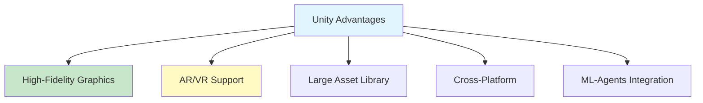
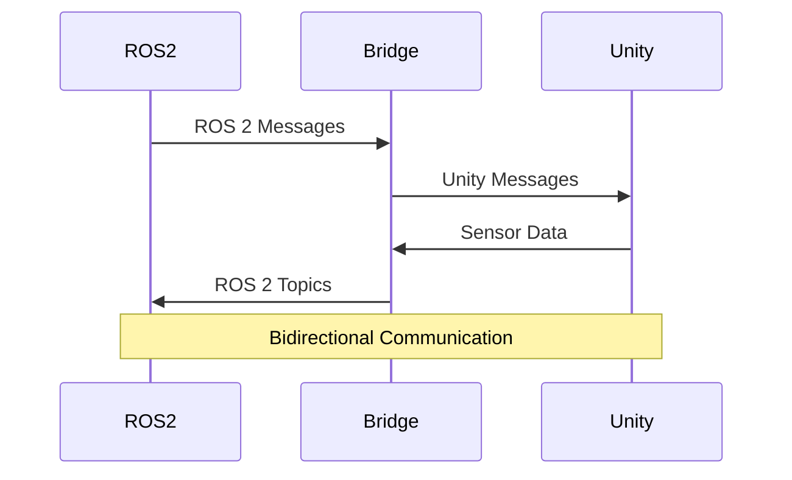

# Chapter 5: Unity Integration

## Unity for Robotics

Unity, primarily known for game development, has become a powerful tool for robotics simulation. With its high-fidelity rendering, physics engine, and ROS integration capabilities, Unity offers an alternative to Gazebo for certain applications.

### Why Unity for Robotics?



**Key Advantages**:
- **Photorealistic Rendering**: High-quality graphics for visual testing
- **AR/VR Support**: Test in virtual/augmented reality
- **Asset Store**: Extensive library of 3D models
- **ML-Agents**: Built-in machine learning framework
- **Cross-Platform**: Windows, Mac, Linux support

### When to Use Unity vs Gazebo

| Feature | Gazebo | Unity |
|---------|--------|-------|
| Physics Accuracy | Excellent | Good |
| Graphics Quality | Good | Excellent |
| ROS Integration | Native | Via Bridge |
| Learning Curve | Moderate | Steeper |
| Cost | Free | Free (Personal) |
| Use Case | General Robotics | Visual Testing, AR/VR |

## ROS-Unity Bridge

The ROS-Unity bridge enables communication between Unity and ROS 2, allowing you to control Unity simulations from ROS 2 nodes and vice versa.

### Architecture



### Installation

#### Step 1: Install Unity Hub

Download from: https://unity.com/download

#### Step 2: Install Unity Editor

- Unity 2021.3 LTS or later recommended
- Install with Linux Build Support (for ROS 2)

#### Step 3: Install ROS-TCP-Connector

```bash
# Clone ROS-TCP-Connector
cd ~
git clone https://github.com/Unity-Technologies/ROS-TCP-Connector.git
```

#### Step 4: Install ROS-TCP-Endpoint (Python)

```bash
# Install ROS 2 dependencies
pip3 install rosbridge-suite

# Install ROS-TCP-Endpoint
cd ~/ROS-TCP-Connector/ROS-TCP-Endpoint
pip3 install -r requirements.txt
```

### Basic Setup

#### Unity Side

1. Create new Unity project
2. Import ROS-TCP-Connector package
3. Add ROSConnection prefab to scene
4. Configure connection settings

#### ROS 2 Side

```python
#!/usr/bin/env python3
"""
ROS-Unity Bridge Example

Connects to Unity and exchanges messages.
"""

import rclpy
from rclpy.node import Node
from geometry_msgs.msg import Twist
from sensor_msgs.msg import Image
import socket
import json


class UnityBridge(Node):
    def __init__(self):
        super().__init__('unity_bridge')
        
        # Connect to Unity
        self.unity_socket = socket.socket(socket.AF_INET, socket.SOCK_STREAM)
        self.unity_socket.connect(('localhost', 10000))
        
        # ROS 2 subscribers
        self.cmd_sub = self.create_subscription(
            Twist,
            '/cmd_vel',
            self.cmd_vel_callback,
            10
        )
        
        # ROS 2 publishers
        self.image_pub = self.create_publisher(
            Image,
            '/unity/camera/image_raw',
            10
        )
        
        self.get_logger().info('Unity bridge connected')
    
    def cmd_vel_callback(self, msg):
        """Send velocity command to Unity."""
        command = {
            'linear': {'x': msg.linear.x, 'y': msg.linear.y, 'z': msg.linear.z},
            'angular': {'x': msg.angular.x, 'y': msg.angular.y, 'z': msg.angular.z}
        }
        
        # Send to Unity
        self.unity_socket.send(json.dumps(command).encode())
    
    def receive_from_unity(self):
        """Receive data from Unity."""
        data = self.unity_socket.recv(1024)
        if data:
            # Process Unity data
            # Convert to ROS 2 message
            pass


def main(args=None):
    rclpy.init(args=args)
    bridge = UnityBridge()
    
    try:
        rclpy.spin(bridge)
    except KeyboardInterrupt:
        bridge.get_logger().info('Shutting down...')
    finally:
        bridge.unity_socket.close()
        bridge.destroy_node()
        rclpy.shutdown()


if __name__ == '__main__':
    main()
```

## High-Fidelity Rendering

Unity's rendering capabilities far exceed Gazebo's, making it ideal for visual testing and computer vision applications.

### Rendering Features

1. **Real-Time Ray Tracing**: Hardware-accelerated ray tracing (RTX)
2. **Global Illumination**: Realistic lighting
3. **Post-Processing**: Bloom, depth of field, motion blur
4. **Shader Graph**: Custom visual effects
5. **HDR Rendering**: High dynamic range

### Camera Setup in Unity

```csharp
using UnityEngine;
using RosMessageTypes.Sensor;

public class UnityCamera : MonoBehaviour
{
    public string topicName = "/unity/camera/image_raw";
    private Camera camera;
    private Texture2D texture;
    
    void Start()
    {
        camera = GetComponent<Camera>();
        texture = new Texture2D(camera.pixelWidth, camera.pixelHeight);
    }
    
    void Update()
    {
        // Capture camera image
        RenderTexture renderTexture = camera.targetTexture;
        RenderTexture.active = renderTexture;
        texture.ReadPixels(new Rect(0, 0, renderTexture.width, renderTexture.height), 0, 0);
        texture.Apply();
        
        // Convert to ROS 2 Image message
        // Publish via ROS-TCP-Connector
    }
}
```

### Material and Lighting

Unity's material system allows for realistic surfaces:

```csharp
// Create realistic material
Material robotMaterial = new Material(Shader.Find("Standard"));
robotMaterial.SetFloat("_Metallic", 0.5f);
robotMaterial.SetFloat("_Glossiness", 0.8f);
robotMaterial.SetColor("_Color", Color.blue);
```

## AR/VR Possibilities

Unity's AR/VR support opens new possibilities for robotics:

### AR Applications

1. **Robot Visualization**: Overlay robot state in real world
2. **Path Planning**: Visualize planned paths in AR
3. **Remote Operation**: Control robots through AR interface
4. **Training**: AR-based robot training

### VR Applications

1. **Teleoperation**: Control robots in VR
2. **Training Simulators**: Practice in VR before real operation
3. **Design Review**: Review robot designs in VR
4. **Collaborative Workspaces**: Multiple users in shared VR space

### AR Foundation Setup

```csharp
using UnityEngine;
using UnityEngine.XR.ARFoundation;

public class ARRobotController : MonoBehaviour
{
    private ARSessionOrigin arSessionOrigin;
    private GameObject robotModel;
    
    void Start()
    {
        arSessionOrigin = FindObjectOfType<ARSessionOrigin>();
        
        // Spawn robot model in AR space
        robotModel = Instantiate(robotPrefab);
        arSessionOrigin.MakeContentAppearAt(robotModel.transform, Vector3.zero);
    }
    
    void Update()
    {
        // Update robot pose from ROS 2
        // Sync with AR tracking
    }
}
```

## Complete Unity-ROS 2 Example

### Unity Scene Setup

1. **Create Scene**: New 3D scene
2. **Add Robot Model**: Import or create robot
3. **Add ROSConnection**: ROS-TCP-Connector prefab
4. **Add Camera**: For image capture
5. **Add Scripts**: Control and communication

### ROS 2 Control Script

```python
#!/usr/bin/env python3
"""
Complete Unity-ROS 2 Integration

Controls Unity robot from ROS 2.
"""

import rclpy
from rclpy.node import Node
from geometry_msgs.msg import Twist, Pose
from sensor_msgs.msg import Image
from std_msgs.msg import String
import socket
import json
import threading


class UnityRobotController(Node):
    def __init__(self):
        super().__init__('unity_robot_controller')
        
        # Connect to Unity
        self.connect_to_unity()
        
        # Subscribers
        self.cmd_sub = self.create_subscription(
            Twist,
            '/cmd_vel',
            self.cmd_callback,
            10
        )
        
        self.pose_sub = self.create_subscription(
            Pose,
            '/target_pose',
            self.pose_callback,
            10
        )
        
        # Publishers
        self.image_pub = self.create_publisher(
            Image,
            '/unity/camera/image_raw',
            10
        )
        
        self.status_pub = self.create_publisher(
            String,
            '/unity/status',
            10
        )
        
        # Thread for receiving Unity data
        self.receive_thread = threading.Thread(target=self.receive_loop)
        self.receive_thread.start()
        
        self.get_logger().info('Unity robot controller started')
    
    def connect_to_unity(self):
        """Connect to Unity via TCP."""
        self.unity_socket = socket.socket(socket.AF_INET, socket.SOCK_STREAM)
        try:
            self.unity_socket.connect(('localhost', 10000))
            self.get_logger().info('Connected to Unity')
        except Exception as e:
            self.get_logger().error(f'Failed to connect: {e}')
    
    def cmd_callback(self, msg):
        """Send velocity command to Unity."""
        command = {
            'type': 'cmd_vel',
            'linear': {
                'x': float(msg.linear.x),
                'y': float(msg.linear.y),
                'z': float(msg.linear.z)
            },
            'angular': {
                'x': float(msg.angular.x),
                'y': float(msg.angular.y),
                'z': float(msg.angular.z)
            }
        }
        self.send_to_unity(command)
    
    def pose_callback(self, msg):
        """Send target pose to Unity."""
        pose = {
            'type': 'target_pose',
            'position': {
                'x': float(msg.position.x),
                'y': float(msg.position.y),
                'z': float(msg.position.z)
            },
            'orientation': {
                'x': float(msg.orientation.x),
                'y': float(msg.orientation.y),
                'z': float(msg.orientation.z),
                'w': float(msg.orientation.w)
            }
        }
        self.send_to_unity(pose)
    
    def send_to_unity(self, data):
        """Send JSON data to Unity."""
        try:
            message = json.dumps(data) + '\n'
            self.unity_socket.send(message.encode())
        except Exception as e:
            self.get_logger().error(f'Failed to send: {e}')
    
    def receive_loop(self):
        """Receive data from Unity."""
        buffer = ''
        while rclpy.ok():
            try:
                data = self.unity_socket.recv(4096).decode()
                buffer += data
                
                # Process complete messages
                while '\n' in buffer:
                    line, buffer = buffer.split('\n', 1)
                    if line:
                        self.process_unity_message(json.loads(line))
            except Exception as e:
                self.get_logger().error(f'Receive error: {e}')
                break
    
    def process_unity_message(self, data):
        """Process message from Unity."""
        msg_type = data.get('type')
        
        if msg_type == 'image':
            # Convert to ROS 2 Image message
            # Publish to /unity/camera/image_raw
            pass
        elif msg_type == 'status':
            # Publish status
            status_msg = String()
            status_msg.data = data.get('status', '')
            self.status_pub.publish(status_msg)


def main(args=None):
    rclpy.init(args=args)
    controller = UnityRobotController()
    
    try:
        rclpy.spin(controller)
    except KeyboardInterrupt:
        controller.get_logger().info('Shutting down...')
    finally:
        controller.unity_socket.close()
        controller.destroy_node()
        rclpy.shutdown()


if __name__ == '__main__':
    main()
```

## Best Practices

1. **Use Unity for Visual Testing**: When graphics quality matters
2. **Use Gazebo for Physics**: When physics accuracy is critical
3. **Hybrid Approach**: Use both for different aspects
4. **Optimize Communication**: Minimize data transfer between Unity and ROS 2
5. **Error Handling**: Robust connection handling

## Common Pitfalls

### Pitfall 1: Connection Issues

**Problem**: Can't connect to Unity.

**Solution**: Check firewall, port availability, and Unity ROS-TCP settings.

### Pitfall 2: Performance Issues

**Problem**: Slow communication.

**Solution**: Optimize message frequency, use compression, reduce data size.

### Pitfall 3: Coordinate Frame Mismatch

**Problem**: Robot in wrong position.

**Solution**: Ensure consistent coordinate frames between Unity and ROS 2.

## Next Steps

Continue learning:
- [Chapter 6: Practical Lab](06-practical-lab.md) - Build complete humanoid simulation
- Module 3: AI-Powered Perception - Computer vision and SLAM

