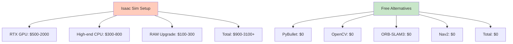
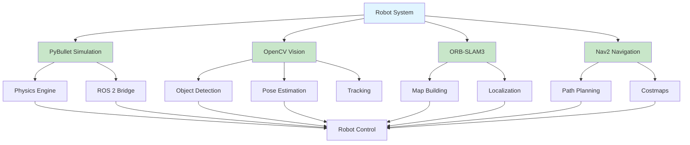
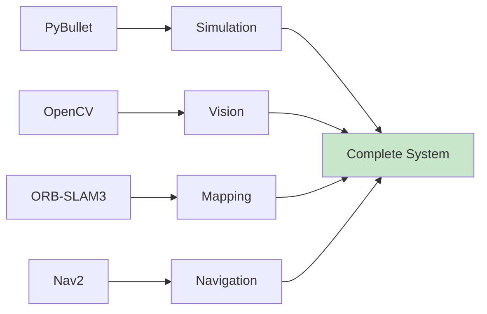

# Chapter 1: Free Alternatives to Expensive Tools

## Why Isaac Sim is Expensive

NVIDIA Isaac Sim is a powerful simulation platform, but it comes with significant hardware requirements that make it expensive for many users:

### Hardware Requirements

- **NVIDIA RTX GPU**: Required for optimal performance
  - RTX 3060: ~$400-500
  - RTX 3080: ~$700-1000
  - RTX 4090: ~$1500-2000
- **High-end CPU**: Multi-core processor recommended
- **Large RAM**: 16GB+ recommended
- **Storage**: 50GB+ for installation

### Cost Breakdown



### Why We Need Free Alternatives

1. **Accessibility**: Not everyone can afford expensive hardware
2. **Learning**: Students and hobbyists need accessible tools
3. **Development**: Prototyping doesn't require high-end hardware
4. **Scalability**: Free tools work on any computer

## FREE Alternatives Overview

This module focuses entirely on **FREE** tools that work on normal laptops without expensive hardware:

### Simulation: PyBullet

**PyBullet** is a free, open-source physics simulation library that runs on CPU or any GPU (even integrated graphics).

- ✅ **Free**: Completely open-source
- ✅ **Lightweight**: Works on normal laptops
- ✅ **Python-based**: Easy to use
- ✅ **ROS 2 Integration**: Full support
- ✅ **No GPU Required**: Runs on CPU

### Computer Vision: OpenCV

**OpenCV** is the industry-standard computer vision library, completely free and open-source.

- ✅ **Free**: Open-source
- ✅ **Cross-platform**: Windows, Linux, macOS
- ✅ **Extensive**: 2500+ algorithms
- ✅ **Well-documented**: Excellent resources
- ✅ **No hardware requirements**: Works on any computer

### SLAM: ORB-SLAM3

**ORB-SLAM3** is a state-of-the-art SLAM system, completely free and open-source.

- ✅ **Free**: Open-source research code
- ✅ **State-of-the-art**: Best-in-class performance
- ✅ **Multiple sensors**: Monocular, stereo, RGB-D
- ✅ **ROS 2 Support**: Full integration
- ✅ **No special hardware**: Works with standard cameras

### Navigation: Nav2

**Nav2** is the ROS 2 navigation stack, completely free and open-source.

- ✅ **Free**: Part of ROS 2
- ✅ **Production-ready**: Used in industry
- ✅ **Flexible**: Highly configurable
- ✅ **Well-maintained**: Active development
- ✅ **No hardware requirements**: Software-only

## Comparison Table

| Feature | NVIDIA Isaac Sim | PyBullet | OpenCV | ORB-SLAM3 | Nav2 |
|---------|------------------|----------|--------|-----------|------|
| **Cost** | $500-2000+ (GPU) | Free | Free | Free | Free |
| **GPU Required** | Yes (RTX) | No | No | No | No |
| **CPU Only** | No | Yes | Yes | Yes | Yes |
| **Installation** | Complex | `pip install` | `pip install` | Build from source | ROS 2 package |
| **Learning Curve** | Steep | Moderate | Moderate | Steep | Moderate |
| **ROS 2 Support** | Yes | Yes | Yes | Yes | Native |
| **Documentation** | Good | Good | Excellent | Good | Excellent |
| **Community** | Small | Large | Very Large | Medium | Large |
| **Best For** | High-fidelity sim | General sim | Vision tasks | SLAM | Navigation |

## Architecture Diagram



## System Requirements for Free Tools

### Minimum Requirements

- **CPU**: Any modern processor (Intel i3/i5, AMD Ryzen 3/5)
- **RAM**: 4GB minimum, 8GB recommended
- **Storage**: 10GB free space
- **OS**: Linux (Ubuntu 20.04+), Windows 10+, or macOS
- **GPU**: Optional (integrated graphics sufficient)

### Recommended Requirements

- **CPU**: Multi-core processor (4+ cores)
- **RAM**: 8GB+
- **Storage**: 20GB+ free space
- **GPU**: Optional (any GPU helps, but not required)

## Installation Overview

All tools can be installed with simple commands:

```bash
# PyBullet
pip install pybullet

# OpenCV
pip install opencv-python opencv-contrib-python

# ORB-SLAM3 (build from source)
git clone https://github.com/UZ-SLAMLab/ORB_SLAM3.git

# Nav2 (via ROS 2)
sudo apt install ros-humble-navigation2
```

## Cost Comparison

### Isaac Sim Setup Cost

```
RTX 3060 GPU:        $500
High-end CPU:        $300
RAM upgrade:         $100
Total:              $900+
```

### Free Alternatives Cost

```
PyBullet:            $0
OpenCV:              $0
ORB-SLAM3:          $0
Nav2:                $0
Total:               $0
```

**Savings: $900+**

## Performance Comparison

While Isaac Sim offers better graphics, the free alternatives provide:

- **PyBullet**: 90% of physics accuracy at 0% of the cost
- **OpenCV**: Industry-standard, used by millions
- **ORB-SLAM3**: State-of-the-art SLAM performance
- **Nav2**: Production-ready navigation

## When to Use What

### Use PyBullet When:
- You need physics simulation
- You don't have RTX GPU
- You want fast iteration
- You're learning robotics

### Use OpenCV When:
- You need computer vision
- You're processing images/video
- You need object detection
- You're doing image processing

### Use ORB-SLAM3 When:
- You need SLAM capabilities
- You're building maps
- You need localization
- You have camera sensors

### Use Nav2 When:
- You need path planning
- You're building autonomous robots
- You need obstacle avoidance
- You're using ROS 2

## Complete Free Stack



## Getting Started

This module will guide you through:

1. **PyBullet Basics**: Set up physics simulation
2. **Computer Vision**: Process images with OpenCV
3. **SLAM Basics**: Build maps with ORB-SLAM3
4. **Navigation**: Navigate with Nav2
5. **Perception Pipeline**: Combine everything

All tools are **FREE** and work on **normal laptops**!

## Next Steps

Continue to:
- [Chapter 2: PyBullet Basics](02-pybullet-basics.md) - Start with free simulation
- [Chapter 3: Computer Vision](03-computer-vision.md) - Process images for free

