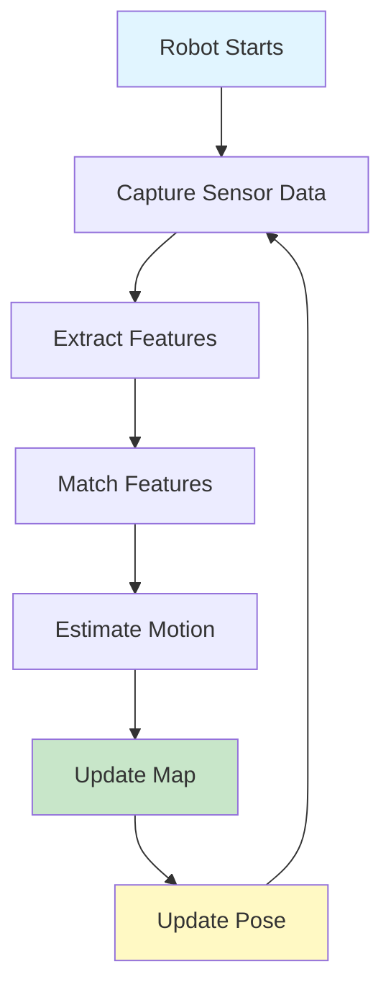

# Chapter 4: SLAM Basics

## What is SLAM?

SLAM (Simultaneous Localization and Mapping) is a technique that allows robots to build a map of an unknown environment while simultaneously tracking their location within that map. It's essential for autonomous navigation.

### Why SLAM?

- **Unknown Environments**: Navigate without prior maps
- **Localization**: Know where you are
- **Mapping**: Build maps for future use
- **Autonomy**: Enable fully autonomous robots

### SLAM Process



## ORB-SLAM3 Setup

ORB-SLAM3 is a state-of-the-art SLAM system, completely free and open-source.

### Installation

```bash
# Install dependencies
sudo apt update
sudo apt install -y \
    cmake \
    git \
    libeigen3-dev \
    libopencv-dev \
    libpangolin-dev \
    python3-dev \
    python3-numpy

# Install Pangolin (visualization)
cd ~
git clone https://github.com/stevenlovegrove/Pangolin.git
cd Pangolin
mkdir build && cd build
cmake ..
make -j4
sudo make install

# Install ORB-SLAM3
cd ~
git clone https://github.com/UZ-SLAMLab/ORB_SLAM3.git
cd ORB_SLAM3
chmod +x build.sh
./build.sh
```

### Building ORB-SLAM3

```bash
cd ~/ORB_SLAM3
./build.sh

# If build fails, try:
mkdir build
cd build
cmake ..
make -j4
```

### Verify Installation

```bash
# Check if executable exists
ls ~/ORB_SLAM3/Examples/Monocular/mono_euroc

# Test with sample data
cd ~/ORB_SLAM3
./Examples/Monocular/mono_euroc \
    Vocabulary/ORBvoc.txt \
    Examples/Monocular/EuRoC.yaml \
    /path/to/EuRoC/dataset
```

## ORB-SLAM3 Usage

### Monocular SLAM

```cpp
// Example C++ usage
#include "System.h"
#include <opencv2/opencv.hpp>

int main(int argc, char **argv) {
    // Initialize ORB-SLAM3
    ORB_SLAM3::System SLAM(
        argv[1],  // Vocabulary file
        argv[2],  // Settings file
        ORB_SLAM3::System::MONOCULAR,
        true      // Use viewer
    );
    
    cv::VideoCapture cap(0);
    cv::Mat frame;
    
    while (cap.read(frame)) {
        // Track frame
        SLAM.TrackMonocular(frame, timestamp);
    }
    
    SLAM.Shutdown();
    return 0;
}
```

### Python Wrapper (pyORB_SLAM3)

```bash
# Install Python wrapper
pip install pyorbslam3

# Or build from source
git clone https://github.com/jingpang/pyORB_SLAM3.git
cd pyORB_SLAM3
python setup.py install
```

### Python Example

```python
#!/usr/bin/env python3
"""
ORB-SLAM3 Python Example

Run SLAM with webcam.
"""

import cv2
import pyorbslam3

# Initialize SLAM
vocab_path = "Vocabulary/ORBvoc.txt"
settings_path = "Examples/Monocular/TUM1.yaml"
slam = pyorbslam3.System(vocab_path, settings_path, pyorbslam3.System.MONOCULAR, True)

# Open camera
cap = cv2.VideoCapture(0)

timestamp = 0.0

while True:
    ret, frame = cap.read()
    if not ret:
        break
    
    # Track frame
    slam.TrackMonocular(frame, timestamp)
    
    timestamp += 1.0/30.0  # 30 FPS
    
    if cv2.waitKey(1) & 0xFF == ord('q'):
        break

slam.Shutdown()
cap.release()
```

## RTAB-Map for RGB-D SLAM

RTAB-Map is another excellent free SLAM system, especially good for RGB-D cameras.

### Installation

```bash
# Install RTAB-Map
sudo apt install ros-humble-rtabmap-ros

# Or build from source
cd ~
git clone https://github.com/introlab/rtabmap.git
cd rtabmap/build
cmake ..
make -j4
sudo make install
```

### RTAB-Map with ROS 2

```python
#!/usr/bin/env python3
"""
RTAB-Map ROS 2 Node

Run RTAB-Map SLAM with ROS 2.
"""

import rclpy
from rclpy.node import Node
from sensor_msgs.msg import Image, CameraInfo
from geometry_msgs.msg import TransformStamped
import tf2_ros

class RTABMapNode(Node):
    def __init__(self):
        super().__init__('rtabmap_node')
        
        # Subscribers
        self.rgb_sub = self.create_subscription(
            Image,
            '/camera/rgb/image_raw',
            self.rgb_callback,
            10
        )
        
        self.depth_sub = self.create_subscription(
            Image,
            '/camera/depth/image_raw',
            self.depth_callback,
            10
        )
        
        self.camera_info_sub = self.create_subscription(
            CameraInfo,
            '/camera/rgb/camera_info',
            self.camera_info_callback,
            10
        )
        
        self.get_logger().info('RTAB-Map node started')
    
    def rgb_callback(self, msg):
        """Process RGB image."""
        # Process image for RTAB-Map
        pass
    
    def depth_callback(self, msg):
        """Process depth image."""
        # Process depth for RTAB-Map
        pass
    
    def camera_info_callback(self, msg):
        """Process camera info."""
        # Store camera parameters
        pass

def main(args=None):
    rclpy.init(args=args)
    node = RTABMapNode()
    rclpy.spin(node)
    node.destroy_node()
    rclpy.shutdown()

if __name__ == '__main__':
    main()
```

### RTAB-Map Launch File

```python
from launch import LaunchDescription
from launch_ros.actions import Node

def generate_launch_description():
    return LaunchDescription([
        # RTAB-Map node
        Node(
            package='rtabmap_ros',
            executable='rtabmap',
            name='rtabmap',
            parameters=[{
                'frame_id': 'base_link',
                'odom_frame_id': 'odom',
                'map_frame_id': 'map',
                'use_sim_time': False
            }],
            remappings=[
                ('rgb/image', '/camera/rgb/image_raw'),
                ('depth/image', '/camera/depth/image_raw'),
                ('rgb/camera_info', '/camera/rgb/camera_info')
            ]
        )
    ])
```

## Map Building

### Building Maps with ORB-SLAM3

```python
#!/usr/bin/env python3
"""
Map Building with ORB-SLAM3

Build and save maps.
"""

import cv2
import pyorbslam3
import numpy as np

# Initialize SLAM
vocab_path = "Vocabulary/ORBvoc.txt"
settings_path = "Examples/Monocular/TUM1.yaml"
slam = pyorbslam3.System(vocab_path, settings_path, pyorbslam3.System.MONOCULAR, True)

cap = cv2.VideoCapture(0)
timestamp = 0.0
map_points = []

while True:
    ret, frame = cap.read()
    if not ret:
        break
    
    # Track frame
    slam.TrackMonocular(frame, timestamp)
    
    # Get map points
    current_map = slam.GetMapPoints()
    if current_map:
        map_points = current_map
    
    timestamp += 1.0/30.0
    
    # Visualize
    cv2.imshow('SLAM', frame)
    
    if cv2.waitKey(1) & 0xFF == ord('q'):
        break

# Save map
slam.SaveMap("map.bin")
print(f"Map saved with {len(map_points)} points")

slam.Shutdown()
cap.release()
```

### Loading Saved Maps

```python
# Load map
slam = pyorbslam3.System(vocab_path, settings_path, pyorbslam3.System.MONOCULAR, True)
slam.LoadMap("map.bin")
```

## Complete Example with ROS 2

### SLAM Node

```python
#!/usr/bin/env python3
"""
Complete SLAM System

ORB-SLAM3 integrated with ROS 2.
"""

import rclpy
from rclpy.node import Node
from sensor_msgs.msg import Image
from nav_msgs.msg import OccupancyGrid, MapMetaData
from geometry_msgs.msg import PoseWithCovarianceStamped
from cv_bridge import CvBridge
import cv2
import numpy as np

# Note: This is a conceptual example
# Actual ORB-SLAM3 ROS 2 integration may require C++ wrapper

class SLAMNode(Node):
    def __init__(self):
        super().__init__('slam_node')
        
        self.bridge = CvBridge()
        
        # Initialize SLAM (pseudo-code)
        # self.slam = initialize_slam()
        
        # Subscribers
        self.image_sub = self.create_subscription(
            Image,
            '/camera/image_raw',
            self.image_callback,
            10
        )
        
        # Publishers
        self.map_pub = self.create_publisher(
            OccupancyGrid,
            '/map',
            10
        )
        
        self.pose_pub = self.create_publisher(
            PoseWithCovarianceStamped,
            '/slam_pose',
            10
        )
        
        self.get_logger().info('SLAM node started')
    
    def image_callback(self, msg):
        """Process image for SLAM."""
        try:
            # Convert to OpenCV
            cv_image = self.bridge.imgmsg_to_cv2(msg, "bgr8")
            
            # Process with SLAM
            # pose = self.slam.process_frame(cv_image)
            # map_data = self.slam.get_map()
            
            # Publish pose
            pose_msg = PoseWithCovarianceStamped()
            pose_msg.header = msg.header
            # pose_msg.pose = pose
            self.pose_pub.publish(pose_msg)
            
            # Publish map
            map_msg = OccupancyGrid()
            map_msg.header = msg.header
            map_msg.info.resolution = 0.05  # 5cm per pixel
            map_msg.info.width = 100
            map_msg.info.height = 100
            # map_msg.data = map_data
            self.map_pub.publish(map_msg)
        
        except Exception as e:
            self.get_logger().error(f'SLAM error: {e}')

def main(args=None):
    rclpy.init(args=args)
    node = SLAMNode()
    
    try:
        rclpy.spin(node)
    except KeyboardInterrupt:
        node.get_logger().info('Shutting down...')
    finally:
        node.destroy_node()
        rclpy.shutdown()

if __name__ == '__main__':
    main()
```

## Visualization

### Viewing Maps in RViz2

```bash
# Launch RViz2
rviz2

# Add displays:
# - Map (topic: /map)
# - RobotModel
# - TF
# - Camera (topic: /camera/image_raw)
```

### Map Visualization

```python
import matplotlib.pyplot as plt
import numpy as np

# Load map data
map_data = np.load('map.npy')

# Visualize
plt.figure(figsize=(10, 10))
plt.imshow(map_data, cmap='gray')
plt.colorbar()
plt.title('SLAM Map')
plt.show()
```

## Best Practices

1. **Good lighting**: SLAM works better with good lighting
2. **Feature-rich scenes**: Avoid blank walls
3. **Slow movement**: Move slowly for better tracking
4. **Loop closure**: Return to known areas for map refinement
5. **Save maps**: Save maps for reuse

## Common Errors and Solutions

### Error 1: "ORB-SLAM3 build fails"

```bash
# Solution: Install all dependencies
sudo apt install libeigen3-dev libopencv-dev libpangolin-dev
```

### Error 2: "No features detected"

```python
# Solution: Check image quality, lighting, and scene content
# Use feature-rich environments
```

### Error 3: "Tracking lost"

```python
# Solution: 
# - Move slower
# - Ensure good lighting
# - Use feature-rich scenes
# - Check camera calibration
```

## Next Steps

Continue learning:
- [Chapter 5: Navigation](05-navigation.md) - Navigate with Nav2
- [Chapter 6: Perception Pipeline](06-perception-pipeline.md) - Complete system

