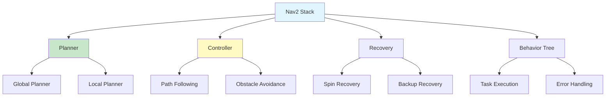

# Chapter 5: Navigation with Nav2

## Introduction

Nav2 (Navigation 2) is the ROS 2 navigation stack, providing path planning, obstacle avoidance, and autonomous navigation capabilities. It's completely free, open-source, and production-ready.

### Why Nav2?

- **Free**: Part of ROS 2 ecosystem
- **Production-Ready**: Used in industry
- **Flexible**: Highly configurable
- **Well-Maintained**: Active development
- **No Hardware Requirements**: Software-only

## Installation

### Install Nav2

```bash
# Install Nav2 packages
sudo apt install ros-humble-navigation2 \
                 ros-humble-nav2-bringup \
                 ros-humble-nav2-common \
                 ros-humble-nav2-msgs \
                 ros-humble-nav2-util

# Install additional plugins
sudo apt install ros-humble-nav2-plugins
```

### Verify Installation

```bash
# Check Nav2 packages
ros2 pkg list | grep nav2

# Test installation
ros2 run nav2_bringup bringup
```

## Nav2 Architecture



## Path Planning Algorithms

### Global Planners

Nav2 supports multiple global path planning algorithms:

1. **NavFn**: Default A* based planner
2. **Theta***: Any-angle path planner
3. **Smac Planner**: State Lattice planner
4. **Planner Server**: Plugin-based system

### Local Planners

1. **DWB (Dynamic Window Approach)**: Default local planner
2. **TEB (Timed Elastic Band)**: Optimization-based
3. **MPPI (Model Predictive Path Integral)**: Sampling-based

### Configuring Planners

```yaml
# nav2_params.yaml
planner_server:
  ros__parameters:
    planner_plugins: ["GridBased"]
    GridBased:
      plugin: "nav2_navfn_planner/NavfnPlanner"
      tolerance: 0.5
      use_astar: false
      allow_unknown: true

controller_server:
  ros__parameters:
    controller_frequency: 20.0
    min_x_velocity_threshold: 0.001
    min_y_velocity_threshold: 0.5
    min_theta_velocity_threshold: 0.001
    failure_tolerance: 0.3
    progress_checker_plugin: "progress_checker"
    goal_checker_plugins: ["general_goal_checker"]
    controller_plugins: ["FollowPath"]
    
    FollowPath:
      plugin: "dwb_core::DWBLocalPlanner"
      debug_trajectory_details: True
      min_vel_x: 0.0
      min_vel_y: 0.0
      max_vel_x: 0.26
      max_vel_y: 0.0
      max_vel_theta: 1.0
      min_speed_xy: 0.0
      max_speed_xy: 0.26
      min_speed_theta: 0.0
      acc_lim_x: 2.5
      acc_lim_y: 0.0
      acc_lim_theta: 3.2
      decel_lim_x: -2.5
      decel_lim_y: 0.0
      decel_lim_theta: -3.2
```

## Costmap Configuration

Costmaps define obstacles and free space for navigation.

### Global Costmap

```yaml
global_costmap:
  global_costmap:
    ros__parameters:
      global_frame: map
      robot_base_frame: base_link
      update_frequency: 1.0
      publish_frequency: 1.0
      static_map: true
      rolling_window: false
      width: 10
      height: 10
      resolution: 0.05
      plugins: ["static_layer", "obstacle_layer", "inflation_layer"]
      inflation_layer:
        plugin: "nav2_costmap_2d::InflationLayer"
        cost_scaling_factor: 3.0
        inflation_radius: 0.55
      static_layer:
        plugin: "nav2_costmap_2d::StaticLayer"
      obstacle_layer:
        plugin: "nav2_costmap_2d::ObstacleLayer"
        observation_sources: scan
        scan:
          topic: /scan
          max_obstacle_height: 2.0
          clearing: true
          marking: true
```

### Local Costmap

```yaml
local_costmap:
  local_costmap:
    ros__parameters:
      global_frame: odom
      robot_base_frame: base_link
      update_frequency: 5.0
      publish_frequency: 2.0
      width: 3
      height: 3
      resolution: 0.05
      rolling_window: true
      plugins: ["obstacle_layer", "inflation_layer"]
      obstacle_layer:
        plugin: "nav2_costmap_2d::ObstacleLayer"
        observation_sources: scan
        scan:
          topic: /scan
          max_obstacle_height: 2.0
          clearing: true
          marking: true
      inflation_layer:
        plugin: "nav2_costmap_2d::InflationLayer"
        cost_scaling_factor: 3.0
        inflation_radius: 0.55
```

## Complete Nav2 Setup

### Launch File

```python
#!/usr/bin/env python3
"""
Nav2 Launch File

Complete Nav2 setup with all components.
"""

from launch import LaunchDescription
from launch.actions import DeclareLaunchArgument
from launch.substitutions import LaunchConfiguration
from launch_ros.actions import Node
import os
from ament_index_python.packages import get_package_share_directory

def generate_launch_description():
    # Get package directory
    nav2_bringup_dir = get_package_share_directory('nav2_bringup')
    
    # Parameters
    params_file = os.path.join(nav2_bringup_dir, 'params', 'nav2_params.yaml')
    
    return LaunchDescription([
        # Declare arguments
        DeclareLaunchArgument(
            'use_sim_time',
            default_value='false',
            description='Use simulation time'
        ),
        
        # Nav2 Bringup
        Node(
            package='nav2_bringup',
            executable='bringup',
            name='nav2_bringup',
            parameters=[params_file],
            output='screen'
        ),
        
        # Lifecycle Manager
        Node(
            package='nav2_lifecycle_manager',
            executable='lifecycle_manager',
            name='lifecycle_manager',
            parameters=[{
                'use_sim_time': LaunchConfiguration('use_sim_time'),
                'autostart': True,
                'node_names': [
                    'map_server',
                    'amcl',
                    'controller_server',
                    'planner_server',
                    'recoveries_server',
                    'bt_navigator',
                    'waypoint_follower'
                ]
            }],
            output='screen'
        )
    ])
```

### Basic Navigation Node

```python
#!/usr/bin/env python3
"""
Basic Navigation Node

Send goals to Nav2 and monitor navigation.
"""

import rclpy
from rclpy.node import Node
from geometry_msgs.msg import PoseStamped
from nav2_msgs.action import NavigateToPose
from rclpy.action import ActionClient
import math

class NavigationNode(Node):
    def __init__(self):
        super().__init__('navigation_node')
        
        # Create action client
        self.nav_to_pose_client = ActionClient(
            self,
            NavigateToPose,
            'navigate_to_pose'
        )
        
        # Wait for server
        self.get_logger().info('Waiting for Nav2 server...')
        self.nav_to_pose_client.wait_for_server()
        self.get_logger().info('Nav2 server ready')
    
    def navigate_to_pose(self, x, y, theta):
        """
        Navigate to a pose.
        
        Args:
            x: X position (meters)
            y: Y position (meters)
            theta: Orientation (radians)
        """
        # Create goal
        goal_msg = NavigateToPose.Goal()
        goal_msg.pose.header.frame_id = 'map'
        goal_msg.pose.header.stamp = self.get_clock().now().to_msg()
        
        goal_msg.pose.pose.position.x = x
        goal_msg.pose.pose.position.y = y
        goal_msg.pose.pose.position.z = 0.0
        
        # Convert theta to quaternion
        goal_msg.pose.pose.orientation.z = math.sin(theta / 2.0)
        goal_msg.pose.pose.orientation.w = math.cos(theta / 2.0)
        
        # Send goal
        self.get_logger().info(f'Sending goal: ({x}, {y}, {theta})')
        send_goal_future = self.nav_to_pose_client.send_goal_async(
            goal_msg,
            feedback_callback=self.feedback_callback
        )
        
        rclpy.spin_until_future_complete(self, send_goal_future)
        goal_handle = send_goal_future.result()
        
        if not goal_handle.accepted:
            self.get_logger().error('Goal rejected')
            return
        
        self.get_logger().info('Goal accepted')
        
        # Wait for result
        result_future = goal_handle.get_result_async()
        rclpy.spin_until_future_complete(self, result_future)
        
        result = result_future.result().result
        self.get_logger().info(f'Navigation result: {result}')
    
    def feedback_callback(self, feedback_msg):
        """Handle navigation feedback."""
        feedback = feedback_msg.feedback
        current_pose = feedback.current_pose.pose
        self.get_logger().info(
            f'Current pose: ({current_pose.position.x:.2f}, '
            f'{current_pose.position.y:.2f})'
        )

def main(args=None):
    rclpy.init(args=args)
    node = NavigationNode()
    
    # Navigate to a goal
    node.navigate_to_pose(2.0, 1.0, 0.0)
    
    node.destroy_node()
    rclpy.shutdown()

if __name__ == '__main__':
    main()
```

## Waypoint Navigation

### Following Waypoints

```python
#!/usr/bin/env python3
"""
Waypoint Navigation

Navigate through a series of waypoints.
"""

import rclpy
from rclpy.node import Node
from nav2_msgs.action import FollowWaypoints
from geometry_msgs.msg import PoseStamped
from rclpy.action import ActionClient
import math

class WaypointNavigator(Node):
    def __init__(self):
        super().__init__('waypoint_navigator')
        
        self.follow_waypoints_client = ActionClient(
            self,
            FollowWaypoints,
            'follow_waypoints'
        )
        
        self.follow_waypoints_client.wait_for_server()
        self.get_logger().info('Waypoint server ready')
    
    def create_waypoint(self, x, y, theta):
        """Create a waypoint pose."""
        pose = PoseStamped()
        pose.header.frame_id = 'map'
        pose.header.stamp = self.get_clock().now().to_msg()
        pose.pose.position.x = x
        pose.pose.position.y = y
        pose.pose.position.z = 0.0
        pose.pose.orientation.z = math.sin(theta / 2.0)
        pose.pose.orientation.w = math.cos(theta / 2.0)
        return pose
    
    def follow_waypoints(self, waypoints):
        """
        Follow a list of waypoints.
        
        Args:
            waypoints: List of (x, y, theta) tuples
        """
        goal_msg = FollowWaypoints.Goal()
        goal_msg.poses = [self.create_waypoint(x, y, theta) 
                         for x, y, theta in waypoints]
        
        self.get_logger().info(f'Following {len(waypoints)} waypoints')
        send_goal_future = self.follow_waypoints_client.send_goal_async(goal_msg)
        
        rclpy.spin_until_future_complete(self, send_goal_future)
        goal_handle = send_goal_future.result()
        
        if not goal_handle.accepted:
            self.get_logger().error('Waypoint goal rejected')
            return
        
        result_future = goal_handle.get_result_async()
        rclpy.spin_until_future_complete(self, result_future)
        
        result = result_future.result().result
        self.get_logger().info(f'Waypoint navigation complete')

def main(args=None):
    rclpy.init(args=args)
    navigator = WaypointNavigator()
    
    # Define waypoints
    waypoints = [
        (1.0, 0.0, 0.0),
        (2.0, 1.0, 1.57),
        (1.0, 2.0, 3.14),
        (0.0, 1.0, -1.57),
        (1.0, 0.0, 0.0)
    ]
    
    navigator.follow_waypoints(waypoints)
    
    navigator.destroy_node()
    rclpy.shutdown()

if __name__ == '__main__':
    main()
```

## Complete Navigation Example

### Full System

```python
#!/usr/bin/env python3
"""
Complete Navigation System

Nav2 with map, localization, and path planning.
"""

import rclpy
from rclpy.node import Node
from nav2_msgs.action import NavigateToPose
from nav_msgs.msg import OccupancyGrid
from geometry_msgs.msg import PoseWithCovarianceStamped
from rclpy.action import ActionClient
import math

class CompleteNavigationSystem(Node):
    def __init__(self):
        super().__init__('complete_navigation')
        
        # Action clients
        self.nav_client = ActionClient(self, NavigateToPose, 'navigate_to_pose')
        
        # Subscribers
        self.map_sub = self.create_subscription(
            OccupancyGrid,
            '/map',
            self.map_callback,
            10
        )
        
        self.pose_sub = self.create_subscription(
            PoseWithCovarianceStamped,
            '/amcl_pose',
            self.pose_callback,
            10
        )
        
        # State
        self.current_pose = None
        self.map_received = False
        
        self.get_logger().info('Complete navigation system started')
    
    def map_callback(self, msg):
        """Handle map updates."""
        self.map_received = True
        self.get_logger().info(
            f'Map received: {msg.info.width}x{msg.info.height}, '
            f'resolution: {msg.info.resolution}'
        )
    
    def pose_callback(self, msg):
        """Handle pose updates."""
        self.current_pose = msg.pose.pose
        pos = self.current_pose.position
        self.get_logger().info(
            f'Current pose: ({pos.x:.2f}, {pos.y:.2f})',
            throttle_duration_sec=5.0
        )
    
    def navigate_to(self, x, y, theta):
        """Navigate to goal."""
        if not self.map_received:
            self.get_logger().warn('Map not received yet')
            return
        
        goal = NavigateToPose.Goal()
        goal.pose.header.frame_id = 'map'
        goal.pose.header.stamp = self.get_clock().now().to_msg()
        goal.pose.pose.position.x = x
        goal.pose.pose.position.y = y
        goal.pose.pose.position.z = 0.0
        goal.pose.pose.orientation.z = math.sin(theta / 2.0)
        goal.pose.pose.orientation.w = math.cos(theta / 2.0)
        
        self.nav_client.wait_for_server()
        future = self.nav_client.send_goal_async(goal)
        rclpy.spin_until_future_complete(self, future)
        
        goal_handle = future.result()
        if goal_handle.accepted:
            self.get_logger().info('Navigation started')
        else:
            self.get_logger().error('Navigation rejected')

def main(args=None):
    rclpy.init(args=args)
    system = CompleteNavigationSystem()
    
    # Wait for map
    while not system.map_received:
        rclpy.spin_once(system, timeout_sec=0.1)
    
    # Navigate
    system.navigate_to(2.0, 1.0, 0.0)
    
    try:
        rclpy.spin(system)
    except KeyboardInterrupt:
        system.get_logger().info('Shutting down...')
    finally:
        system.destroy_node()
        rclpy.shutdown()

if __name__ == '__main__':
    main()
```

## Best Practices

1. **Tune costmaps**: Adjust inflation radius and cost scaling
2. **Configure planners**: Choose appropriate planner for your robot
3. **Monitor performance**: Check computation time
4. **Handle failures**: Implement recovery behaviors
5. **Test thoroughly**: Test in various scenarios

## Common Errors and Solutions

### Error 1: "Nav2 server not found"

```python
# Solution: Wait for server
self.nav_client.wait_for_server(timeout_sec=10.0)
```

### Error 2: "Goal rejected"

```python
# Solution: Check goal is in map bounds and reachable
# Verify map is loaded
# Check costmap configuration
```

### Error 3: "Robot stuck"

```python
# Solution: 
# - Check recovery behaviors are enabled
# - Verify obstacle layer is working
# - Check for dynamic obstacles
```

## Next Steps

Continue learning:
- [Chapter 6: Perception Pipeline](06-perception-pipeline.md) - Complete autonomous system

