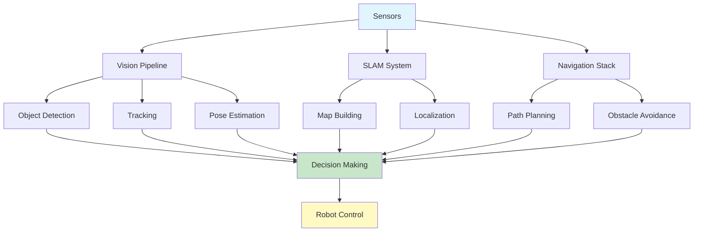

# Chapter 6: Complete Perception Pipeline

## Introduction

This chapter integrates all the free tools we've learned into a complete autonomous perception and navigation system. We'll combine object detection, SLAM, and navigation to create a fully functional autonomous robot.

### System Architecture



## Complete Autonomous System

### System Components

1. **Vision Pipeline**: OpenCV + YOLO for object detection
2. **SLAM System**: ORB-SLAM3 or RTAB-Map for mapping
3. **Navigation Stack**: Nav2 for path planning
4. **Sensor Fusion**: Combine multiple sensor inputs
5. **Decision Making**: High-level task planning

### Architecture Overview

```python
#!/usr/bin/env python3
"""
Complete Perception Pipeline

Integrates vision, SLAM, and navigation.
"""

import rclpy
from rclpy.node import Node
from sensor_msgs.msg import Image, LaserScan, Imu
from nav_msgs.msg import OccupancyGrid, Odometry
from geometry_msgs.msg import PoseStamped, Twist
from cv_bridge import CvBridge
from ultralytics import YOLO
import cv2
import numpy as np

class PerceptionPipeline(Node):
    def __init__(self):
        super().__init__('perception_pipeline')
        
        # Initialize components
        self.bridge = CvBridge()
        self.yolo_model = YOLO('yolov8n.pt')
        
        # State
        self.current_map = None
        self.current_pose = None
        self.detected_objects = []
        
        # Subscribers
        self.image_sub = self.create_subscription(
            Image, '/camera/image_raw', self.image_callback, 10
        )
        self.scan_sub = self.create_subscription(
            LaserScan, '/scan', self.scan_callback, 10
        )
        self.map_sub = self.create_subscription(
            OccupancyGrid, '/map', self.map_callback, 10
        )
        self.odom_sub = self.create_subscription(
            Odometry, '/odom', self.odom_callback, 10
        )
        
        # Publishers
        self.cmd_vel_pub = self.create_publisher(Twist, '/cmd_vel', 10)
        self.detection_pub = self.create_publisher(Image, '/detections', 10)
        
        # Timer for control loop
        self.timer = self.create_timer(0.1, self.control_loop)
        
        self.get_logger().info('Perception pipeline started')
    
    def image_callback(self, msg):
        """Process camera images."""
        try:
            cv_image = self.bridge.imgmsg_to_cv2(msg, "bgr8")
            
            # Run object detection
            results = self.yolo_model(cv_image)
            
            # Store detections
            self.detected_objects = []
            for result in results:
                for box in result.boxes:
                    cls = int(box.cls[0])
                    conf = float(box.conf[0])
                    label = self.yolo_model.names[cls]
                    
                    if conf > 0.5:  # Confidence threshold
                        self.detected_objects.append({
                            'label': label,
                            'confidence': conf,
                            'bbox': box.xyxy[0].cpu().numpy()
                        })
            
            # Draw and publish
            annotated = results[0].plot()
            ros_image = self.bridge.cv2_to_imgmsg(annotated, "bgr8")
            ros_image.header = msg.header
            self.detection_pub.publish(ros_image)
        
        except Exception as e:
            self.get_logger().error(f'Image processing error: {e}')
    
    def scan_callback(self, msg):
        """Process LiDAR scans."""
        # Store scan data for obstacle avoidance
        self.latest_scan = msg
    
    def map_callback(self, msg):
        """Process map updates."""
        self.current_map = msg
    
    def odom_callback(self, msg):
        """Process odometry."""
        self.current_pose = msg.pose.pose
    
    def control_loop(self):
        """Main control loop."""
        if self.current_pose is None:
            return
        
        cmd = Twist()
        
        # Simple obstacle avoidance
        if self.latest_scan:
            # Find minimum distance
            ranges = [r for r in self.latest_scan.ranges 
                     if r > self.latest_scan.range_min 
                     and r < self.latest_scan.range_max]
            
            if ranges:
                min_dist = min(ranges)
                
                if min_dist < 0.5:  # Too close
                    cmd.angular.z = 0.5  # Turn
                else:
                    cmd.linear.x = 0.2  # Move forward
        
        self.cmd_vel_pub.publish(cmd)

def main(args=None):
    rclpy.init(args=args)
    node = PerceptionPipeline()
    
    try:
        rclpy.spin(node)
    except KeyboardInterrupt:
        node.get_logger().info('Shutting down...')
    finally:
        node.destroy_node()
        rclpy.shutdown()

if __name__ == '__main__':
    main()
```

## Sensor Fusion

### Combining Multiple Sensors

```python
#!/usr/bin/env python3
"""
Sensor Fusion

Combines camera, LiDAR, and IMU data.
"""

import rclpy
from rclpy.node import Node
from sensor_msgs.msg import Image, LaserScan, Imu
from geometry_msgs.msg import Twist
import numpy as np
from scipy.spatial.transform import Rotation

class SensorFusion(Node):
    def __init__(self):
        super().__init__('sensor_fusion')
        
        # Subscribers
        self.image_sub = self.create_subscription(
            Image, '/camera/image_raw', self.image_callback, 10
        )
        self.scan_sub = self.create_subscription(
            LaserScan, '/scan', self.scan_callback, 10
        )
        self.imu_sub = self.create_subscription(
            Imu, '/imu/data', self.imu_callback, 10
        )
        
        # State
        self.image_data = None
        self.scan_data = None
        self.imu_data = None
        
        # Timer for fusion
        self.timer = self.create_timer(0.1, self.fuse_sensors)
        
        self.get_logger().info('Sensor fusion started')
    
    def image_callback(self, msg):
        """Store image data."""
        self.image_data = msg
    
    def scan_callback(self, msg):
        """Store scan data."""
        self.scan_data = msg
    
    def imu_callback(self, msg):
        """Store IMU data."""
        self.imu_data = msg
    
    def fuse_sensors(self):
        """Fuse sensor data."""
        if not all([self.image_data, self.scan_data, self.imu_data]):
            return
        
        # Extract information from each sensor
        # Image: Object detection, visual features
        # LiDAR: Distance measurements, obstacle detection
        # IMU: Orientation, acceleration
        
        # Combine for robust perception
        # Example: Use IMU to stabilize image processing
        # Use LiDAR to validate visual detections
        
        self.get_logger().info('Sensor fusion complete')

def main(args=None):
    rclpy.init(args=args)
    node = SensorFusion()
    rclpy.spin(node)
    node.destroy_node()
    rclpy.shutdown()

if __name__ == '__main__':
    main()
```

## Object Detection + SLAM + Nav2 Integration

### Complete System

```python
#!/usr/bin/env python3
"""
Complete Autonomous System

Object detection, SLAM, and navigation integrated.
"""

import rclpy
from rclpy.node import Node
from sensor_msgs.msg import Image
from nav_msgs.msg import OccupancyGrid
from nav2_msgs.action import NavigateToPose
from geometry_msgs.msg import PoseStamped, Twist
from rclpy.action import ActionClient
from cv_bridge import CvBridge
from ultralytics import YOLO
import math

class AutonomousSystem(Node):
    def __init__(self):
        super().__init__('autonomous_system')
        
        # Components
        self.bridge = CvBridge()
        self.yolo_model = YOLO('yolov8n.pt')
        self.nav_client = ActionClient(self, NavigateToPose, 'navigate_to_pose')
        
        # State
        self.map = None
        self.target_object = None
        self.navigation_active = False
        
        # Subscribers
        self.image_sub = self.create_subscription(
            Image, '/camera/image_raw', self.image_callback, 10
        )
        self.map_sub = self.create_subscription(
            OccupancyGrid, '/map', self.map_callback, 10
        )
        
        # Publishers
        self.cmd_vel_pub = self.create_publisher(Twist, '/cmd_vel', 10)
        
        # Timer
        self.timer = self.create_timer(0.1, self.autonomous_loop)
        
        self.get_logger().info('Autonomous system started')
    
    def image_callback(self, msg):
        """Process images for object detection."""
        try:
            cv_image = self.bridge.imgmsg_to_cv2(msg, "bgr8")
            results = self.yolo_model(cv_image)
            
            # Look for target object (e.g., "person")
            for result in results:
                for box in result.boxes:
                    cls = int(box.cls[0])
                    label = self.yolo_model.names[cls]
                    
                    if label == "person" and float(box.conf[0]) > 0.5:
                        # Calculate object position in image
                        bbox = box.xyxy[0].cpu().numpy()
                        center_x = (bbox[0] + bbox[2]) / 2
                        center_y = (bbox[1] + bbox[3]) / 2
                        
                        # Convert to world coordinates (simplified)
                        # In real system, use camera calibration and depth
                        self.target_object = {
                            'label': label,
                            'image_x': center_x,
                            'image_y': center_y
                        }
                        self.get_logger().info(f'Target detected: {label}')
        
        except Exception as e:
            self.get_logger().error(f'Image processing error: {e}')
    
    def map_callback(self, msg):
        """Store map."""
        self.map = msg
    
    def navigate_to_object(self, x, y):
        """Navigate to detected object."""
        if self.navigation_active:
            return
        
        goal = NavigateToPose.Goal()
        goal.pose.header.frame_id = 'map'
        goal.pose.header.stamp = self.get_clock().now().to_msg()
        goal.pose.pose.position.x = x
        goal.pose.pose.position.y = y
        goal.pose.pose.orientation.w = 1.0
        
        self.nav_client.wait_for_server()
        future = self.nav_client.send_goal_async(goal)
        rclpy.spin_until_future_complete(self, future)
        
        goal_handle = future.result()
        if goal_handle.accepted:
            self.navigation_active = True
            self.get_logger().info('Navigation to object started')
    
    def autonomous_loop(self):
        """Main autonomous behavior loop."""
        if self.target_object and not self.navigation_active:
            # Simple strategy: navigate towards object
            # In real system, use more sophisticated approach
            # For now, just log
            self.get_logger().info('Planning navigation to target object')

def main(args=None):
    rclpy.init(args=args)
    node = AutonomousSystem()
    
    try:
        rclpy.spin(node)
    except KeyboardInterrupt:
        node.get_logger().info('Shutting down...')
    finally:
        node.destroy_node()
        rclpy.shutdown()

if __name__ == '__main__':
    main()
```

## Performance Optimization

### Optimization Strategies

1. **Reduce Image Resolution**
```python
# Downscale for faster processing
small_image = cv2.resize(cv_image, (320, 240))
results = self.yolo_model(small_image)
```

2. **Process at Lower Frequency**
```python
# Process every 5th frame
self.frame_count = 0
if self.frame_count % 5 == 0:
    # Process image
    pass
self.frame_count += 1
```

3. **Use Smaller Models**
```python
# Use nano model for speed
model = YOLO('yolov8n.pt')  # Fastest
# Instead of
# model = YOLO('yolov8x.pt')  # Slowest but most accurate
```

4. **Multithreading**
```python
import threading

class OptimizedPipeline(Node):
    def __init__(self):
        super().__init__('optimized_pipeline')
        self.processing_thread = threading.Thread(target=self.process_images)
        self.processing_thread.start()
    
    def process_images(self):
        """Process images in separate thread."""
        while rclpy.ok():
            if self.image_queue:
                image = self.image_queue.pop(0)
                # Process image
                pass
```

## Deployment Tips

### 1. Resource Management

```python
# Monitor CPU and memory
import psutil

def check_resources(self):
    cpu_percent = psutil.cpu_percent()
    memory_percent = psutil.virtual_memory().percent
    
    if cpu_percent > 80:
        self.get_logger().warn('High CPU usage')
    if memory_percent > 80:
        self.get_logger().warn('High memory usage')
```

### 2. Error Recovery

```python
def robust_processing(self):
    """Robust processing with error recovery."""
    try:
        # Main processing
        result = self.process()
    except Exception as e:
        self.get_logger().error(f'Error: {e}')
        # Fallback behavior
        result = self.fallback_processing()
    return result
```

### 3. Logging and Monitoring

```python
# Structured logging
self.get_logger().info(
    f'Processing frame: detection_count={len(detections)}, '
    f'processing_time={processing_time:.3f}s'
)
```

### 4. Configuration Files

```yaml
# config.yaml
perception:
  yolo_model: "yolov8n.pt"
  confidence_threshold: 0.5
  image_resolution: [640, 480]
  
navigation:
  planner: "navfn"
  controller: "dwb"
  inflation_radius: 0.55
```

## Complete Launch File

```python
from launch import LaunchDescription
from launch_ros.actions import Node

def generate_launch_description():
    return LaunchDescription([
        # Perception pipeline
        Node(
            package='perception_package',
            executable='perception_pipeline',
            name='perception_pipeline'
        ),
        
        # SLAM (if using RTAB-Map)
        Node(
            package='rtabmap_ros',
            executable='rtabmap',
            name='rtabmap'
        ),
        
        # Navigation
        Node(
            package='nav2_bringup',
            executable='bringup',
            name='nav2_bringup'
        ),
        
        # Robot control
        Node(
            package='robot_control',
            executable='autonomous_controller',
            name='autonomous_controller'
        )
    ])
```

## Testing and Validation

### Test Checklist

- [ ] Object detection working
- [ ] SLAM building maps
- [ ] Navigation planning paths
- [ ] Sensor fusion combining data
- [ ] System handles errors gracefully
- [ ] Performance meets requirements
- [ ] All components communicate correctly

## Module 3 Summary

Congratulations! You've completed Module 3: AI-Powered Perception. You now understand:

- ✅ Free alternatives to expensive tools
- ✅ PyBullet for simulation
- ✅ OpenCV for computer vision
- ✅ ORB-SLAM3 for SLAM
- ✅ Nav2 for navigation
- ✅ Complete perception pipelines

**All tools are FREE and work on normal laptops!**

## Next Steps

Continue your learning:
- **Module 4: Vision-Language-Action** - Natural language control
- **Projects** - Apply your knowledge

Keep building amazing robots for free! 🤖

