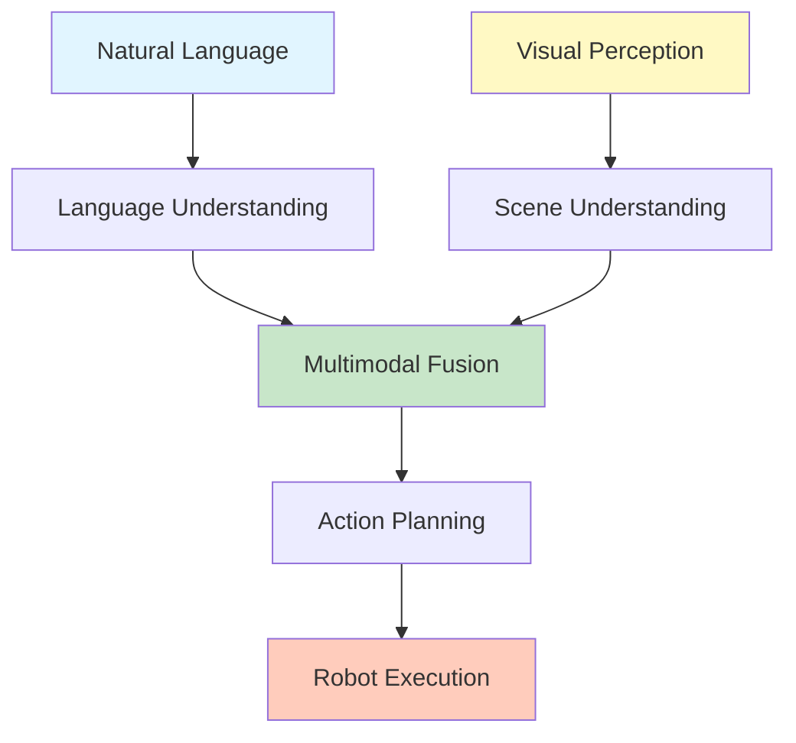
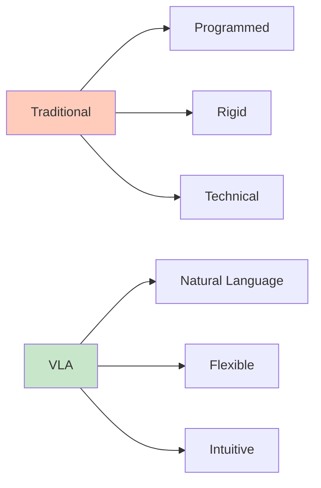
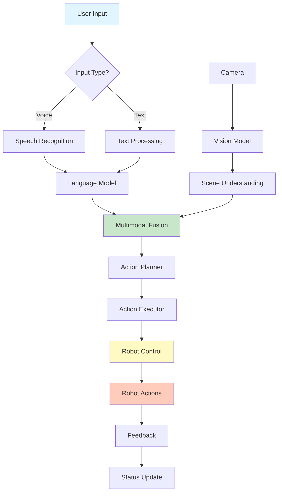
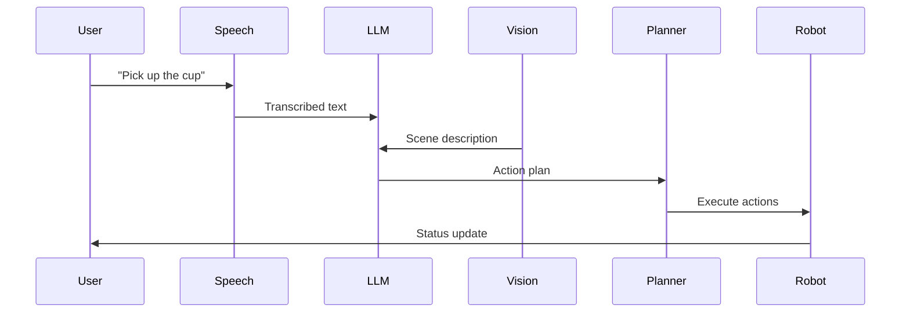
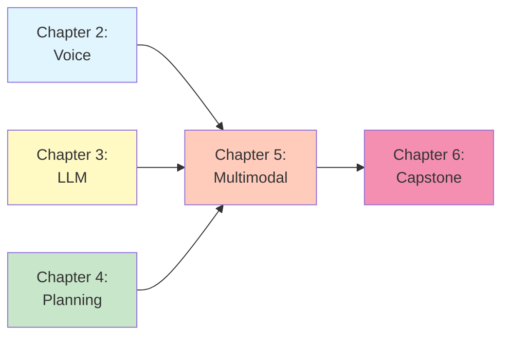

# Chapter 1: VLA Introduction

## What is VLA?

Vision-Language-Action (VLA) represents the cutting edge of robotics, enabling robots to understand natural language instructions, perceive their environment through vision, and execute appropriate actions. This paradigm shift makes robots more accessible and intuitive to interact with.

### The VLA Paradigm



### Core Components

1. **Vision**: Understanding visual scenes through cameras
2. **Language**: Processing natural language instructions
3. **Action**: Generating and executing robot commands

### Why VLA is Revolutionary

- **Natural Interaction**: Talk to robots like humans
- **Flexibility**: No need to program every scenario
- **Generalization**: Handle unseen situations
- **Accessibility**: Non-technical users can control robots

## Why VLA is the Future

### Current Limitations

Traditional robotics requires:
- **Explicit Programming**: Every behavior must be coded
- **Limited Flexibility**: Hard to handle new scenarios
- **Technical Expertise**: Requires robotics knowledge
- **Rigid Interfaces**: Buttons, joysticks, GUIs

### VLA Advantages



**VLA enables**:
- Natural language control
- Learning from demonstrations
- Adapting to new situations
- Human-like interaction

### Real-World Applications

1. **Household Robots**: "Pick up the cup and bring it to me"
2. **Industrial Automation**: "Move the box to shelf 3"
3. **Healthcare**: "Help the patient sit up"
4. **Service Robots**: "Take this order to table 5"

## Architecture Diagram

### Complete VLA System



### Component Breakdown

1. **Input Layer**: Voice or text commands
2. **Perception Layer**: Vision and language understanding
3. **Fusion Layer**: Combining modalities
4. **Planning Layer**: Generating action sequences
5. **Execution Layer**: Robot control
6. **Feedback Layer**: Status and updates

## Free Tools We'll Use

This module focuses entirely on **FREE** or low-cost tools:

### 1. Web Speech API (Free)

- **Cost**: $0
- **Platform**: Browser-based
- **Use**: Real-time speech recognition
- **Limitations**: Requires internet, browser only

### 2. OpenAI Whisper API (Free Tier)

- **Cost**: Free for limited use, then pay-per-use
- **Platform**: Cloud API
- **Use**: High-accuracy speech recognition
- **Limitations**: API rate limits

### 3. OpenAI GPT API ($5 Credit)

- **Cost**: $5 free credit (enough for learning)
- **Platform**: Cloud API
- **Use**: Language understanding and generation
- **Limitations**: Pay after credit expires

### 4. OpenCV (Free)

- **Cost**: $0
- **Platform**: Local
- **Use**: Computer vision
- **Limitations**: None

### 5. ROS 2 (Free)

- **Cost**: $0
- **Platform**: Local
- **Use**: Robot control
- **Limitations**: None

## Cost Breakdown

### Total Budget: $5

```
Web Speech API:        $0 (Free)
OpenAI Whisper:        $0 (Free tier)
OpenAI GPT API:        $5 (Free credit)
OpenCV:                $0 (Free)
ROS 2:                 $0 (Free)
--------------------------------
Total:                 $5
```

**After $5 credit**: ~$0.01-0.10 per session (very affordable)

## Architecture Details

### Vision Component

```python
# Free vision processing
import cv2
from ultralytics import YOLO

# Load free YOLO model
model = YOLO('yolov8n.pt')  # Free, downloads automatically

# Process image
results = model(image)
```

### Language Component

```python
# Free/cheap language processing
import openai

# OpenAI API (with $5 credit)
response = openai.ChatCompletion.create(
    model="gpt-3.5-turbo",  # Cheapest option
    messages=[{"role": "user", "content": "Pick up the cup"}]
)
```

### Action Component

```python
# Free robot control
import rclpy
from geometry_msgs.msg import Twist

# ROS 2 control (free)
cmd = Twist()
cmd.linear.x = 0.5
cmd_pub.publish(cmd)
```

## System Flow

### Complete Pipeline



## Why Free Tools Matter

### Accessibility

- **Students**: Can learn without expensive subscriptions
- **Hobbyists**: Can experiment affordably
- **Startups**: Can prototype with minimal cost
- **Education**: Can teach VLA concepts easily

### Learning Path

1. **Start Free**: Use Web Speech API
2. **Upgrade Gradually**: Add Whisper for accuracy
3. **Add Intelligence**: Use GPT with $5 credit
4. **Scale Up**: Pay only when needed

## Comparison: Free vs Paid

| Feature | Free Tools | Paid Tools |
|---------|------------|------------|
| **Cost** | $0-5 | $50-500/month |
| **Setup** | Simple | Complex |
| **Learning** | Easy | Steeper |
| **Performance** | Good | Excellent |
| **Best For** | Learning, prototyping | Production |

## Getting Started

### Prerequisites

- Python 3.8+
- ROS 2 Humble
- Web browser (for Web Speech API)
- OpenAI account (free, $5 credit)

### Quick Start

```bash
# Install dependencies
pip install openai opencv-python ultralytics

# Set up OpenAI API key
export OPENAI_API_KEY="your-key-here"

# Run example
python vla_example.py
```

## Next Steps

This module will teach you:

1. **Voice Commands**: Free speech recognition
2. **LLM Integration**: $5 OpenAI setup
3. **Action Planning**: Task decomposition
4. **Multimodal Systems**: Vision + Language
5. **Complete Projects**: Full implementations

All for **$5 or less**!

## Module Overview



## Cost Optimization Tips

1. **Use GPT-3.5-turbo**: Cheapest model ($0.002 per 1K tokens)
2. **Cache responses**: Store common queries
3. **Batch requests**: Process multiple at once
4. **Monitor usage**: Track API calls
5. **Use free tiers**: Maximize free credits

## Next Steps

Continue to:
- [Chapter 2: Voice Commands](02-voice-commands.md) - Free speech recognition
- [Chapter 3: LLM Integration](03-llm-integration.md) - $5 OpenAI setup

