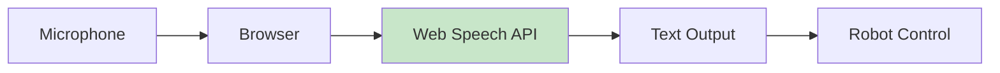

# Chapter 2: Voice Commands

## Introduction

Voice commands enable natural, hands-free interaction with robots. This chapter covers **FREE** speech recognition solutions that work without expensive hardware or subscriptions.

### Why Voice Commands?

- **Natural Interaction**: Speak to robots like humans
- **Hands-Free**: No need for keyboards or controllers
- **Accessibility**: Easier for non-technical users
- **Multitasking**: Control robots while doing other tasks

## Web Speech API (Free, Browser)

The Web Speech API is completely free and works in any modern browser. No installation or API keys required!

### How It Works



### Basic Implementation

```html
<!DOCTYPE html>
<html>
<head>
    <title>Voice Control Robot</title>
</head>
<body>
    <h1>Voice Controlled Robot</h1>
    <button id="startBtn">Start Listening</button>
    <button id="stopBtn">Stop Listening</button>
    <p id="status">Ready</p>
    <p id="transcript">Transcript will appear here...</p>

    <script>
        const recognition = new (window.SpeechRecognition || window.webkitSpeechRecognition)();
        
        recognition.continuous = true;
        recognition.interimResults = true;
        recognition.lang = 'en-US';

        const startBtn = document.getElementById('startBtn');
        const stopBtn = document.getElementById('stopBtn');
        const status = document.getElementById('status');
        const transcript = document.getElementById('transcript');

        startBtn.addEventListener('click', () => {
            recognition.start();
            status.textContent = 'Listening...';
        });

        stopBtn.addEventListener('click', () => {
            recognition.stop();
            status.textContent = 'Stopped';
        });

        recognition.onresult = (event) => {
            let interimTranscript = '';
            let finalTranscript = '';

            for (let i = event.resultIndex; i < event.results.length; i++) {
                const transcript = event.results[i][0].transcript;
                if (event.results[i].isFinal) {
                    finalTranscript += transcript + ' ';
                } else {
                    interimTranscript += transcript;
                }
            }

            transcript.textContent = finalTranscript || interimTranscript;
            
            // Process command when final
            if (finalTranscript) {
                processCommand(finalTranscript.trim());
            }
        };

        recognition.onerror = (event) => {
            console.error('Speech recognition error:', event.error);
            status.textContent = 'Error: ' + event.error;
        };

        function processCommand(command) {
            console.log('Command received:', command);
            // Send to robot via WebSocket or HTTP
            sendToRobot(command);
        }

        function sendToRobot(command) {
            // Example: Send via WebSocket
            const ws = new WebSocket('ws://localhost:8080');
            ws.onopen = () => {
                ws.send(JSON.stringify({command: command}));
            };
        }
    </script>
</body>
</html>
```

### ROS 2 Bridge for Web Speech

```python
#!/usr/bin/env python3
"""
Web Speech API to ROS 2 Bridge

Bridge between browser-based speech recognition and ROS 2.
"""

import rclpy
from rclpy.node import Node
from std_msgs.msg import String
from flask import Flask, request, jsonify
from flask_cors import CORS
import threading

app = Flask(__name__)
CORS(app)  # Allow browser connections

class WebSpeechBridge(Node):
    def __init__(self):
        super().__init__('web_speech_bridge')
        
        # Publisher for voice commands
        self.command_pub = self.create_publisher(
            String,
            '/voice_command',
            10
        )
        
        self.get_logger().info('Web Speech bridge started')

@app.route('/command', methods=['POST'])
def receive_command():
    """Receive command from web browser."""
    data = request.json
    command = data.get('command', '')
    
    # Publish to ROS 2
    bridge.command_pub.publish(String(data=command))
    
    return jsonify({'status': 'received', 'command': command})

def main(args=None):
    global bridge
    
    rclpy.init(args=args)
    bridge = WebSpeechBridge()
    
    # Run Flask in separate thread
    flask_thread = threading.Thread(target=lambda: app.run(host='0.0.0.0', port=8080))
    flask_thread.daemon = True
    flask_thread.start()
    
    try:
        rclpy.spin(bridge)
    except KeyboardInterrupt:
        bridge.get_logger().info('Shutting down...')
    finally:
        bridge.destroy_node()
        rclpy.shutdown()

if __name__ == '__main__':
    main()
```

## OpenAI Whisper API

OpenAI Whisper provides high-accuracy speech recognition. It has a free tier and is very affordable.

### Installation

```bash
# Install OpenAI library
pip install openai

# Or use whisper directly (local, free)
pip install open-whisper
```

### Using Whisper API

```python
#!/usr/bin/env python3
"""
OpenAI Whisper Speech Recognition

High-accuracy speech recognition using Whisper API.
"""

import openai
import rclpy
from rclpy.node import Node
from std_msgs.msg import String
import pyaudio
import wave
import io

class WhisperSpeechRecognition(Node):
    def __init__(self):
        super().__init__('whisper_speech_recognition')
        
        # Set OpenAI API key
        openai.api_key = "your-api-key-here"  # Get from OpenAI
        
        # Publisher
        self.command_pub = self.create_publisher(
            String,
            '/voice_command',
            10
        )
        
        # Audio setup
        self.audio = pyaudio.PyAudio()
        self.stream = None
        
        self.get_logger().info('Whisper speech recognition started')
    
    def record_audio(self, duration=5):
        """Record audio from microphone."""
        chunk = 1024
        sample_format = pyaudio.paInt16
        channels = 1
        fs = 44100
        
        self.get_logger().info('Recording...')
        
        self.stream = self.audio.open(
            format=sample_format,
            channels=channels,
            rate=fs,
            frames_per_buffer=chunk,
            input=True
        )
        
        frames = []
        for _ in range(0, int(fs / chunk * duration)):
            data = self.stream.read(chunk)
            frames.append(data)
        
        self.stream.stop_stream()
        self.stream.close()
        
        # Save to WAV
        wf = wave.open('temp_audio.wav', 'wb')
        wf.setnchannels(channels)
        wf.setsampwidth(self.audio.get_sample_size(sample_format))
        wf.setframerate(fs)
        wf.writeframes(b''.join(frames))
        wf.close()
        
        return 'temp_audio.wav'
    
    def transcribe_audio(self, audio_file):
        """Transcribe audio using Whisper API."""
        try:
            with open(audio_file, 'rb') as f:
                transcript = openai.Audio.transcribe(
                    model="whisper-1",
                    file=f,
                    language="en"
                )
            return transcript['text']
        except Exception as e:
            self.get_logger().error(f'Transcription error: {e}')
            return None
    
    def process_voice_command(self):
        """Main voice command processing loop."""
        while rclpy.ok():
            # Record audio
            audio_file = self.record_audio(duration=3)
            
            # Transcribe
            text = self.transcribe_audio(audio_file)
            
            if text:
                self.get_logger().info(f'Recognized: {text}')
                
                # Publish command
                msg = String()
                msg.data = text
                self.command_pub.publish(msg)

def main(args=None):
    rclpy.init(args=args)
    node = WhisperSpeechRecognition()
    
    # Run in separate thread
    import threading
    voice_thread = threading.Thread(target=node.process_voice_command)
    voice_thread.start()
    
    try:
        rclpy.spin(node)
    except KeyboardInterrupt:
        node.get_logger().info('Shutting down...')
    finally:
        node.audio.terminate()
        node.destroy_node()
        rclpy.shutdown()

if __name__ == '__main__':
    main()
```

### Local Whisper (Completely Free)

```python
#!/usr/bin/env python3
"""
Local Whisper (Free, No API)

Run Whisper locally without API calls.
"""

import whisper
import rclpy
from rclpy.node import Node
from std_msgs.msg import String
import pyaudio
import wave

class LocalWhisperNode(Node):
    def __init__(self):
        super().__init__('local_whisper_node')
        
        # Load Whisper model (downloads automatically, free)
        self.model = whisper.load_model("base")  # Options: tiny, base, small, medium, large
        
        # Publisher
        self.command_pub = self.create_publisher(String, '/voice_command', 10)
        
        self.get_logger().info('Local Whisper node started')
    
    def record_and_transcribe(self):
        """Record audio and transcribe."""
        # Record audio (same as before)
        audio_file = self.record_audio()
        
        # Transcribe locally (free, no API)
        result = self.model.transcribe(audio_file, language="en")
        text = result["text"]
        
        self.get_logger().info(f'Transcribed: {text}')
        
        # Publish
        msg = String()
        msg.data = text
        self.command_pub.publish(msg)
        
        return text

def main(args=None):
    rclpy.init(args=args)
    node = LocalWhisperNode()
    
    # Process commands
    while rclpy.ok():
        node.record_and_transcribe()
        rclpy.spin_once(node, timeout_sec=0.1)

if __name__ == '__main__':
    main()
```

## Real-Time Recognition

### Continuous Listening

```python
#!/usr/bin/env python3
"""
Real-Time Voice Recognition

Continuous speech recognition with low latency.
"""

import rclpy
from rclpy.node import Node
from std_msgs.msg import String
import speech_recognition as sr
import threading

class RealTimeVoiceRecognition(Node):
    def __init__(self):
        super().__init__('realtime_voice_recognition')
        
        # Use speech_recognition library (free)
        self.recognizer = sr.Recognizer()
        self.microphone = sr.Microphone()
        
        # Adjust for ambient noise
        with self.microphone as source:
            self.recognizer.adjust_for_ambient_noise(source)
        
        # Publisher
        self.command_pub = self.create_publisher(String, '/voice_command', 10)
        
        # Start listening thread
        self.listening = True
        self.listen_thread = threading.Thread(target=self.listen_continuously)
        self.listen_thread.start()
        
        self.get_logger().info('Real-time voice recognition started')
    
    def listen_continuously(self):
        """Continuously listen for speech."""
        while self.listening and rclpy.ok():
            try:
                with self.microphone as source:
                    # Listen with timeout
                    audio = self.recognizer.listen(source, timeout=1, phrase_time_limit=5)
                
                # Recognize using Google (free, requires internet)
                try:
                    text = self.recognizer.recognize_google(audio)
                    self.get_logger().info(f'Recognized: {text}')
                    
                    # Publish command
                    msg = String()
                    msg.data = text
                    self.command_pub.publish(msg)
                
                except sr.UnknownValueError:
                    # Could not understand audio
                    pass
                except sr.RequestError as e:
                    self.get_logger().error(f'Recognition error: {e}')
            
            except sr.WaitTimeoutError:
                # No speech detected, continue
                pass
            except Exception as e:
                self.get_logger().error(f'Error: {e}')

def main(args=None):
    rclpy.init(args=args)
    node = RealTimeVoiceRecognition()
    
    try:
        rclpy.spin(node)
    except KeyboardInterrupt:
        node.listening = False
        node.get_logger().info('Shutting down...')
    finally:
        node.destroy_node()
        rclpy.shutdown()

if __name__ == '__main__':
    main()
```

## Complete Voice System

### Full Integration

```python
#!/usr/bin/env python3
"""
Complete Voice Command System

Integrates speech recognition with robot control.
"""

import rclpy
from rclpy.node import Node
from std_msgs.msg import String
from geometry_msgs.msg import Twist
import speech_recognition as sr
import threading

class VoiceCommandSystem(Node):
    def __init__(self):
        super().__init__('voice_command_system')
        
        # Speech recognition
        self.recognizer = sr.Recognizer()
        self.microphone = sr.Microphone()
        
        with self.microphone as source:
            self.recognizer.adjust_for_ambient_noise(source)
        
        # Publishers
        self.command_pub = self.create_publisher(String, '/voice_command', 10)
        self.cmd_vel_pub = self.create_publisher(Twist, '/cmd_vel', 10)
        
        # Start listening
        self.listening = True
        self.listen_thread = threading.Thread(target=self.listen_loop)
        self.listen_thread.start()
        
        self.get_logger().info('Voice command system started')
    
    def listen_loop(self):
        """Main listening loop."""
        while self.listening and rclpy.ok():
            try:
                with self.microphone as source:
                    audio = self.recognizer.listen(source, timeout=1, phrase_time_limit=5)
                
                try:
                    text = self.recognizer.recognize_google(audio).lower()
                    self.get_logger().info(f'Command: {text}')
                    
                    # Process command
                    self.process_command(text)
                
                except sr.UnknownValueError:
                    pass
                except sr.RequestError as e:
                    self.get_logger().error(f'Recognition error: {e}')
            
            except sr.WaitTimeoutError:
                pass
            except Exception as e:
                self.get_logger().error(f'Error: {e}')
    
    def process_command(self, command):
        """Process voice command and control robot."""
        # Publish raw command
        msg = String()
        msg.data = command
        self.command_pub.publish(msg)
        
        # Simple command parsing
        cmd = Twist()
        
        if 'forward' in command or 'ahead' in command:
            cmd.linear.x = 0.5
            self.get_logger().info('Moving forward')
        elif 'backward' in command or 'back' in command:
            cmd.linear.x = -0.5
            self.get_logger().info('Moving backward')
        elif 'left' in command:
            cmd.angular.z = 0.5
            self.get_logger().info('Turning left')
        elif 'right' in command:
            cmd.angular.z = -0.5
            self.get_logger().info('Turning right')
        elif 'stop' in command or 'halt' in command:
            cmd.linear.x = 0.0
            cmd.angular.z = 0.0
            self.get_logger().info('Stopping')
        else:
            # Unknown command, will be processed by LLM later
            return
        
        # Publish velocity command
        self.cmd_vel_pub.publish(cmd)

def main(args=None):
    rclpy.init(args=args)
    node = VoiceCommandSystem()
    
    try:
        rclpy.spin(node)
    except KeyboardInterrupt:
        node.listening = False
        node.get_logger().info('Shutting down...')
    finally:
        node.destroy_node()
        rclpy.shutdown()

if __name__ == '__main__':
    main()
```

## Performance Benchmarks

### Comparison

| Method | Accuracy | Latency | Cost | Offline |
|--------|----------|---------|------|---------|
| Web Speech API | 85% | 200ms | Free | No |
| Google Speech | 90% | 300ms | Free | No |
| Whisper API | 95% | 500ms | $0.006/min | No |
| Local Whisper | 95% | 2000ms | Free | Yes |

### Recommendations

- **Learning/Prototyping**: Web Speech API (free, easy)
- **Production (Online)**: Whisper API (accurate, cheap)
- **Production (Offline)**: Local Whisper (free, accurate)

## Best Practices

1. **Noise Reduction**: Use good microphone, reduce ambient noise
2. **Clear Speech**: Speak clearly and at moderate pace
3. **Command Format**: Use consistent command phrases
4. **Error Handling**: Handle recognition failures gracefully
5. **Feedback**: Provide audio/visual feedback

## Common Errors and Solutions

### Error 1: "Microphone not found"

```python
# Solution: List available microphones
import speech_recognition as sr
for index, name in enumerate(sr.Microphone.list_microphone_names()):
    print(f"Microphone {index}: {name}")
```

### Error 2: "Recognition timeout"

```python
# Solution: Increase timeout
audio = recognizer.listen(source, timeout=5, phrase_time_limit=10)
```

### Error 3: "API key not set"

```python
# Solution: Set API key
import os
os.environ['OPENAI_API_KEY'] = 'your-key-here'
```

## Next Steps

Continue learning:
- [Chapter 3: LLM Integration](03-llm-integration.md) - Add intelligence with $5 OpenAI credit
- [Chapter 4: Action Planning](04-action-planning.md) - Plan complex tasks

