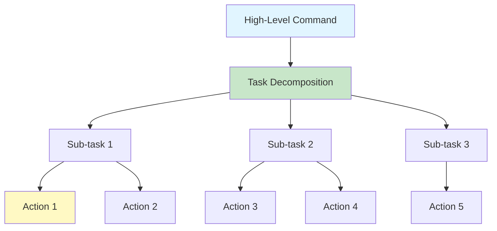

# Chapter 4: Action Planning

## Introduction

Action planning is the process of breaking down high-level natural language commands into sequences of executable robot actions. This chapter covers task decomposition, action primitives, state machines, and complete planning systems.

### Why Action Planning?

Natural language commands are often complex and need to be broken down:

- **"Pick up the cup and bring it to me"** → Multiple steps
- **"Navigate to the kitchen and check if the door is open"** → Sequential tasks
- **"Clean the room"** → Complex multi-step process

## Task Planning

### Hierarchical Task Decomposition



### Planning with LLM

```python
#!/usr/bin/env python3
"""
Task Planner

Breaks down complex commands into action sequences.
"""

import openai
import rclpy
from rclpy.node import Node
from std_msgs.msg import String
import json

class TaskPlanner(Node):
    def __init__(self):
        super().__init__('task_planner')
        
        openai.api_key = os.getenv('OPENAI_API_KEY')
        
        # Subscriber
        self.command_sub = self.create_subscription(
            String,
            '/voice_command',
            self.command_callback,
            10
        )
        
        # Publisher
        self.plan_pub = self.create_publisher(String, '/action_plan', 10)
        
        self.get_logger().info('Task planner started')
    
    def command_callback(self, msg):
        """Plan task from command."""
        command = msg.data
        self.get_logger().info(f'Planning: {command}')
        
        # Generate plan
        plan = self.generate_plan(command)
        
        if plan:
            # Publish plan
            plan_msg = String()
            plan_msg.data = json.dumps(plan)
            self.plan_pub.publish(plan_msg)
            
            # Execute plan
            self.execute_plan(plan)
    
    def generate_plan(self, command):
        """Generate action plan using LLM."""
        prompt = f"""Break down this robot command into a sequence of actions.

Command: "{command}"

Available actions:
- navigate_to(location)
- pick_up(object)
- place(object, location)
- open(door)
- close(door)
- check(object)
- wait(duration)

Respond with JSON array of actions:
[
    {{"action": "navigate_to", "parameters": {{"location": "kitchen"}}}},
    {{"action": "pick_up", "parameters": {{"object": "cup"}}}},
    {{"action": "navigate_to", "parameters": {{"location": "user"}}}},
    {{"action": "place", "parameters": {{"object": "cup", "location": "user"}}}}
]

Example:
Command: "Pick up the cup and bring it to me"
Plan: [
    {{"action": "navigate_to", "parameters": {{"location": "cup_location"}}}},
    {{"action": "pick_up", "parameters": {{"object": "cup"}}}},
    {{"action": "navigate_to", "parameters": {{"location": "user"}}}},
    {{"action": "place", "parameters": {{"object": "cup", "location": "user"}}}}
]

Now plan: "{command}"
"""
        
        try:
            response = openai.ChatCompletion.create(
                model="gpt-3.5-turbo",
                messages=[
                    {"role": "system", "content": "You are a robot task planner. Always respond with valid JSON arrays."},
                    {"role": "user", "content": prompt}
                ],
                temperature=0.3,
                max_tokens=500
            )
            
            text = response.choices[0].message.content.strip()
            
            # Extract JSON
            if '```' in text:
                text = text.split('```')[1]
                if text.startswith('json'):
                    text = text[4:]
            
            plan = json.loads(text)
            return plan
        
        except Exception as e:
            self.get_logger().error(f'Planning error: {e}')
            return None
    
    def execute_plan(self, plan):
        """Execute action plan."""
        for i, action in enumerate(plan):
            self.get_logger().info(f'Step {i+1}/{len(plan)}: {action["action"]}')
            self.execute_action(action)
            
            # Wait for action to complete
            # (Implementation depends on your robot)

def main(args=None):
    rclpy.init(args=args)
    node = TaskPlanner()
    
    try:
        rclpy.spin(node)
    except KeyboardInterrupt:
        node.get_logger().info('Shutting down...')
    finally:
        node.destroy_node()
        rclpy.shutdown()

if __name__ == '__main__':
    main()
```

## Breaking Commands into Steps

### Step-by-Step Decomposition

```python
class CommandDecomposer:
    """Decomposes commands into executable steps."""
    
    def __init__(self):
        self.action_primitives = {
            'move': ['navigate', 'drive', 'go'],
            'pick': ['pick', 'grab', 'take'],
            'place': ['place', 'put', 'set'],
            'turn': ['turn', 'rotate'],
            'stop': ['stop', 'halt', 'wait']
        }
    
    def decompose(self, command):
        """Break command into steps."""
        # Use LLM for complex decomposition
        steps = self.llm_decompose(command)
        return steps
    
    def llm_decompose(self, command):
        """Use LLM to decompose command."""
        prompt = f"""Break this command into steps: "{command}"

Each step should be a single, executable action.
Return as JSON array of strings."""
        
        # Call LLM and parse response
        # (Implementation similar to previous examples)
        pass
```

## Action Primitives

### Defining Primitives

Action primitives are the basic building blocks of robot behavior.

```python
#!/usr/bin/env python3
"""
Action Primitives

Basic robot actions that can be combined.
"""

import rclpy
from rclpy.node import Node
from geometry_msgs.msg import Twist, PoseStamped
from std_msgs.msg import String
import math

class ActionPrimitives(Node):
    def __init__(self):
        super().__init__('action_primitives')
        
        # Publishers
        self.cmd_vel_pub = self.create_publisher(Twist, '/cmd_vel', 10)
        self.goal_pub = self.create_publisher(PoseStamped, '/goal_pose', 10)
        self.status_pub = self.create_publisher(String, '/action_status', 10)
        
        # Action registry
        self.actions = {
            'move_forward': self.move_forward,
            'move_backward': self.move_backward,
            'turn_left': self.turn_left,
            'turn_right': self.turn_right,
            'stop': self.stop,
            'navigate_to': self.navigate_to,
            'pick_up': self.pick_up,
            'place': self.place_object
        }
        
        self.get_logger().info('Action primitives ready')
    
    def execute_primitive(self, action_name, parameters):
        """Execute an action primitive."""
        if action_name in self.actions:
            return self.actions[action_name](parameters)
        else:
            self.get_logger().error(f'Unknown action: {action_name}')
            return False
    
    def move_forward(self, params):
        """Move forward primitive."""
        distance = params.get('distance', 1.0)
        speed = params.get('speed', 0.5)
        
        cmd = Twist()
        cmd.linear.x = speed
        
        # Publish for specified duration
        duration = distance / speed
        # (In real implementation, use timer or action)
        
        self.cmd_vel_pub.publish(cmd)
        self.get_logger().info(f'Moving forward {distance}m')
        return True
    
    def move_backward(self, params):
        """Move backward primitive."""
        distance = params.get('distance', 1.0)
        speed = params.get('speed', 0.5)
        
        cmd = Twist()
        cmd.linear.x = -speed
        self.cmd_vel_pub.publish(cmd)
        
        self.get_logger().info(f'Moving backward {distance}m')
        return True
    
    def turn_left(self, params):
        """Turn left primitive."""
        angle = params.get('angle', 90)
        
        cmd = Twist()
        cmd.angular.z = 0.5
        
        # Calculate duration based on angle
        # (Simplified, real implementation needs odometry)
        
        self.cmd_vel_pub.publish(cmd)
        self.get_logger().info(f'Turning left {angle} degrees')
        return True
    
    def turn_right(self, params):
        """Turn right primitive."""
        angle = params.get('angle', 90)
        
        cmd = Twist()
        cmd.angular.z = -0.5
        self.cmd_vel_pub.publish(cmd)
        
        self.get_logger().info(f'Turning right {angle} degrees')
        return True
    
    def stop(self, params):
        """Stop primitive."""
        cmd = Twist()
        self.cmd_vel_pub.publish(cmd)
        
        self.get_logger().info('Stopping')
        return True
    
    def navigate_to(self, params):
        """Navigate to location primitive."""
        x = params.get('x', 0.0)
        y = params.get('y', 0.0)
        theta = params.get('theta', 0.0)
        
        goal = PoseStamped()
        goal.header.frame_id = 'map'
        goal.pose.position.x = x
        goal.pose.position.y = y
        goal.pose.orientation.z = math.sin(theta / 2.0)
        goal.pose.orientation.w = math.cos(theta / 2.0)
        
        self.goal_pub.publish(goal)
        self.get_logger().info(f'Navigating to ({x}, {y})')
        return True
    
    def pick_up(self, params):
        """Pick up object primitive."""
        object_name = params.get('object', 'unknown')
        
        # Implementation depends on robot
        # This is a placeholder
        self.get_logger().info(f'Picking up {object_name}')
        return True
    
    def place_object(self, params):
        """Place object primitive."""
        object_name = params.get('object', 'unknown')
        location = params.get('location', 'unknown')
        
        self.get_logger().info(f'Placing {object_name} at {location}')
        return True

def main(args=None):
    rclpy.init(args=args)
    node = ActionPrimitives()
    
    # Example usage
    node.execute_primitive('move_forward', {'distance': 2.0})
    
    try:
        rclpy.spin(node)
    except KeyboardInterrupt:
        node.get_logger().info('Shutting down...')
    finally:
        node.destroy_node()
        rclpy.shutdown()

if __name__ == '__main__':
    main()
```

## State Machines

State machines provide structured control flow for robot behaviors.

### Basic State Machine

```python
#!/usr/bin/env python3
"""
Robot State Machine

Manages robot states and transitions.
"""

import rclpy
from rclpy.node import Node
from enum import Enum
from std_msgs.msg import String

class RobotState(Enum):
    IDLE = 'idle'
    PLANNING = 'planning'
    EXECUTING = 'executing'
    WAITING = 'waiting'
    ERROR = 'error'

class RobotStateMachine(Node):
    def __init__(self):
        super().__init__('robot_state_machine')
        
        # State
        self.current_state = RobotState.IDLE
        self.current_plan = []
        self.current_action_index = 0
        
        # Subscribers
        self.command_sub = self.create_subscription(
            String, '/voice_command', self.command_callback, 10
        )
        self.status_sub = self.create_subscription(
            String, '/action_status', self.status_callback, 10
        )
        
        # Publishers
        self.state_pub = self.create_publisher(String, '/robot_state', 10)
        self.action_pub = self.create_publisher(String, '/execute_action', 10)
        
        # Timer for state machine
        self.timer = self.create_timer(0.1, self.state_machine_step)
        
        self.get_logger().info('State machine started')
    
    def command_callback(self, msg):
        """Handle new command."""
        if self.current_state == RobotState.IDLE:
            self.transition_to(RobotState.PLANNING)
            self.plan_task(msg.data)
    
    def status_callback(self, msg):
        """Handle action status updates."""
        status = msg.data
        
        if status == 'completed' and self.current_state == RobotState.EXECUTING:
            self.current_action_index += 1
            
            if self.current_action_index >= len(self.current_plan):
                # Plan complete
                self.transition_to(RobotState.IDLE)
            else:
                # Execute next action
                self.execute_next_action()
        
        elif status == 'failed':
            self.transition_to(RobotState.ERROR)
    
    def transition_to(self, new_state):
        """Transition to new state."""
        old_state = self.current_state
        self.current_state = new_state
        
        self.get_logger().info(f'State: {old_state.value} -> {new_state.value}')
        
        # Publish state
        state_msg = String()
        state_msg.data = new_state.value
        self.state_pub.publish(state_msg)
    
    def plan_task(self, command):
        """Plan task from command."""
        # Generate plan (using LLM or other method)
        # self.current_plan = generate_plan(command)
        
        if self.current_plan:
            self.transition_to(RobotState.EXECUTING)
            self.current_action_index = 0
            self.execute_next_action()
        else:
            self.transition_to(RobotState.ERROR)
    
    def execute_next_action(self):
        """Execute next action in plan."""
        if self.current_action_index < len(self.current_plan):
            action = self.current_plan[self.current_action_index]
            
            action_msg = String()
            action_msg.data = json.dumps(action)
            self.action_pub.publish(action_msg)
            
            self.get_logger().info(
                f'Executing action {self.current_action_index + 1}/{len(self.current_plan)}: '
                f'{action["action"]}'
            )
    
    def state_machine_step(self):
        """State machine update loop."""
        # Handle state-specific logic
        if self.current_state == RobotState.ERROR:
            # Error recovery
            self.recover_from_error()
    
    def recover_from_error(self):
        """Recover from error state."""
        # Implement error recovery
        self.get_logger().warn('Recovering from error')
        self.transition_to(RobotState.IDLE)

def main(args=None):
    rclpy.init(args=args)
    node = RobotStateMachine()
    
    try:
        rclpy.spin(node)
    except KeyboardInterrupt:
        node.get_logger().info('Shutting down...')
    finally:
        node.destroy_node()
        rclpy.shutdown()

if __name__ == '__main__':
    main()
```

## Complete Planner

### Integrated Planning System

```python
#!/usr/bin/env python3
"""
Complete Action Planner

Integrates LLM planning with state machine and primitives.
"""

import openai
import rclpy
from rclpy.node import Node
from std_msgs.msg import String
from geometry_msgs.msg import Twist
import json
from enum import Enum

class PlannerState(Enum):
    IDLE = 'idle'
    PLANNING = 'planning'
    EXECUTING = 'executing'
    COMPLETED = 'completed'
    FAILED = 'failed'

class CompletePlanner(Node):
    def __init__(self):
        super().__init__('complete_planner')
        
        openai.api_key = os.getenv('OPENAI_API_KEY')
        
        # State
        self.state = PlannerState.IDLE
        self.current_plan = []
        self.current_step = 0
        
        # Subscribers
        self.command_sub = self.create_subscription(
            String, '/voice_command', self.command_callback, 10
        )
        
        # Publishers
        self.plan_pub = self.create_publisher(String, '/action_plan', 10)
        self.action_pub = self.create_publisher(String, '/execute_action', 10)
        self.cmd_vel_pub = self.create_publisher(Twist, '/cmd_vel', 10)
        
        # Timer
        self.timer = self.create_timer(0.1, self.planner_loop)
        
        self.get_logger().info('Complete planner started')
    
    def command_callback(self, msg):
        """Handle new command."""
        if self.state == PlannerState.IDLE:
            command = msg.data
            self.get_logger().info(f'New command: {command}')
            self.plan_command(command)
    
    def plan_command(self, command):
        """Generate plan from command."""
        self.state = PlannerState.PLANNING
        
        # Use LLM to generate plan
        plan = self.generate_plan_with_llm(command)
        
        if plan and len(plan) > 0:
            self.current_plan = plan
            self.current_step = 0
            self.state = PlannerState.EXECUTING
            
            # Publish plan
            plan_msg = String()
            plan_msg.data = json.dumps(plan)
            self.plan_pub.publish(plan_msg)
            
            self.get_logger().info(f'Plan generated: {len(plan)} steps')
        else:
            self.state = PlannerState.FAILED
            self.get_logger().error('Failed to generate plan')
    
    def generate_plan_with_llm(self, command):
        """Generate plan using LLM."""
        prompt = f"""Create an action plan for this robot command: "{command}"

Available actions:
- move_forward(distance)
- move_backward(distance)
- turn_left(angle)
- turn_right(angle)
- navigate_to(x, y, theta)
- pick_up(object)
- place(object, location)
- stop()

Return JSON array:
[
    {{"action": "action_name", "parameters": {{"param": "value"}}}},
    ...
]"""
        
        try:
            response = openai.ChatCompletion.create(
                model="gpt-3.5-turbo",
                messages=[
                    {"role": "system", "content": "You are a robot planner. Return valid JSON arrays."},
                    {"role": "user", "content": prompt}
                ],
                temperature=0.3,
                max_tokens=500
            )
            
            text = response.choices[0].message.content.strip()
            
            # Extract JSON
            if '```' in text:
                text = text.split('```')[1]
                if text.startswith('json'):
                    text = text[4:]
            
            return json.loads(text)
        
        except Exception as e:
            self.get_logger().error(f'LLM planning error: {e}')
            return None
    
    def planner_loop(self):
        """Main planner loop."""
        if self.state == PlannerState.EXECUTING:
            if self.current_step < len(self.current_plan):
                action = self.current_plan[self.current_step]
                self.execute_action(action)
            else:
                # Plan complete
                self.state = PlannerState.COMPLETED
                self.get_logger().info('Plan completed')
                self.state = PlannerState.IDLE
    
    def execute_action(self, action):
        """Execute a single action."""
        action_name = action.get('action')
        params = action.get('parameters', {})
        
        self.get_logger().info(f'Executing: {action_name} with {params}')
        
        # Execute based on action type
        success = False
        
        if action_name == 'move_forward':
            success = self.move_forward(params)
        elif action_name == 'move_backward':
            success = self.move_backward(params)
        elif action_name == 'turn_left':
            success = self.turn_left(params)
        elif action_name == 'turn_right':
            success = self.turn_right(params)
        elif action_name == 'stop':
            success = self.stop()
        elif action_name == 'navigate_to':
            success = self.navigate_to(params)
        else:
            self.get_logger().warn(f'Unknown action: {action_name}')
        
        if success:
            # Move to next step
            self.current_step += 1
        else:
            # Retry or fail
            self.get_logger().warn(f'Action failed: {action_name}')
    
    def move_forward(self, params):
        """Execute move forward."""
        cmd = Twist()
        cmd.linear.x = 0.5
        self.cmd_vel_pub.publish(cmd)
        return True
    
    def move_backward(self, params):
        """Execute move backward."""
        cmd = Twist()
        cmd.linear.x = -0.5
        self.cmd_vel_pub.publish(cmd)
        return True
    
    def turn_left(self, params):
        """Execute turn left."""
        cmd = Twist()
        cmd.angular.z = 0.5
        self.cmd_vel_pub.publish(cmd)
        return True
    
    def turn_right(self, params):
        """Execute turn right."""
        cmd = Twist()
        cmd.angular.z = -0.5
        self.cmd_vel_pub.publish(cmd)
        return True
    
    def stop(self):
        """Execute stop."""
        cmd = Twist()
        self.cmd_vel_pub.publish(cmd)
        return True
    
    def navigate_to(self, params):
        """Execute navigate to."""
        # Use Nav2 or custom navigation
        # (Implementation depends on your setup)
        return True

def main(args=None):
    rclpy.init(args=args)
    node = CompletePlanner()
    
    try:
        rclpy.spin(node)
    except KeyboardInterrupt:
        node.get_logger().info('Shutting down...')
    finally:
        node.destroy_node()
        rclpy.shutdown()

if __name__ == '__main__':
    main()
```

## ROS 2 Integration

### Planning Service

```python
from example_interfaces.srv import String

class PlanningService(Node):
    def __init__(self):
        super().__init__('planning_service')
        
        self.service = self.create_service(
            String,
            'plan_command',
            self.plan_callback
        )
    
    def plan_callback(self, request, response):
        """Service callback for planning."""
        command = request.data
        
        # Generate plan
        plan = self.generate_plan(command)
        
        response.data = json.dumps(plan)
        return response
```

## Best Practices

1. **Validate Plans**: Always check plan validity before execution
2. **Error Handling**: Handle plan generation failures
3. **State Management**: Use state machines for complex behaviors
4. **Modular Actions**: Keep action primitives simple and reusable
5. **Feedback**: Provide status updates during execution

## Common Errors and Solutions

### Error 1: "Invalid plan format"

```python
# Solution: Validate plan structure
def validate_plan(plan):
    if not isinstance(plan, list):
        return False
    for action in plan:
        if 'action' not in action:
            return False
    return True
```

### Error 2: "Action execution failed"

```python
# Solution: Implement retry logic
def execute_with_retry(action, max_retries=3):
    for i in range(max_retries):
        if execute_action(action):
            return True
        time.sleep(1)
    return False
```

## Next Steps

Continue learning:
- [Chapter 5: Multimodal Systems](05-multimodal.md) - Complete VLA pipeline
- [Chapter 6: Capstone Project](06-capstone-project.md) - Build autonomous butler

