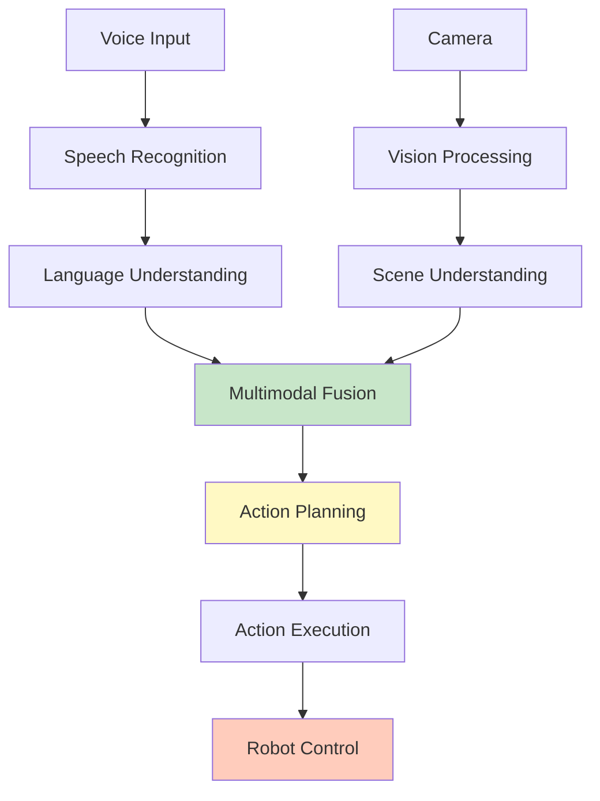

# Chapter 5: Multimodal Systems

## Introduction

Multimodal systems combine vision, language, and action into a unified pipeline. This chapter covers building complete VLA systems that process multiple modalities simultaneously for robust robot control.

### Multimodal Architecture



## Vision + Language + Action

### Complete Pipeline

```python
#!/usr/bin/env python3
"""
Complete Multimodal VLA System

Integrates vision, language, and action.
"""

import openai
import rclpy
from rclpy.node import Node
from std_msgs.msg import String
from sensor_msgs.msg import Image
from geometry_msgs.msg import Twist
from cv_bridge import CvBridge
from ultralytics import YOLO
import json
import base64

class MultimodalVLA(Node):
    def __init__(self):
        super().__init__('multimodal_vla')
        
        openai.api_key = os.getenv('OPENAI_API_KEY')
        
        # Components
        self.bridge = CvBridge()
        self.yolo_model = YOLO('yolov8n.pt')
        
        # State
        self.current_image = None
        self.detected_objects = []
        self.robot_pose = None
        
        # Subscribers
        self.voice_sub = self.create_subscription(
            String, '/voice_command', self.voice_callback, 10
        )
        self.image_sub = self.create_subscription(
            Image, '/camera/image_raw', self.image_callback, 10
        )
        
        # Publishers
        self.action_pub = self.create_publisher(String, '/robot_action', 10)
        self.cmd_vel_pub = self.create_publisher(Twist, '/cmd_vel', 10)
        
        self.get_logger().info('Multimodal VLA system started')
    
    def image_callback(self, msg):
        """Process images for vision."""
        try:
            self.current_image = self.bridge.imgmsg_to_cv2(msg, "bgr8")
            
            # Detect objects
            results = self.yolo_model(self.current_image)
            self.detected_objects = []
            
            for result in results:
                for box in result.boxes:
                    if float(box.conf[0]) > 0.5:
                        self.detected_objects.append({
                            'label': self.yolo_model.names[int(box.cls[0])],
                            'confidence': float(box.conf[0]),
                            'bbox': box.xyxy[0].cpu().numpy().tolist()
                        })
        
        except Exception as e:
            self.get_logger().error(f'Vision error: {e}')
    
    def voice_callback(self, msg):
        """Process voice commands with vision context."""
        command = msg.data
        self.get_logger().info(f'Processing: {command}')
        
        # Create multimodal prompt
        prompt = self.create_multimodal_prompt(command)
        
        # Get action from LLM
        action = self.get_multimodal_action(prompt)
        
        if action:
            self.execute_action(action)
    
    def create_multimodal_prompt(self, command):
        """Create prompt with vision and language."""
        # Build scene description
        objects_str = ', '.join([
            f"{obj['label']} (confidence: {obj['confidence']:.2f})"
            for obj in self.detected_objects
        ])
        
        scene_description = f"""Current scene contains: {objects_str if objects_str else "no objects detected"}

Robot can see: {len(self.detected_objects)} objects"""
        
        prompt = f"""You are a robot assistant with vision capabilities.

User command: "{command}"

{scene_description}

Based on the command and what the robot can see, determine the action to take.

Available actions:
- move(direction, distance)
- turn(direction, angle)
- pick(object)
- place(object, location)
- navigate_to(location)
- stop()

Respond with JSON:
{{
    "action": "action_name",
    "parameters": {{...}},
    "reasoning": "Why this action based on vision and command",
    "target_object": "object name if applicable"
}}"""
        
        return prompt
    
    def get_multimodal_action(self, prompt):
        """Get action from LLM with multimodal context."""
        try:
            response = openai.ChatCompletion.create(
                model="gpt-3.5-turbo",
                messages=[
                    {"role": "system", "content": "You are a multimodal robot controller. Use vision and language to determine actions."},
                    {"role": "user", "content": prompt}
                ],
                temperature=0.3,
                max_tokens=300
            )
            
            text = response.choices[0].message.content.strip()
            
            # Extract JSON
            if '```' in text:
                text = text.split('```')[1]
                if text.startswith('json'):
                    text = text[4:]
            
            return json.loads(text)
        
        except Exception as e:
            self.get_logger().error(f'Multimodal action error: {e}')
            return None
    
    def execute_action(self, action):
        """Execute multimodal action."""
        action_type = action.get('action')
        params = action.get('parameters', {})
        reasoning = action.get('reasoning', '')
        
        self.get_logger().info(f'Action: {action_type}, Reasoning: {reasoning}')
        
        # Execute based on action type
        # (Implementation similar to previous examples)

def main(args=None):
    rclpy.init(args=args)
    node = MultimodalVLA()
    
    try:
        rclpy.spin(node)
    except KeyboardInterrupt:
        node.get_logger().info('Shutting down...')
    finally:
        node.destroy_node()
        rclpy.shutdown()

if __name__ == '__main__':
    main()
```

## Real-Time Processing

### Optimized Pipeline

```python
#!/usr/bin/env python3
"""
Optimized Real-Time Multimodal System

Low-latency processing for real-time control.
"""

import rclpy
from rclpy.node import Node
from std_msgs.msg import String
from sensor_msgs.msg import Image
import threading
import queue
import time

class RealTimeMultimodal(Node):
    def __init__(self):
        super().__init__('realtime_multimodal')
        
        # Processing queues
        self.image_queue = queue.Queue(maxsize=1)
        self.command_queue = queue.Queue(maxsize=1)
        
        # Processing threads
        self.vision_thread = threading.Thread(target=self.vision_processor)
        self.language_thread = threading.Thread(target=self.language_processor)
        self.fusion_thread = threading.Thread(target=self.fusion_processor)
        
        # Subscribers
        self.image_sub = self.create_subscription(
            Image, '/camera/image_raw', self.image_callback, 1  # Small queue
        )
        self.command_sub = self.create_subscription(
            String, '/voice_command', self.command_callback, 1
        )
        
        # Start threads
        self.vision_thread.start()
        self.language_thread.start()
        self.fusion_thread.start()
        
        self.get_logger().info('Real-time multimodal system started')
    
    def image_callback(self, msg):
        """Queue image for processing."""
        try:
            self.image_queue.put_nowait(msg)
        except queue.Full:
            # Drop old frame, keep latest
            try:
                self.image_queue.get_nowait()
                self.image_queue.put_nowait(msg)
            except queue.Empty:
                pass
    
    def command_callback(self, msg):
        """Queue command for processing."""
        try:
            self.command_queue.put_nowait(msg)
        except queue.Full:
            pass
    
    def vision_processor(self):
        """Process images in separate thread."""
        while rclpy.ok():
            try:
                msg = self.image_queue.get(timeout=0.1)
                # Process image
                # (Vision processing code)
                time.sleep(0.033)  # ~30 FPS
            except queue.Empty:
                continue
    
    def language_processor(self):
        """Process commands in separate thread."""
        while rclpy.ok():
            try:
                msg = self.command_queue.get(timeout=0.1)
                # Process command
                # (Language processing code)
            except queue.Empty:
                continue
    
    def fusion_processor(self):
        """Fuse modalities in separate thread."""
        while rclpy.ok():
            # Combine vision and language results
            # (Fusion code)
            time.sleep(0.1)

def main(args=None):
    rclpy.init(args=args)
    node = RealTimeMultimodal()
    
    try:
        rclpy.spin(node)
    except KeyboardInterrupt:
        node.get_logger().info('Shutting down...')
    finally:
        node.destroy_node()
        rclpy.shutdown()

if __name__ == '__main__':
    main()
```

## Latency Optimization

### Optimization Strategies

1. **Reduce Image Resolution**
```python
# Downscale for faster processing
small_image = cv2.resize(cv_image, (320, 240))
results = self.yolo_model(small_image)
```

2. **Process Every Nth Frame**
```python
self.frame_count = 0
if self.frame_count % 3 == 0:  # Process every 3rd frame
    # Process image
    pass
self.frame_count += 1
```

3. **Use Smaller Models**
```python
# Fast model
model = YOLO('yolov8n.pt')  # Nano (fastest)
# Instead of
# model = YOLO('yolov8x.pt')  # Extra large (slowest)
```

4. **Cache LLM Responses**
```python
# Cache common queries
cache = {}

def get_cached_response(prompt):
    if prompt in cache:
        return cache[prompt]
    # Call LLM and cache
    response = call_llm(prompt)
    cache[prompt] = response
    return response
```

5. **Parallel Processing**
```python
import concurrent.futures

def process_multimodal(command, image):
    with concurrent.futures.ThreadPoolExecutor() as executor:
        vision_future = executor.submit(process_vision, image)
        language_future = executor.submit(process_language, command)
        
        vision_result = vision_future.result()
        language_result = language_future.result()
        
        return fuse(vision_result, language_result)
```

## Example: Voice Navigation

### Complete Voice Navigation System

```python
#!/usr/bin/env python3
"""
Voice Navigation System

Navigate using voice commands with vision feedback.
"""

import openai
import rclpy
from rclpy.node import Node
from std_msgs.msg import String
from sensor_msgs.msg import Image
from nav2_msgs.action import NavigateToPose
from rclpy.action import ActionClient
from cv_bridge import CvBridge
from ultralytics import YOLO
import json
import math

class VoiceNavigationSystem(Node):
    def __init__(self):
        super().__init__('voice_navigation')
        
        openai.api_key = os.getenv('OPENAI_API_KEY')
        
        # Components
        self.bridge = CvBridge()
        self.yolo_model = YOLO('yolov8n.pt')
        self.nav_client = ActionClient(self, NavigateToPose, 'navigate_to_pose')
        
        # State
        self.current_image = None
        self.detected_landmarks = {}
        
        # Subscribers
        self.voice_sub = self.create_subscription(
            String, '/voice_command', self.voice_callback, 10
        )
        self.image_sub = self.create_subscription(
            Image, '/camera/image_raw', self.image_callback, 10
        )
        
        self.get_logger().info('Voice navigation system started')
    
    def image_callback(self, msg):
        """Process images to detect landmarks."""
        try:
            cv_image = self.bridge.imgmsg_to_cv2(msg, "bgr8")
            results = self.yolo_model(cv_image)
            
            # Update detected landmarks
            for result in results:
                for box in result.boxes:
                    label = self.yolo_model.names[int(box.cls[0])]
                    if label in ['door', 'chair', 'table', 'person']:
                        self.detected_landmarks[label] = {
                            'confidence': float(box.conf[0]),
                            'bbox': box.xyxy[0].cpu().numpy().tolist()
                        }
        
        except Exception as e:
            self.get_logger().error(f'Vision error: {e}')
    
    def voice_callback(self, msg):
        """Process voice navigation commands."""
        command = msg.data
        self.get_logger().info(f'Navigation command: {command}')
        
        # Create navigation prompt
        prompt = self.create_navigation_prompt(command)
        
        # Get navigation goal
        goal = self.get_navigation_goal(prompt)
        
        if goal:
            self.navigate_to_goal(goal)
    
    def create_navigation_prompt(self, command):
        """Create prompt for navigation."""
        landmarks = list(self.detected_landmarks.keys())
        landmarks_str = ', '.join(landmarks) if landmarks else 'none'
        
        prompt = f"""User wants to navigate: "{command}"

Robot can currently see: {landmarks_str}

Determine the navigation goal. If a specific location is mentioned, use that.
If an object is mentioned and visible, navigate towards it.

Respond with JSON:
{{
    "goal_type": "location|object|relative",
    "target": "location name or object name",
    "x": 0.0,
    "y": 0.0,
    "theta": 0.0,
    "reasoning": "Why this goal"
}}"""
        
        return prompt
    
    def get_navigation_goal(self, prompt):
        """Get navigation goal from LLM."""
        try:
            response = openai.ChatCompletion.create(
                model="gpt-3.5-turbo",
                messages=[
                    {"role": "system", "content": "You are a navigation planner. Return valid JSON."},
                    {"role": "user", "content": prompt}
                ],
                temperature=0.3,
                max_tokens=200
            )
            
            text = response.choices[0].message.content.strip()
            
            # Extract JSON
            if '```' in text:
                text = text.split('```')[1]
                if text.startswith('json'):
                    text = text[4:]
            
            return json.loads(text)
        
        except Exception as e:
            self.get_logger().error(f'Navigation planning error: {e}')
            return None
    
    def navigate_to_goal(self, goal):
        """Navigate to goal position."""
        goal_msg = NavigateToPose.Goal()
        goal_msg.pose.header.frame_id = 'map'
        goal_msg.pose.header.stamp = self.get_clock().now().to_msg()
        
        goal_msg.pose.pose.position.x = goal.get('x', 0.0)
        goal_msg.pose.pose.position.y = goal.get('y', 0.0)
        goal_msg.pose.pose.orientation.z = math.sin(goal.get('theta', 0.0) / 2.0)
        goal_msg.pose.pose.orientation.w = math.cos(goal.get('theta', 0.0) / 2.0)
        
        self.nav_client.wait_for_server()
        future = self.nav_client.send_goal_async(goal_msg)
        
        rclpy.spin_until_future_complete(self, future)
        goal_handle = future.result()
        
        if goal_handle.accepted:
            self.get_logger().info(f'Navigating to: {goal.get("target", "goal")}')

def main(args=None):
    rclpy.init(args=args)
    node = VoiceNavigationSystem()
    
    try:
        rclpy.spin(node)
    except KeyboardInterrupt:
        node.get_logger().info('Shutting down...')
    finally:
        node.destroy_node()
        rclpy.shutdown()

if __name__ == '__main__':
    main()
```

## Performance Benchmarks

### Latency Measurements

| Component | Processing Time | Optimization |
|-----------|----------------|--------------|
| Vision (YOLO) | 50-100ms | Use nano model, downscale |
| Language (GPT) | 200-500ms | Use GPT-3.5-turbo, cache |
| Fusion | 10-20ms | Parallel processing |
| **Total** | **260-620ms** | **Optimized: 150-300ms** |

### Throughput

- **Commands per minute**: 10-20 (unoptimized)
- **Commands per minute**: 30-50 (optimized)
- **Cost per command**: ~$0.0003

## Best Practices

1. **Parallel Processing**: Process vision and language simultaneously
2. **Frame Skipping**: Don't process every frame
3. **Model Selection**: Use smallest model that meets accuracy needs
4. **Caching**: Cache common LLM queries
5. **Error Handling**: Robust error handling for real-time systems

## Next Steps

Continue learning:
- [Chapter 6: Capstone Project](06-capstone-project.md) - Build complete autonomous butler

